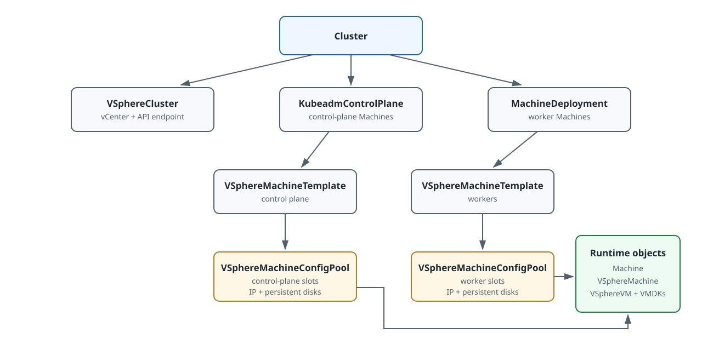

# Creating Clusters on VMware vSphere

This document explains how to create a VMware vSphere workload cluster by applying Cluster API manifests to the ACP `global` management cluster. The procedure does not create the `global` cluster itself. It covers a minimum supported topology with one datacenter, one NIC per node, and static IP allocation through `VSphereMachineConfigPool`. The provider behavior and fields on this page are validated against VMware vSphere Provider `v1.0.16`.

## Scenarios

Use this document in the following scenarios:

- You want to create the first baseline VMware vSphere workload cluster in your environment.
- You use one datacenter and one NIC per node for the initial validation.
- You want to keep the first deployment simple before enabling advanced placement or networking features.

This document applies to the following deployment model:

- CAPV connects directly to vCenter.
- Control plane and worker nodes both use `VSphereMachineConfigPool` for static IP allocation and data disks.
- `ClusterResourceSet` delivers the vSphere CPI component automatically.
- The first validation uses one datacenter and one NIC per node.

This document does not apply to the following scenarios:

- A deployment that depends on vSphere Supervisor or `vm-operator`.
- A deployment that does not use `VSphereMachineConfigPool`.

This document is written for the current platform environment. The `kube-ovn` delivery path depends on platform controllers that consume annotations on the `Cluster` resource, so this workflow is not intended to be a generic standalone CAPV deployment guide outside the platform context.

## How to Use This Page

1. Complete the infrastructure and parameter checklist.
2. Prepare the baseline manifest files in the procedure below.
3. Before applying them, add only the required [creation-time topology variants](#creation-time-topology-variants).
4. Apply the complete manifest set and finish the verification checks.
5. After the cluster is running, use [Managing Nodes on VMware vSphere](../manage-nodes/vmware-vsphere.mdx) for scale-out, immutable template replacement, and runtime topology changes.

The baseline is the validation reference. If the target cluster needs several optional topology features, introduce and validate one manifest change at a time before combining them.

## Prerequisites

Before you begin, ensure the following conditions are met:

1. You completed [VMware vSphere Infrastructure Preparation](../infrastructure/vmware-vsphere.mdx).
2. The `global` cluster can reach vCenter.
3. The target template, networks, datastores, and vCenter resource pool are available.
4. The external control plane LoadBalancer satisfies [the endpoint contract](../how-to/control-plane-endpoint.mdx). VMware vSphere Provider `v1.0.16` does not deploy a Self-built VIP.
5. All required static IP addresses are allocated and not in use.
6. `ClusterResourceSet=true` is enabled.
7. The platform already has a valid `public-registry-credential` Secret, and the permanent Registry address is reachable from workload nodes.
8. The permanent platform Registry contains the required Kube-OVN, CoreDNS, and vSphere CPI tags.
9. The platform can process the cluster annotations required to install the network plugin.

## Key Objects



The top-level `Cluster` references `VSphereCluster` and the control-plane or worker controllers. Those controllers reference immutable `VSphereMachineTemplate` objects. Each template references one `VSphereMachineConfigPool`, whose slots provide hostnames, static network configuration, and persistent disks to the runtime `Machine`, `VSphereMachine`, and `VSphereVM` objects.

| Stage | Input | Apply | Expected result | Diagnose first |
|---|---|---|---|---|
| Endpoint and Registry | LoadBalancer, permanent Registry, version set | Validate external dependencies. | Endpoint and Registry are reachable from the required networks. | LoadBalancer health, DNS, Registry API, and ACP port rules. |
| Cluster root | Network CIDRs, vCenter identity, endpoint | Apply `Cluster` and `VSphereCluster`. | Both resources exist and report progressing conditions. | `Cluster` and `VSphereCluster` conditions. |
| CPI delivery | vCenter CPI config and credentials | Apply the `ClusterResourceSet` resources. | The workload cluster receives the vSphere CPI after its API is reachable. | `ClusterResourceSetBinding` and CPI Pods. |
| Node slots | Hostnames, static IPs, datastores, persistent disks | Apply both `VSphereMachineConfigPool` objects. | Each pool is Ready and exposes the expected slots. | Pool conditions and `status.configStatuses`. |
| Control plane | VM template, kubeadm config, Kubernetes versions | Apply `VSphereMachineTemplate` and `KubeadmControlPlane`. | Three control-plane Machines become Ready. | KCP, Machine, `VSphereMachine`, `VSphereVM`, and endpoint health. |
| Workers | Worker template and bootstrap config | Apply `KubeadmConfigTemplate` and `MachineDeployment`. | Worker Machines and Nodes become Ready. | MachineDeployment rollout, VM status, CPI, and CNI. |

### `ClusterResourceSet`

`ClusterResourceSet` is a Cluster API resource in the `global` cluster. After the workload API server becomes reachable, it applies the referenced `ConfigMap` and `Secret` resources to the workload cluster.

In this workflow, `ClusterResourceSet` is used to deliver the vSphere CPI resources automatically.

### vSphere CPI component

The vSphere CPI component is delivered to the workload cluster through `ClusterResourceSet`. It connects workload nodes to the vSphere infrastructure so the cluster can report infrastructure identities and complete cloud-provider initialization.

### machine config pool

The machine config pool is the `VSphereMachineConfigPool` custom resource. In the baseline workflow:

- One machine config pool is used for control plane nodes.
- One machine config pool is used for worker nodes.

Each node slot includes the hostname, datacenter, static IP assignment, and optional data disk definitions.

For network configuration, distinguish the following fields:

- `networkName` is the vCenter network or port group name.
- `deviceName` is the NIC name inside the guest operating system.

If `deviceName` is set, CAPV writes that value into the generated guest-network metadata. If it is omitted, the current implementation typically uses NIC names such as `eth0`, `eth1`, and `eth2` by NIC order.

Also distinguish the following value formats:

- A node IP address is used together with a prefix length, for example `10.10.10.11/24`.
- The gateway field contains only the gateway IP address, for example `10.10.10.1`.

### VM template requirements

The VM template used by this workflow should meet the following minimum requirements:

1. It uses the required operating system for the target platform environment.
2. It includes `cloud-init`.
3. It includes VMware Tools or `open-vm-tools`.
4. It includes `containerd`.
5. It includes the baseline components required by kubeadm bootstrap.
6. It includes pre-exported container image tar files under `/root/images/`. These files are imported into containerd by `capv-load-local-images.sh` before kubeadm runs, so that node bootstrap does not depend on pulling images from a remote registry.
7. The tar files include the kubeadm control-plane images supplied with the OS template, including etcd and kube-apiserver, under the exact image references generated from `clusterConfiguration.imageRepository`, the Kubernetes version, and the component image tags. Although etcd and kube-apiserver run as static Pods, they still require container images. A missing or mismatched local reference causes the runtime to try the configured Registry instead.
8. The `/root/images/*.tar` files **must** include the sandbox (pause) image whose reference exactly matches the `sandbox_image` value (containerd v1) or `sandbox` value (containerd v2) configured in `/etc/containerd/config.toml`. For example, if containerd is configured with `sandbox_image = "registry.example.com/tkestack/pause:3.10"`, one of the tar files must contain that exact image reference. A mismatch causes containerd to pull the sandbox image from the network, which defeats the purpose of local preloading and fails in air-gapped environments.

Static IP configuration, hostname injection, and other initialization settings depend on `cloud-init`. Node IP reporting depends on guest tools.

## Local File Layout

<Directive type="warning" title="Workload Cluster Naming">
The workload `cluster_name` **must not** be `global`. That name is reserved for the `global` cluster, and reusing it causes the workload cluster's resources to collide with `global` cluster resources in `cpaas-system`. The `global-` prefix is reserved for resources owned by the `global` cluster's DR workflow; see [Common Prerequisites](../global/install.mdx#common-prerequisites). Do not use `global-` for workload-cluster resources, because failover operations can select those resources as if they belonged to the `global` cluster.

As a convention, keep the CAPI `Cluster` and provider cluster resource (`VSphereCluster`) named exactly `<cluster_name>`, and prefix non-root CAPI and provider resources (`KubeadmControlPlane`, `KubeadmConfigTemplate`, `MachineDeployment`, `VSphereMachineTemplate`, `VSphereMachineConfigPool`, etc.) with `<cluster_name>-` — for example, the example manifests use `<cluster_name>-kcp` and `<cluster_name>-md-0`. This is a recommendation rather than a controller-enforced rule, but it prevents same-namespace collisions when multiple workload clusters live in `cpaas-system` and makes resource ownership obvious during operations.
</Directive>

Create a local working directory and store the manifests with the following layout:

```text
capv-cluster/
├── 00-namespace.yaml
├── 01-vsphere-credentials-secret.yaml
├── 10-cluster.yaml
├── 15-vsphere-cpi-clusterresourceset.yaml
├── 16-vspheremachineconfigpool-control-plane.yaml
├── 17-vspheremachineconfigpool-worker.yaml
├── 18-failure-domains.yaml  # only when failure domains are enabled
├── 20-control-plane.yaml
└── 30-workers-md-0.yaml
```

Use the following commands to create the directory:

```bash
mkdir -p ./capv-cluster
cd ./capv-cluster
```

## Steps

<Steps>
### Validate the environment

Run the following commands from the `global` cluster to verify the minimum prerequisites:

```bash
kubectl get ns
kubectl get minfo -l cpaas.io/module-name=cluster-api-provider-vsphere
kubectl get minfo -l cpaas.io/module-name=cluster-api-provider-kubeadm
kubectl -n cpaas-system get deploy capi-controller-manager -o jsonpath='{.spec.template.spec.containers[0].args}'
kubectl -n cpaas-system get secret public-registry-credential -o name
kubectl -n cpaas-system get cluster global \
  -o jsonpath='{.metadata.annotations.cpaas\.io/registry-address}{"\n"}'
```

Export the permanent platform Registry address returned by the `Cluster` annotation and the image Registry used by the CPI and kubeadm manifests. If both placeholders identify the same Registry, use the same value for both variables.

```bash
export CLUSTER_REGISTRY_ADDRESS="<registry_address>"
export IMAGE_REGISTRY_ADDRESS="<image_registry>"
curl -sk "https://${CLUSTER_REGISTRY_ADDRESS}/v2/acp/chart-cpaas-kube-ovn/tags/list"
curl -sk "https://${IMAGE_REGISTRY_ADDRESS}/v2/tkestack/coredns/tags/list"
curl -sk "https://${IMAGE_REGISTRY_ADDRESS}/v2/ait/cloud-provider-vsphere/tags/list"
```

The `/v2/` segment is part of the Registry HTTP API URL only. In the workload `Cluster` manifest, set the Registry annotation to `<registry_address>` without a scheme or path.

Confirm the following results:

- The `global` cluster is reachable.
- Alauda Container Platform Kubeadm Provider and Alauda Container Platform VMware vSphere Infrastructure Provider are running.
- The controller arguments include `ClusterResourceSet=true`.
- The `public-registry-credential` Secret exists; its contents are not printed by this procedure.
- The permanent platform Registry contains the required Kube-OVN, CoreDNS, and vSphere CPI tags.
- The VM template passed [the executable local-image validation](../infrastructure/vmware-vsphere.mdx#validate-the-locally-preloaded-images), including exact etcd, kube-apiserver, and sandbox image references. Their static-Pod deployment does not remove the image requirement.

Before you continue, also verify the following items:

- The vCenter server address is reachable.
- The vCenter username and password are valid.
- The thumbprint is correct.
- The template name is correct.
- The template is resolvable in the target datacenter.
- If the VM is cloned as a `fullClone`, the template system disk is not larger than the `diskGiB` value used later in the manifests. If CAPV completes a `linkedClone`, the system disk size stays at the template's size and `diskGiB` is ignored.
- VMware Tools or `open-vm-tools` is installed in the template.
- The external LoadBalancer follows the Layer 4 listener, backend, health-check, reachability, and ownership requirements in [Plan the Control Plane Endpoint](../how-to/control-plane-endpoint.mdx).

### Create the namespace and vCenter credential secret

Create the namespace that stores the workload cluster objects.

This workflow stores workload cluster objects in the `cpaas-system` namespace. In the manifests and commands below, replace every `<namespace>` placeholder with `cpaas-system`.

```yaml title="00-namespace.yaml"
apiVersion: v1
kind: Namespace
metadata:
  name: <namespace>
```

Create the vCenter credential secret referenced by `VSphereCluster.spec.identityRef`.

```yaml title="01-vsphere-credentials-secret.yaml"
apiVersion: v1
kind: Secret
metadata:
  name: <credentials_secret_name>
  namespace: <namespace>
type: Opaque
stringData:
  username: "<vsphere_username>"
  password: "<vsphere_password>"
```

Apply both manifests:

```bash
kubectl apply -f 00-namespace.yaml
kubectl apply -f 01-vsphere-credentials-secret.yaml
```

### Create the `Cluster` and `VSphereCluster` objects

Create the base cluster manifest with the workload cluster network settings, the control plane endpoint, and the vCenter connection settings. Set `cpaas.io/registry-address` to the permanent platform Registry in the form `<registry_address>` (`<host>:<port>` only).

```yaml title="10-cluster.yaml"
apiVersion: cluster.x-k8s.io/v1beta1
kind: Cluster
metadata:
  name: <cluster_name>
  namespace: <namespace>
  labels:
    cluster.x-k8s.io/cluster-name: <cluster_name>
    cluster-type: VSphere
    addons.cluster.x-k8s.io/vsphere-cpi: "enabled"
  annotations:
    capi.cpaas.io/resource-group-version: infrastructure.cluster.x-k8s.io/v1beta1
    capi.cpaas.io/resource-kind: VSphereCluster
    cpaas.io/sentry-deploy-type: Baremetal
    cpaas.io/alb-address-type: ClusterAddress
    cpaas.io/network-type: kube-ovn
    cpaas.io/kube-ovn-version: <kube_ovn_version>
    cpaas.io/kube-ovn-join-cidr: <kube_ovn_join_cidr>
    cpaas.io/registry-address: <registry_address>
spec:
  clusterNetwork:
    pods:
      cidrBlocks:
      - <pod_cidr>
    services:
      cidrBlocks:
      - <service_cidr>
  controlPlaneRef:
    apiVersion: controlplane.cluster.x-k8s.io/v1beta1
    kind: KubeadmControlPlane
    name: <cluster_name>-kcp
  infrastructureRef:
    apiVersion: infrastructure.cluster.x-k8s.io/v1beta1
    kind: VSphereCluster
    name: <cluster_name>
---
apiVersion: infrastructure.cluster.x-k8s.io/v1beta1
kind: VSphereCluster
metadata:
  name: <cluster_name>
  namespace: <namespace>
spec:
  controlPlaneEndpoint:
    host: "<vip>"
    port: <api_server_port>
  identityRef:
    kind: Secret
    name: <credentials_secret_name>
  server: "<vsphere_server>"
  thumbprint: "<thumbprint>"
```

Apply the manifest:

```bash
kubectl apply -f 10-cluster.yaml
```

### Create the vSphere CPI delivery resources

Create a `ClusterResourceSet` so the workload cluster receives the vSphere CPI configuration and manifests automatically after the workload API server becomes reachable.

<Directive type="info">
In the baseline workflow `VSphereCluster.spec.failureDomainSelector` is intentionally not set and the CPI `vsphere.conf` does not include a `[Labels]` block. Both are required only after you enable failure domains; configure them together as described in [Multiple datacenters and failure domains](#multiple-datacenters-and-failure-domains). Adding `[Labels]` to `vsphere.conf` without matching `VSphereFailureDomain` objects causes the CPI to look up zone and region tags that do not exist.
</Directive>

<Directive type="info">
The vSphere CPI TLS bypass option is `insecure-flag`. Keep `insecure-flag = "1"` in the `[Global]` section of `<cluster_name>-vsphere-cpi-config` so the CPI can connect when the vCenter certificate is self-signed or not trusted by the workload cluster nodes. The CPI applies the global value to vCenter entries that do not set their own `insecure-flag`.
</Directive>

<Directive type="warning">
The CPI `ConfigMap`, `Secret`, and `ClusterResourceSet` resources **must** be created in the same namespace as the `Cluster` resource. In this guide that namespace is `cpaas-system`. A `ClusterResourceSet` can only match clusters within its own namespace; deploying it in a different namespace will silently prevent resource delivery.
</Directive>

<Directive type="info">
The `kube-ovn` configuration in the `Cluster` annotations is consumed by platform controllers. This document does not install the network plugin directly.
</Directive>

<Directive type="tip">
This manifest is long and contains nested YAML inside `data` fields. Validate the manifest before applying: `kubectl apply --dry-run=client -f 15-vsphere-cpi-clusterresourceset.yaml`.
</Directive>

```yaml title="15-vsphere-cpi-clusterresourceset.yaml"
apiVersion: v1
kind: ConfigMap
metadata:
  name: <cluster_name>-vsphere-cpi-config
  namespace: <namespace>
data:
  data: |
    apiVersion: v1
    kind: ConfigMap
    metadata:
      name: cloud-config
      namespace: kube-system
    data:
      vsphere.conf: |
        [Global]
        secret-name = "vsphere-cloud-secret"
        secret-namespace = "kube-system"
        service-account = "cloud-controller-manager"
        port = "443"
        insecure-flag = "1"
        datacenters = "<cpi_datacenters>"

        [VirtualCenter "<vsphere_server>"]
---
apiVersion: v1
kind: Secret
metadata:
  name: <cluster_name>-vsphere-cpi-secret
  namespace: <namespace>
type: addons.cluster.x-k8s.io/resource-set
stringData:
  data: |
    apiVersion: v1
    kind: Secret
    metadata:
      name: vsphere-cloud-secret
      namespace: kube-system
    type: Opaque
    stringData:
      <vsphere_server>.username: <vsphere_username>
      <vsphere_server>.password: <vsphere_password>
---
apiVersion: v1
kind: ConfigMap
metadata:
  name: <cluster_name>-vsphere-cpi-manifests
  namespace: <namespace>
data:
  data: |
    apiVersion: v1
    kind: ServiceAccount
    metadata:
      name: cloud-controller-manager
      namespace: kube-system
    automountServiceAccountToken: false
    ---
    apiVersion: rbac.authorization.k8s.io/v1
    kind: ClusterRole
    metadata:
      name: system:cloud-controller-manager
    rules:
    - apiGroups: [""]
      resources: ["events"]
      verbs: ["create", "patch", "update"]
    - apiGroups: [""]
      resources: ["nodes"]
      verbs: ["*"]
    - apiGroups: [""]
      resources: ["nodes/status"]
      verbs: ["patch"]
    - apiGroups: [""]
      resources: ["services"]
      verbs: ["list", "patch", "update", "watch"]
    - apiGroups: [""]
      resources: ["services/status"]
      verbs: ["patch"]
    - apiGroups: [""]
      resources: ["serviceaccounts"]
      verbs: ["create", "get", "list", "watch", "update"]
    - apiGroups: [""]
      resources: ["persistentvolumes"]
      verbs: ["get", "list", "update", "watch"]
    - apiGroups: [""]
      resources: ["endpoints"]
      verbs: ["create", "get", "list", "watch", "update"]
    - apiGroups: [""]
      resources: ["secrets"]
      verbs: ["get", "list", "watch"]
    - apiGroups: ["coordination.k8s.io"]
      resources: ["leases"]
      verbs: ["get", "list", "watch", "create", "update"]
    ---
    apiVersion: rbac.authorization.k8s.io/v1
    kind: RoleBinding
    metadata:
      name: servicecatalog.k8s.io:apiserver-authentication-reader
      namespace: kube-system
    roleRef:
      apiGroup: rbac.authorization.k8s.io
      kind: Role
      name: extension-apiserver-authentication-reader
    subjects:
    - apiGroup: ""
      kind: ServiceAccount
      name: cloud-controller-manager
      namespace: kube-system
    - apiGroup: ""
      kind: User
      name: cloud-controller-manager
    ---
    apiVersion: rbac.authorization.k8s.io/v1
    kind: ClusterRoleBinding
    metadata:
      name: system:cloud-controller-manager
    roleRef:
      apiGroup: rbac.authorization.k8s.io
      kind: ClusterRole
      name: system:cloud-controller-manager
    subjects:
    - kind: ServiceAccount
      name: cloud-controller-manager
      namespace: kube-system
    - kind: User
      name: cloud-controller-manager
    ---
    apiVersion: apps/v1
    kind: DaemonSet
    metadata:
      annotations:
        scheduler.alpha.kubernetes.io/critical-pod: ""
      labels:
        component: cloud-controller-manager
        tier: control-plane
        k8s-app: vsphere-cloud-controller-manager
      name: vsphere-cloud-controller-manager
      namespace: kube-system
    spec:
      selector:
        matchLabels:
          k8s-app: vsphere-cloud-controller-manager
      updateStrategy:
        type: RollingUpdate
      template:
        metadata:
          labels:
            component: cloud-controller-manager
            k8s-app: vsphere-cloud-controller-manager
        spec:
          securityContext:
            runAsUser: 1001
          automountServiceAccountToken: true
          # Optional: required when the CPI image is stored in a private
          # registry that needs authentication. The platform automatically
          # syncs a dockerconfigjson secret named "global-registry-auth"
          # into every namespace of the workload cluster when the
          # `global` cluster secret "public-registry-credential"
          # (data.content) is configured. If your environment does not
          # use a private registry, remove the imagePullSecrets block.
          imagePullSecrets:
          - name: global-registry-auth
          serviceAccountName: cloud-controller-manager
          hostNetwork: true
          tolerations:
          - operator: Exists
          - key: node.cloudprovider.kubernetes.io/uninitialized
            value: "true"
            effect: NoSchedule
          - key: node-role.kubernetes.io/master
            effect: NoSchedule
          - key: node.kubernetes.io/not-ready
            effect: NoSchedule
            operator: Exists
          containers:
          - name: vsphere-cloud-controller-manager
            image: <image_registry>/ait/cloud-provider-vsphere:<cpi_image_tag>
            args:
            - --v=2
            - --cloud-provider=vsphere
            - --cloud-config=/etc/cloud/vsphere.conf
            volumeMounts:
            - mountPath: /etc/cloud
              name: vsphere-config-volume
              readOnly: true
            resources:
              requests:
                cpu: 200m
          volumes:
          - name: vsphere-config-volume
            configMap:
              name: cloud-config
    ---
    apiVersion: v1
    kind: Service
    metadata:
      labels:
        component: cloud-controller-manager
      name: vsphere-cloud-controller-manager
      namespace: kube-system
    spec:
      type: NodePort
      ports:
      - port: 43001
        protocol: TCP
        targetPort: 43001
      selector:
        component: cloud-controller-manager
---
apiVersion: addons.cluster.x-k8s.io/v1beta1
kind: ClusterResourceSet
metadata:
  name: <cluster_name>-vsphere-cpi
  namespace: <namespace>
spec:
  strategy: Reconcile
  clusterSelector:
    matchLabels:
      addons.cluster.x-k8s.io/vsphere-cpi: "enabled"
  resources:
  - name: <cluster_name>-vsphere-cpi-config
    kind: ConfigMap
  - name: <cluster_name>-vsphere-cpi-secret
    kind: Secret
  - name: <cluster_name>-vsphere-cpi-manifests
    kind: ConfigMap
```

Apply the manifest:

```bash
kubectl apply -f 15-vsphere-cpi-clusterresourceset.yaml
```

### Create the machine config pools

Create the control plane machine config pool.

<Directive type="info">
Each node slot declares its NIC layout under `network.primary` (required) and `network.additional` (optional list). The primary NIC's `networkName` is required, and the provider derives the Kubernetes node name, the kubelet serving certificate DNS SAN, and the kubelet `node-ip` from `hostname` and the resolved primary NIC addresses. The `hostname` must be a valid DNS-1123 subdomain.
</Directive>

<Directive type="info">
`deviceName` is optional. If you do not need to force the guest NIC name, remove the `deviceName` line from every node slot. The provider assigns NIC names such as `eth0`, `eth1` by NIC order.
</Directive>

<Directive type="warning">
The `dns` entries in `VSphereMachineConfigPool` are kept in the static network configuration, but they might not update the guest operating system's `/etc/resolv.conf` reliably in affected VMware deployments. The control plane and worker bootstrap manifests below therefore also write `/etc/resolv.conf` explicitly through kubeadm `files`.
</Directive>

```yaml title="16-vspheremachineconfigpool-control-plane.yaml"
apiVersion: infrastructure.cluster.x-k8s.io/v1beta1
kind: VSphereMachineConfigPool
metadata:
  name: <cluster_name>-cp-pool
  namespace: <namespace>
spec:
  clusterRef:
    apiVersion: cluster.x-k8s.io/v1beta1
    kind: Cluster
    name: <cluster_name>
  datacenter: "<default_datacenter>"
  releaseDelayHours: <release_delay_hours>
  configs:
  - hostname: "<cp_node_name_1>"
    datacenter: "<master_01_datacenter>"
    network:
      primary:
        networkName: "<nic1_network_name>"
        deviceName: "<nic1_device_name>"
        ip: "<master_01_nic1_ip>/<nic1_prefix>"
        gateway: "<nic1_gateway>"
        dns:
        - "<nic1_dns_1>"
    persistentDisks:
    - name: var-cpaas
      sizeGiB: <cp_var_cpaas_size_gib>
      mountPath: /var/cpaas
      fsFormat: ext4
    - name: var-lib-containerd
      sizeGiB: <cp_var_lib_containerd_size_gib>
      mountPath: /var/lib/containerd
      fsFormat: ext4
    - name: var-lib-etcd
      sizeGiB: <cp_var_lib_etcd_size_gib>
      mountPath: /var/lib/etcd
      fsFormat: ext4
      wipeFilesystem: true
  - hostname: "<cp_node_name_2>"
    datacenter: "<master_02_datacenter>"
    network:
      primary:
        networkName: "<nic1_network_name>"
        deviceName: "<nic1_device_name>"
        ip: "<master_02_nic1_ip>/<nic1_prefix>"
        gateway: "<nic1_gateway>"
        dns:
        - "<nic1_dns_1>"
    persistentDisks:
    - name: var-cpaas
      sizeGiB: <cp_var_cpaas_size_gib>
      mountPath: /var/cpaas
      fsFormat: ext4
    - name: var-lib-containerd
      sizeGiB: <cp_var_lib_containerd_size_gib>
      mountPath: /var/lib/containerd
      fsFormat: ext4
    - name: var-lib-etcd
      sizeGiB: <cp_var_lib_etcd_size_gib>
      mountPath: /var/lib/etcd
      fsFormat: ext4
      wipeFilesystem: true
  - hostname: "<cp_node_name_3>"
    datacenter: "<master_03_datacenter>"
    network:
      primary:
        networkName: "<nic1_network_name>"
        deviceName: "<nic1_device_name>"
        ip: "<master_03_nic1_ip>/<nic1_prefix>"
        gateway: "<nic1_gateway>"
        dns:
        - "<nic1_dns_1>"
    persistentDisks:
    - name: var-cpaas
      sizeGiB: <cp_var_cpaas_size_gib>
      mountPath: /var/cpaas
      fsFormat: ext4
    - name: var-lib-containerd
      sizeGiB: <cp_var_lib_containerd_size_gib>
      mountPath: /var/lib/containerd
      fsFormat: ext4
    - name: var-lib-etcd
      sizeGiB: <cp_var_lib_etcd_size_gib>
      mountPath: /var/lib/etcd
      fsFormat: ext4
      wipeFilesystem: true
```

Create the worker machine config pool.

```yaml title="17-vspheremachineconfigpool-worker.yaml"
apiVersion: infrastructure.cluster.x-k8s.io/v1beta1
kind: VSphereMachineConfigPool
metadata:
  name: <cluster_name>-worker-pool
  namespace: <namespace>
spec:
  clusterRef:
    apiVersion: cluster.x-k8s.io/v1beta1
    kind: Cluster
    name: <cluster_name>
  datacenter: "<default_datacenter>"
  releaseDelayHours: <release_delay_hours>
  configs:
  - hostname: "<worker_node_name_1>"
    datacenter: "<worker_01_datacenter>"
    network:
      primary:
        networkName: "<nic1_network_name>"
        deviceName: "<nic1_device_name>"
        ip: "<worker_01_nic1_ip>/<nic1_prefix>"
        gateway: "<nic1_gateway>"
        dns:
        - "<nic1_dns_1>"
    persistentDisks:
    - name: var-cpaas
      sizeGiB: <worker_var_cpaas_size_gib>
      mountPath: /var/cpaas
      fsFormat: ext4
    - name: var-lib-containerd
      sizeGiB: <worker_var_lib_containerd_size_gib>
      mountPath: /var/lib/containerd
      fsFormat: ext4
```

Apply both manifests:

```bash
kubectl apply -f 16-vspheremachineconfigpool-control-plane.yaml
kubectl apply -f 17-vspheremachineconfigpool-worker.yaml
```

Verify the pool binding and slot state before you create Machines:

```bash
kubectl -n <namespace> get vspheremachineconfigpool
kubectl -n <namespace> get vspheremachineconfigpool <cluster_name>-cp-pool -o yaml
kubectl -n <namespace> get vspheremachineconfigpool <cluster_name>-worker-pool -o yaml
```

The pool is also the authority for persistent-disk replacement state. When a VM is replaced, its slot changes from `InUse` to `Released`; a replacement Machine that references the same existing pool can reuse that slot and its VMDKs immediately. `releaseDelayHours` controls reclaim when the slot remains unused; it is not a reuse delay.

Do not create a new pool name as a routine retry for Machine replacement. A different `VSphereMachineConfigPool.metadata.name` creates independent slots and VMDKs, so repeated teardown and redeployment can temporarily consume multiple complete disk sets. Before another deployment on a capacity-constrained datastore, wait for earlier pools and their VMDKs to finish provider-managed deletion. See [Persistent disk lifecycle](../infrastructure/vmware-vsphere.mdx#persistent-disk-lifecycle) for the teardown checks and `status.configStatuses[].reclaimStatus` fields.

### Apply the optional failure-domain objects

Skip this step for the baseline single-datacenter topology.

If failure domains are enabled, complete [Multiple datacenters and failure domains](#multiple-datacenters-and-failure-domains), then apply the failure-domain objects before creating the control plane:

```bash
kubectl apply -f 18-failure-domains.yaml
kubectl get vspherefailuredomain,vspheredeploymentzone
```

Verify that every `VSphereFailureDomain` and `VSphereDeploymentZone` referenced by the cluster exists. Do not proceed until the deployment zones are available. Treat the following as one configuration set:

- The `VSphereFailureDomain` and `VSphereDeploymentZone` objects in `18-failure-domains.yaml`
- `VSphereCluster.spec.failureDomainSelector` in `10-cluster.yaml`
- The CPI `[Labels]` block in `15-vsphere-cpi-clusterresourceset.yaml`

Do not add `failureDomainSelector` or the CPI `[Labels]` block to the baseline manifests when failure domains are not enabled.

### Create the control plane objects

Create the `VSphereMachineTemplate` and `KubeadmControlPlane` objects. Replace the placeholders in the following full template with the values collected in the checklist document.

<Directive type="warning" title="Kubernetes 1.35 kubelet settings">
The baseline control-plane and worker manifests omit `imagePullCredentialsVerificationPolicy` and are valid for Kubernetes 1.34 or earlier.

For Kubernetes 1.35 or later, add the following field to the `KubeletConfiguration` JSON in both `20-control-plane.yaml` and `30-workers-md-0.yaml` before applying either manifest:

```json
"imagePullCredentialsVerificationPolicy": "NeverVerify",
```
</Directive>

`cloneMode` and `diskGiB` both remain present in the template because CAPV accepts both fields. In practice, `diskGiB` only affects the system disk when the actual clone operation is `fullClone`. If `cloneMode` is `linkedClone` and the template has a usable snapshot, CAPV completes a linked clone and the system disk size remains equal to the source template. If no usable snapshot exists, CAPV falls back to `fullClone`, and `diskGiB` applies again.

<Directive type="warning" title="System disk and persistent disks are separate">
`VSphereMachineTemplate.spec.template.spec.diskGiB` sets only the VM system disk size. It is not the total capacity of all disks on the node.

Data disks are declared separately under `VSphereMachineConfigPool.spec.configs[].persistentDisks[]`. Do not add the persistent disk sizes to `diskGiB`; otherwise the VM can receive a larger system disk plus the separate data disks, which doubles the intended capacity.

For `fullClone`, `diskGiB` must be greater than or equal to the system disk size in the OS image template. For `linkedClone`, the system disk remains at the template size and `diskGiB` is ignored.
</Directive>

```yaml title="20-control-plane.yaml"
apiVersion: infrastructure.cluster.x-k8s.io/v1beta1
kind: VSphereMachineTemplate
metadata:
  name: <cluster_name>-control-plane
  namespace: <namespace>
spec:
  template:
    spec:
      server: "<vsphere_server>"
      template: "<template_name>"
      cloneMode: <clone_mode>
      folder: "<vm_folder>"
      datastore: "<cp_system_datastore>"
      diskGiB: <cp_system_disk_gib>
      memoryMiB: <cp_memory_mib>
      numCPUs: <cp_num_cpus>
      os: Linux
      powerOffMode: <power_off_mode>
      network:
        devices:
        - networkName: "<nic1_network_name>"
      machineConfigPoolRef:
        apiVersion: infrastructure.cluster.x-k8s.io/v1beta1
        kind: VSphereMachineConfigPool
        name: <cluster_name>-cp-pool
        namespace: <namespace>
---
apiVersion: controlplane.cluster.x-k8s.io/v1beta1
kind: KubeadmControlPlane
metadata:
  name: <cluster_name>-kcp
  namespace: <namespace>
spec:
  rolloutStrategy:
    type: RollingUpdate
    rollingUpdate:
      maxSurge: 0
  version: "<k8s_version>"
  replicas: <cp_replicas>
  machineTemplate:
    nodeDrainTimeout: 1m
    nodeDeletionTimeout: 5m
    metadata:
      labels:
        node-role.kubernetes.io/control-plane: ""
    infrastructureRef:
      apiVersion: infrastructure.cluster.x-k8s.io/v1beta1
      kind: VSphereMachineTemplate
      name: <cluster_name>-control-plane
  kubeadmConfigSpec:
    users:
    - name: boot
      sudo: ALL=(ALL) NOPASSWD:ALL
      sshAuthorizedKeys:
      - "<ssh_public_key>"
    files:
    - path: /etc/resolv.conf
      owner: "root:root"
      append: false
      permissions: "0644"
      content: |
        nameserver <nic1_dns_1>
    - path: /etc/kubernetes/admission/psa-config.yaml
      owner: "root:root"
      permissions: "0644"
      content: |
        apiVersion: apiserver.config.k8s.io/v1
        kind: AdmissionConfiguration
        plugins:
        - name: PodSecurity
          configuration:
            apiVersion: pod-security.admission.config.k8s.io/v1
            kind: PodSecurityConfiguration
            defaults:
              enforce: "privileged"
              enforce-version: "latest"
              audit: "baseline"
              audit-version: "latest"
              warn: "baseline"
              warn-version: "latest"
            exemptions:
              usernames: []
              runtimeClasses: []
              namespaces:
              - kube-system
              - <namespace>
    - path: /etc/kubernetes/patches/kubeletconfiguration0+strategic.json
      owner: "root:root"
      permissions: "0644"
      content: |
        {
          "apiVersion": "kubelet.config.k8s.io/v1beta1",
          "kind": "KubeletConfiguration",
          "protectKernelDefaults": true,
          "streamingConnectionIdleTimeout": "5m",
          "tlsCertFile": "/etc/kubernetes/pki/kubelet.crt",
          "tlsPrivateKeyFile": "/etc/kubernetes/pki/kubelet.key"
        }
    # Generate the encryption key with: head -c 32 /dev/urandom | base64
    - path: /etc/kubernetes/encryption-provider.conf
      owner: "root:root"
      append: false
      permissions: "0644"
      content: |
        apiVersion: apiserver.config.k8s.io/v1
        kind: EncryptionConfiguration
        resources:
        - resources:
          - secrets
          providers:
          - aescbc:
              keys:
              - name: key1
                secret: <encryption_provider_secret>
    - path: /etc/kubernetes/audit/policy.yaml
      owner: "root:root"
      append: false
      permissions: "0644"
      content: |
        apiVersion: audit.k8s.io/v1
        kind: Policy
        omitStages:
        - "RequestReceived"
        rules:
        - level: None
          users:
          - system:kube-controller-manager
          - system:kube-scheduler
          - system:serviceaccount:kube-system:endpoint-controller
          verbs: ["get", "update"]
          namespaces: ["kube-system"]
          resources:
          - group: ""
            resources: ["endpoints"]
        - level: None
          nonResourceURLs:
          - /healthz*
          - /version
          - /swagger*
        - level: None
          resources:
          - group: ""
            resources: ["events"]
        - level: None
          resources:
          - group: "devops.alauda.io"
        - level: None
          verbs: ["get", "list", "watch"]
        - level: None
          resources:
          - group: "coordination.k8s.io"
            resources: ["leases"]
        - level: None
          resources:
          - group: "authorization.k8s.io"
            resources: ["subjectaccessreviews", "selfsubjectaccessreviews"]
          - group: "authentication.k8s.io"
            resources: ["tokenreviews"]
        - level: None
          resources:
          - group: "app.alauda.io"
            resources: ["imagewhitelists"]
          - group: "k8s.io"
            resources: ["namespaceoverviews"]
        - level: Metadata
          resources:
          - group: ""
            resources: ["secrets", "configmaps"]
        - level: Metadata
          resources:
          - group: "operator.connectors.alauda.io"
            resources: ["installmanifests"]
          - group: "operators.katanomi.dev"
            resources: ["katanomis"]
        - level: RequestResponse
          resources:
          - group: ""
          - group: "aiops.alauda.io"
          - group: "apps"
          - group: "app.k8s.io"
          - group: "authentication.istio.io"
          - group: "auth.alauda.io"
          - group: "autoscaling"
          - group: "asm.alauda.io"
          - group: "clusterregistry.k8s.io"
          - group: "crd.alauda.io"
          - group: "infrastructure.alauda.io"
          - group: "monitoring.coreos.com"
          - group: "operators.coreos.com"
          - group: "networking.istio.io"
          - group: "extensions.istio.io"
          - group: "install.istio.io"
          - group: "security.istio.io"
          - group: "telemetry.istio.io"
          - group: "opentelemetry.io"
          - group: "networking.k8s.io"
          - group: "portal.alauda.io"
          - group: "rbac.authorization.k8s.io"
          - group: "storage.k8s.io"
          - group: "tke.cloud.tencent.com"
          - group: "devopsx.alauda.io"
          - group: "core.katanomi.dev"
          - group: "deliveries.katanomi.dev"
          - group: "integrations.katanomi.dev"
          - group: "artifacts.katanomi.dev"
          - group: "builds.katanomi.dev"
          - group: "versioning.katanomi.dev"
          - group: "sources.katanomi.dev"
          - group: "tekton.dev"
          - group: "operator.tekton.dev"
          - group: "eventing.knative.dev"
          - group: "flows.knative.dev"
          - group: "messaging.knative.dev"
          - group: "operator.knative.dev"
          - group: "sources.knative.dev"
          - group: "operator.devops.alauda.io"
          - group: "flagger.app"
          - group: "jaegertracing.io"
          - group: "velero.io"
            resources: ["deletebackuprequests"]
          - group: "connectors.alauda.io"
          - group: "operator.connectors.alauda.io"
            resources: ["connectorscores", "connectorsgits", "connectorsocis"]
        - level: Metadata
    - path: /usr/local/bin/capv-load-local-images.sh
      owner: "root:root"
      permissions: "0755"
      content: |
        #!/bin/bash
        set -euo pipefail
        until mountpoint -q /var/lib/containerd; do
          echo "waiting for /var/lib/containerd mount"
          sleep 1
        done
        systemctl restart containerd
        until systemctl is-active --quiet containerd; do
          echo "waiting for containerd"
          sleep 1
        done
        if [ ! -d "/root/images" ]; then
          echo "ERROR: /root/images directory not found" >&2
          exit 1
        fi
        image_count=0
        for image_file in /root/images/*.tar; do
          if [ -f "$image_file" ]; then
            echo "importing image: $image_file"
            ctr -n k8s.io images import "$image_file"
            image_count=$((image_count + 1))
          fi
        done
        if [ "$image_count" -eq 0 ]; then
          echo "ERROR: no tar files found in /root/images" >&2
          exit 1
        fi
        echo "imported $image_count images"
    preKubeadmCommands:
    - hostnamectl set-hostname "{{ ds.meta_data.hostname }}"
    - echo "::1         ipv6-localhost ipv6-loopback localhost6 localhost6.localdomain6" >/etc/hosts
    - echo "127.0.0.1   {{ ds.meta_data.hostname }} {{ local_hostname }} localhost localhost.localdomain localhost4 localhost4.localdomain4" >>/etc/hosts
    - while ! ip route | grep -q "default via"; do sleep 1; done; echo "NetworkManager started"
    - /usr/local/bin/capv-load-local-images.sh
    postKubeadmCommands:
    - chmod 600 /var/lib/kubelet/config.yaml
    clusterConfiguration:
      imageRepository: <image_registry>/tkestack
      dns:
        imageTag: <dns_image_tag>
      etcd:
        local:
          imageTag: <etcd_image_tag>
      apiServer:
        extraArgs:
          admission-control-config-file: /etc/kubernetes/admission/psa-config.yaml
          audit-log-format: json
          audit-log-maxage: "30"
          audit-log-maxbackup: "10"
          audit-log-maxsize: "200"
          audit-log-mode: batch
          audit-log-path: /etc/kubernetes/audit/audit.log
          audit-policy-file: /etc/kubernetes/audit/policy.yaml
          encryption-provider-config: /etc/kubernetes/encryption-provider.conf
          kubelet-certificate-authority: /etc/kubernetes/pki/ca.crt
          profiling: "false"
          tls-cipher-suites: TLS_ECDHE_ECDSA_WITH_AES_128_GCM_SHA256,TLS_ECDHE_RSA_WITH_AES_128_GCM_SHA256,TLS_ECDHE_ECDSA_WITH_CHACHA20_POLY1305,TLS_ECDHE_RSA_WITH_AES_256_GCM_SHA384,TLS_ECDHE_RSA_WITH_CHACHA20_POLY1305,TLS_ECDHE_ECDSA_WITH_AES_256_GCM_SHA384
          tls-min-version: VersionTLS12
        extraVolumes:
        - hostPath: /etc/kubernetes
          mountPath: /etc/kubernetes
          name: vol-dir-0
          pathType: Directory
      controllerManager:
        extraArgs:
          bind-address: "::"
          cloud-provider: external
          flex-volume-plugin-dir: "/opt/libexec/kubernetes/kubelet-plugins/volume/exec/"
          profiling: "false"
          tls-min-version: VersionTLS12
      scheduler:
        extraArgs:
          bind-address: "::"
          profiling: "false"
          tls-min-version: VersionTLS12
    initConfiguration:
      nodeRegistration:
        criSocket: /var/run/containerd/containerd.sock
        ignorePreflightErrors:
        - ImagePull
        kubeletExtraArgs:
          cloud-provider: external
          node-labels: kube-ovn/role=master
          volume-plugin-dir: "/opt/libexec/kubernetes/kubelet-plugins/volume/exec/"
        name: '{{ local_hostname }}'
      patches:
        directory: /etc/kubernetes/patches
    joinConfiguration:
      nodeRegistration:
        criSocket: /var/run/containerd/containerd.sock
        ignorePreflightErrors:
        - ImagePull
        kubeletExtraArgs:
          cloud-provider: external
          node-labels: kube-ovn/role=master
          volume-plugin-dir: "/opt/libexec/kubernetes/kubelet-plugins/volume/exec/"
        name: '{{ local_hostname }}'
      patches:
        directory: /etc/kubernetes/patches
```

Apply the manifest:

```bash
kubectl apply -f 20-control-plane.yaml
```

### Create the worker objects

Create the worker machine template, bootstrap template, and `MachineDeployment`.

The baseline worker kubelet patch omits the Kubernetes 1.35-only field. If the selected version is Kubernetes 1.35 or later, add `imagePullCredentialsVerificationPolicy: NeverVerify` here as well as in `20-control-plane.yaml`, as described in the control-plane step.

```yaml title="30-workers-md-0.yaml"
apiVersion: infrastructure.cluster.x-k8s.io/v1beta1
kind: VSphereMachineTemplate
metadata:
  name: <cluster_name>-worker
  namespace: <namespace>
spec:
  template:
    spec:
      server: "<vsphere_server>"
      template: "<template_name>"
      cloneMode: <clone_mode>
      folder: "<vm_folder>"
      datastore: "<worker_system_datastore>"
      diskGiB: <worker_system_disk_gib>
      memoryMiB: <worker_memory_mib>
      numCPUs: <worker_num_cpus>
      os: Linux
      powerOffMode: <power_off_mode>
      network:
        devices:
        - networkName: "<nic1_network_name>"
      machineConfigPoolRef:
        apiVersion: infrastructure.cluster.x-k8s.io/v1beta1
        kind: VSphereMachineConfigPool
        name: <cluster_name>-worker-pool
        namespace: <namespace>
---
apiVersion: bootstrap.cluster.x-k8s.io/v1beta1
kind: KubeadmConfigTemplate
metadata:
  name: <cluster_name>-worker-bootstrap
  namespace: <namespace>
spec:
  template:
    spec:
      files:
      - path: /etc/resolv.conf
        owner: "root:root"
        append: false
        permissions: "0644"
        content: |
          nameserver <nic1_dns_1>
      - path: /etc/kubernetes/patches/kubeletconfiguration0+strategic.json
        owner: "root:root"
        permissions: "0644"
        content: |
          {
            "apiVersion": "kubelet.config.k8s.io/v1beta1",
            "kind": "KubeletConfiguration",
            "protectKernelDefaults": true,
            "staticPodPath": null,
            "streamingConnectionIdleTimeout": "5m",
            "tlsCertFile": "/etc/kubernetes/pki/kubelet.crt",
            "tlsPrivateKeyFile": "/etc/kubernetes/pki/kubelet.key"
          }
      - path: /usr/local/bin/capv-load-local-images.sh
        owner: "root:root"
        permissions: "0755"
        content: |
          #!/bin/bash
          set -euo pipefail
          until mountpoint -q /var/lib/containerd; do
            echo "waiting for /var/lib/containerd mount"
            sleep 1
          done
          systemctl restart containerd
          until systemctl is-active --quiet containerd; do
            echo "waiting for containerd"
            sleep 1
          done
          if [ ! -d "/root/images" ]; then
            echo "ERROR: /root/images directory not found" >&2
            exit 1
          fi
          image_count=0
          for image_file in /root/images/*.tar; do
            if [ -f "$image_file" ]; then
              echo "importing image: $image_file"
              ctr -n k8s.io images import "$image_file"
              image_count=$((image_count + 1))
            fi
          done
          if [ "$image_count" -eq 0 ]; then
            echo "ERROR: no tar files found in /root/images" >&2
            exit 1
          fi
          echo "imported $image_count images"
      joinConfiguration:
        nodeRegistration:
          criSocket: /var/run/containerd/containerd.sock
          ignorePreflightErrors:
          - ImagePull
          kubeletExtraArgs:
            cloud-provider: external
            volume-plugin-dir: "/opt/libexec/kubernetes/kubelet-plugins/volume/exec/"
          name: '{{ local_hostname }}'
        patches:
          directory: /etc/kubernetes/patches
      preKubeadmCommands:
      - hostnamectl set-hostname "{{ ds.meta_data.hostname }}"
      - echo "::1         ipv6-localhost ipv6-loopback localhost6 localhost6.localdomain6" >/etc/hosts
      - echo "127.0.0.1   {{ ds.meta_data.hostname }} {{ local_hostname }} localhost localhost.localdomain localhost4 localhost4.localdomain4" >>/etc/hosts
      - while ! ip route | grep -q "default via"; do sleep 1; done; echo "NetworkManager started"
      - /usr/local/bin/capv-load-local-images.sh
      postKubeadmCommands:
      - chmod 600 /var/lib/kubelet/config.yaml
      users:
      - name: boot
        sudo: ALL=(ALL) NOPASSWD:ALL
        sshAuthorizedKeys:
        - "<ssh_public_key>"
---
apiVersion: cluster.x-k8s.io/v1beta1
kind: MachineDeployment
metadata:
  name: <cluster_name>-md-0
  namespace: <namespace>
spec:
  clusterName: <cluster_name>
  replicas: <worker_replicas>
  strategy:
    type: RollingUpdate
    rollingUpdate:
      maxSurge: 0
      maxUnavailable: 1
  selector:
    matchLabels:
      nodepool: md-0
  template:
    metadata:
      labels:
        cluster.x-k8s.io/cluster-name: <cluster_name>
        nodepool: md-0
    spec:
      clusterName: <cluster_name>
      version: "<k8s_version>"
      bootstrap:
        configRef:
          apiVersion: bootstrap.cluster.x-k8s.io/v1beta1
          kind: KubeadmConfigTemplate
          name: <cluster_name>-worker-bootstrap
      infrastructureRef:
        apiVersion: infrastructure.cluster.x-k8s.io/v1beta1
        kind: VSphereMachineTemplate
        name: <cluster_name>-worker
```

Apply the manifest:

```bash
kubectl apply -f 30-workers-md-0.yaml
```

In the baseline workflow, note the following worker-specific rules:

- `failureDomain` is not set by default in the main worker manifest because the baseline workflow assumes a single datacenter. If you need a worker `MachineDeployment` to land in a specific `VSphereDeploymentZone`, add `failureDomain` as described in [Multiple datacenters and failure domains](#multiple-datacenters-and-failure-domains).
- Some environments add extra runtime-image replacement commands or service-restart commands to `KubeadmConfigTemplate`. Those commands are intentionally not included in the baseline sample. Add them only when the platform requirements in your environment explicitly require them.

### Wait for the cluster to become ready

After all manifests are applied, the cluster creation is asynchronous. Monitor the progress with:

```bash
kubectl -n <namespace> get cluster,kubeadmcontrolplane,machinedeployment,machine -w
```

Wait until `KubeadmControlPlane` reports the expected number of ready replicas and all `Machine` objects reach the `Running` phase before proceeding to verification.

</Steps>

## Verification

Use the following commands to verify the cluster creation workflow.

1. Check the CPI delivery resources in the `global` cluster:
   ```bash
   kubectl -n <namespace> get clusterresourceset
   kubectl -n <namespace> get clusterresourcesetbinding
   ```
2. Export the workload kubeconfig:
   ```bash
   kubectl -n <namespace> get secret <cluster_name>-kubeconfig -o jsonpath='{.data.value}' | base64 -d > /tmp/<cluster_name>.kubeconfig
   ```
3. Check whether the vSphere CPI daemonset is created in the workload cluster:
   ```bash
   kubectl --kubeconfig=/tmp/<cluster_name>.kubeconfig -n kube-system get daemonset
   ```
4. Check the `global` cluster objects:
   ```bash
   kubectl -n <namespace> get cluster,vspherecluster,kubeadmcontrolplane,machinedeployment,machine,vspheremachine,vspherevm
   ```
5. Check the workload nodes:
   ```bash
   kubectl --kubeconfig=/tmp/<cluster_name>.kubeconfig get nodes -o wide
   ```

Confirm the following results:

- `vsphere-cloud-controller-manager` appears in the workload cluster.
- Control plane and worker nodes are created.
- The nodes eventually become `Ready`.

## Troubleshooting

Use the following commands first when the workflow fails:

```bash
kubectl -n <namespace> describe cluster <cluster_name>
kubectl -n <namespace> describe vspherecluster <cluster_name>
kubectl -n <namespace> describe kubeadmcontrolplane <cluster_name>-kcp
kubectl -n <namespace> describe machinedeployment <cluster_name>-md-0
kubectl -n <namespace> get cluster,vspherecluster,kubeadmcontrolplane,machinedeployment,machine,vspheremachine,vspherevm
kubectl -n cpaas-system logs deploy/capi-controller-manager
```

Prioritize the following checks:

- If the CPI resources are not delivered, verify `ClusterResourceSet=true`, `ClusterResourceSet`, and `ClusterResourceSetBinding`.
- If `ClusterResourceSet` exists but no `ClusterResourceSetBinding` is created, check whether the controller has the required delete permission on the referenced `ConfigMap` and `Secret` resources.
- If the network plugin is not installed, verify that the required cluster annotations are present and that the platform controllers processed them.
- If the `cpaas.io/registry-address` annotation is missing or incorrect, verify that it is set to the permanent `<registry_address>` without a scheme or `/v2/`. Also verify that `public-registry-credential` exists and that the platform controller processed the annotation.
- If a machine is stuck in `Provisioning`, check `VSphereMachine` conditions for `MachineConfigPoolReady` — it shows whether slot allocation failed due to pool binding or datacenter mismatch.
- If a VM is waiting for IP allocation, verify VMware Tools, the static IP settings, and `VSphereVM.status.addresses`.
- If workload `Node` objects remain without `spec.providerID`, first verify the CPI delivery resources and then check for duplicate vCenter guest hostnames. When an old VM in the same datacenter still reports the same guest hostname as a new node, `cloud-provider-vsphere` can fall back to node-name lookup, cache the old VM, and reject the new node because the VM IP does not match the kubelet node IP. Check the leader `vsphere-cloud-controller-manager` logs, the node `SystemUUID`, the real VM UUID, and vCenter guest hostname/IP values. After you fix or remove the duplicate hostname or old VM conflict, restart the workload cluster's `vsphere-cloud-controller-manager` Pods to clear the bad in-memory cache:
  ```bash
  kubectl --kubeconfig=/tmp/<cluster_name>.kubeconfig -n kube-system delete pod \
    -l k8s-app=vsphere-cloud-controller-manager
  ```
- If datastore space is exhausted, first list all current and terminating `VSphereMachineConfigPool` objects and compare their names with every `VSphereMachineTemplate.spec.template.spec.machineConfigPoolRef.name`. Different pool names own independent slots and VMDKs; repeated deployments can therefore accumulate multiple disk sets. Then inspect `status.configStatuses[]`, including `state`, `lastReleasedTime`, `reclaimStatus.state`, `volumePath`, `lastError`, and `retryAfter`, together with related Events and the vCenter attachment state. `insufficient disk available` confirms a datastore capacity failure but does not by itself prove that reclaim failed. Do not manually delete a VMDK or remove a pool finalizer while reuse or provider-managed reclaim is pending.
- If the template system disk size does not match the manifest values, first check the actual clone mode. When the VM was created as `linkedClone`, the system disk stays at the template's size and `diskGiB` is ignored. Only `fullClone` uses `diskGiB`, and in that case `diskGiB` must not be smaller than the template disk size.
- If the control plane endpoint does not come up, verify TCP `6443` passthrough, all control-plane backends, HTTPS `/healthz` results, DNS and certificate SANs, and reachability from the `global` cluster and control-plane nodes.
- If the TLS connection to vCenter fails, verify the thumbprint, the vCenter address, and whether proxy settings interfere with the connection.

When you review controller logs, use the following rules:

- `deploy/capi-controller-manager` runs in the `cpaas-system` namespace of the `global` cluster.
- Do not use the workload-cluster kubeconfig to inspect `capi-controller-manager` logs.
- If platform controllers process the cluster network annotations, also inspect the platform network-controller logs and the platform cluster-lifecycle-controller logs.

## Creation-Time Topology Variants \{#creation-time-topology-variants}

The baseline manifest intentionally starts with one datacenter and one NIC. Before you create the cluster, use the following variants when the initial topology requires additional NICs, multiple datacenters, failure domains, or extra data disks. Apply one variant at a time and validate the complete manifest set before combining them.

### Add a second NIC

When nodes require an additional management, storage, or service network, extend the manifests in the following resources:

- `16-vspheremachineconfigpool-control-plane.yaml`
- `17-vspheremachineconfigpool-worker.yaml`
- `20-control-plane.yaml`
- `30-workers-md-0.yaml`
- `18-failure-domains.yaml` if failure domains are enabled

Each node slot declares its NIC layout under `network.primary` and `network.additional`. The primary NIC is used to derive the kubelet `node-ip` and remains the node's primary identity; additional NICs are merged after it in the order listed.

Add the second NIC to each control plane node slot in the machine config pools:

```yaml
network:
  primary:
    networkName: "<nic1_network_name>"
    deviceName: "<nic1_device_name>"
    ip: "<master_01_nic1_ip>/<nic1_prefix>"
    gateway: "<nic1_gateway>"
    dns:
    - "<nic1_dns_1>"
  additional:
  - networkName: "<nic2_network_name>"
    deviceName: "<nic2_device_name>"
    ip: "<master_01_nic2_ip>/<nic2_prefix>"
    gateway: "<nic2_gateway>"
    dns:
    - "<nic2_dns_1>"
```

Apply the same pattern to the worker node slots:

```yaml
network:
  primary:
    networkName: "<nic1_network_name>"
    deviceName: "<nic1_device_name>"
    ip: "<worker_01_nic1_ip>/<nic1_prefix>"
    gateway: "<nic1_gateway>"
    dns:
    - "<nic1_dns_1>"
  additional:
  - networkName: "<nic2_network_name>"
    deviceName: "<nic2_device_name>"
    ip: "<worker_01_nic2_ip>/<nic2_prefix>"
    gateway: "<nic2_gateway>"
    dns:
    - "<nic2_dns_1>"
```

Add the second NIC to the machine templates:

```yaml
network:
  devices:
  - networkName: "<nic1_network_name>"
  - networkName: "<nic2_network_name>"
```

If the DNS server used by the node changes when you add the second NIC, update the `/etc/resolv.conf` file entries in both `20-control-plane.yaml` and `30-workers-md-0.yaml`. The `dns` values in the machine config pool network blocks do not replace the explicit `/etc/resolv.conf` bootstrap file entries.

If failure domains are enabled, update the network list in `VSphereFailureDomain.spec.topology.networks`:

```yaml
topology:
  networks:
  - <nic1_network_name>
  - <nic2_network_name>
```

When you define the second NIC values, prepare the following placeholders in the infrastructure checklist and manifests:

- `<master_01_nic2_ip>`
- `<master_02_nic2_ip>`
- `<master_03_nic2_ip>`
- `<worker_01_nic2_ip>`
- `<worker_02_nic2_ip>` when you also expand the worker pool

For a running cluster, change all three network definitions together during immutable replacement. See [Runtime Topology Changes](../manage-nodes/vmware-vsphere.mdx#runtime-topology-changes).

### Multiple datacenters and failure domains \{#multiple-datacenters-and-failure-domains}

Use multiple datacenters and failure domains when you need node placement across different vCenter datacenters or compute clusters.

The following principles apply:

- One cluster can define multiple `VSphereFailureDomain` objects.
- Each `VSphereDeploymentZone` references one `VSphereFailureDomain`.
- The control plane uses `VSphereCluster.spec.failureDomainSelector`.
- A worker `MachineDeployment` uses `spec.template.spec.failureDomain` when it must target a specific deployment zone.

Prepare the following placeholders for the first datacenter:

- `<compute_cluster_1>`
- `<default_datastore_1>`
- `<resource_pool_path_1>`
- `<fd_name_1>`
- `<dz_name_1>`

Prepare the following placeholders for the second datacenter:

- `<dc_name_2>`
- `<fd_name_2>`
- `<dz_name_2>`
- `<compute_cluster_2>`
- `<default_datastore_2>`
- `<resource_pool_path_2>`

If you add a third datacenter, continue with the same placeholder pattern:

- `<dc_name_3>`
- `<fd_name_3>`
- `<dz_name_3>`
- `<compute_cluster_3>`
- `<default_datastore_3>`
- `<resource_pool_path_3>`

Create the failure-domain objects in `18-failure-domains.yaml`. The first datacenter also needs a `VSphereFailureDomain` and `VSphereDeploymentZone` when failure domains are enabled:

```yaml
apiVersion: infrastructure.cluster.x-k8s.io/v1beta1
kind: VSphereFailureDomain
metadata:
  name: <fd_name_1>
spec:
  region:
    name: region-a
    type: Datacenter
    tagCategory: k8s-region
    autoConfigure: true
  zone:
    name: zone-1
    type: ComputeCluster
    tagCategory: k8s-zone
    autoConfigure: true
  topology:
    datacenter: <default_datacenter>
    computeCluster: <compute_cluster_1>
    datastore: <default_datastore_1>
    networks:
    - <nic1_network_name>
---
apiVersion: infrastructure.cluster.x-k8s.io/v1beta1
kind: VSphereDeploymentZone
metadata:
  name: <dz_name_1>
spec:
  server: <vsphere_server>
  failureDomain: <fd_name_1>
  controlPlane: true
  placementConstraint:
    resourcePool: <resource_pool_path_1>
---
apiVersion: infrastructure.cluster.x-k8s.io/v1beta1
kind: VSphereFailureDomain
metadata:
  name: <fd_name_2>
spec:
  region:
    name: region-a
    type: Datacenter
    tagCategory: k8s-region
    autoConfigure: true
  zone:
    name: zone-2
    type: ComputeCluster
    tagCategory: k8s-zone
    autoConfigure: true
  topology:
    datacenter: <dc_name_2>
    computeCluster: <compute_cluster_2>
    datastore: <default_datastore_2>
    networks:
    - <nic1_network_name>
---
apiVersion: infrastructure.cluster.x-k8s.io/v1beta1
kind: VSphereDeploymentZone
metadata:
  name: <dz_name_2>
spec:
  server: <vsphere_server>
  failureDomain: <fd_name_2>
  controlPlane: true
  placementConstraint:
    resourcePool: <resource_pool_path_2>
```

Enable control plane selection across the available failure domains by adding `failureDomainSelector` to the `VSphereCluster` spec in `10-cluster.yaml`:

```yaml
apiVersion: infrastructure.cluster.x-k8s.io/v1beta1
kind: VSphereCluster
metadata:
  name: <cluster_name>
  namespace: <namespace>
spec:
  controlPlaneEndpoint:
    host: "<vip>"
    port: <api_server_port>
  identityRef:
    kind: Secret
    name: <credentials_secret_name>
  server: "<vsphere_server>"
  thumbprint: "<thumbprint>"
  failureDomainSelector: {}
```

An empty selector `{}` matches every `VSphereDeploymentZone` that has `controlPlane: true`. Use match labels to restrict the control plane to a subset of zones.

Also add the `[Labels]` block to the CPI `ConfigMap` so the vSphere CPI publishes the matching zone and region labels on workload nodes. The keys must match the `tagCategory` values used in `VSphereFailureDomain.spec.zone.tagCategory` and `VSphereFailureDomain.spec.region.tagCategory`. Update the `vsphere.conf` data in `15-vsphere-cpi-clusterresourceset.yaml`:

```yaml
      vsphere.conf: |
        [Global]
        secret-name = "vsphere-cloud-secret"
        secret-namespace = "kube-system"
        service-account = "cloud-controller-manager"
        port = "443"
        insecure-flag = "1"
        datacenters = "<cpi_datacenters>"

        [Labels]
        zone = "k8s-zone"
        region = "k8s-region"

        [VirtualCenter "<vsphere_server>"]
```

`failureDomainSelector` and the CPI `[Labels]` block must be enabled together. Adding either one alone leaves the cluster in an inconsistent state: nodes get unresolved zone or region labels, or the control plane cannot select a deployment target.

Set a worker deployment zone when a worker `MachineDeployment` must be pinned to one deployment target. Add `failureDomain` to `spec.template.spec` in `30-workers-md-0.yaml`:

```yaml
apiVersion: cluster.x-k8s.io/v1beta1
kind: MachineDeployment
metadata:
  name: <cluster_name>-md-0
  namespace: <namespace>
spec:
  clusterName: <cluster_name>
  replicas: <worker_replicas>
  template:
    spec:
      clusterName: <cluster_name>
      failureDomain: <worker_failure_domain>
      version: "<k8s_version>"
      # ... rest of spec
```

Use a `VSphereDeploymentZone` name for `<worker_failure_domain>`, not a `VSphereFailureDomain` name.

Before you enable multiple datacenters, confirm all of the following prerequisites:

1. The template is already synchronized to every target datacenter.
2. The network names are resolvable in every target datacenter.
3. The datastore names are resolvable in every target datacenter.
4. The vSphere CPI datacenter list covers every target datacenter.

### Add data disks

The baseline deployment includes the following required data disks:

- **Control plane nodes**: `var-cpaas`, `var-lib-containerd`, and `var-lib-etcd` (3 disks per node). Do not remove any of these disks. The `var-lib-etcd` disk must set `wipeFilesystem: true` to allow `kubeadm join` during rolling updates.
- **Worker nodes**: `var-cpaas` and `var-lib-containerd` (2 disks per node). Do not remove any of these disks.

`VSphereMachineTemplate.spec.template.spec.diskGiB` is the system disk size, not the total disk capacity of the VM. Keep additional persistent or data disks under `VSphereMachineConfigPool.spec.configs[].persistentDisks[]`. Do not add the persistent-disk sizes to `diskGiB` unless you intentionally want a larger system disk.

If a node needs additional data disks beyond the required set, append more entries to the same `persistentDisks` list in the corresponding `VSphereMachineConfigPool` node slot. The following optional fields are especially relevant here:

- **`mountPath`**: If set, the disk is formatted and mounted at the specified path. If omitted, the disk is attached as a raw device with a symlink at `/dev/disk/by-capv/<name>`, allowing an external process to manage it at runtime.
- **`wipeFilesystem`**: When `true`, disk content is wiped on the first boot of a new VM. Normal reboots and manual service restarts are not affected. Defaults to `false`.

To attach a raw disk without formatting or mounting, omit `mountPath` and `fsFormat`:

```yaml
persistentDisks:
# ...required disks...
- name: app-data
  sizeGiB: 50
```

The disk is accessible inside the guest OS at `/dev/disk/by-capv/app-data`. On rolling updates, the same VMDK is re-attached to the new VM and the symlink is recreated. The disk is never formatted or mounted automatically; the application is responsible for managing it at runtime.

### Verify creation-time variants

After you apply a topology variant, validate the cluster state with the following commands:

```bash
kubectl -n <namespace> get cluster,vspherecluster,kubeadmcontrolplane,machinedeployment,machine,vspheremachine,vspherevm
kubectl --kubeconfig=/tmp/<cluster_name>.kubeconfig get nodes -o wide
```

Confirm the following results:

- The placement, NIC, or disk definitions are reflected in the target resources.
- New nodes reach the `Ready` state.
- Existing nodes remain healthy after the change.

## Next Steps

For worker scale-out and later template or runtime-topology changes, see [Managing Nodes on VMware vSphere](../manage-nodes/vmware-vsphere.mdx). Apply one change at a time and validate the result before you combine multiple changes in the same cluster.
