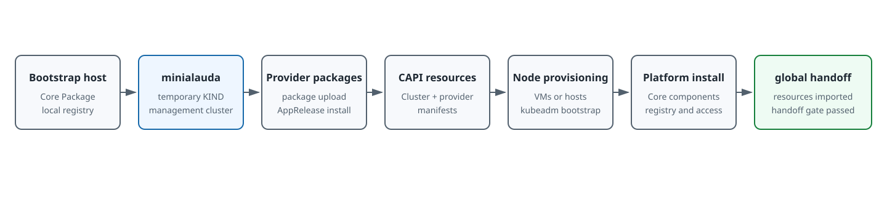

# Installing the global Cluster

This document describes how to install the `global` cluster onto Immutable Infrastructure. The `global` cluster is the platform control plane and is provisioned through Cluster API. Use this path when the platform control plane must run on an immutable operating system such as Alauda OS.

For a `global` cluster on Huawei DCS, review [Alauda OS and Provider Compatibility](../overview/providers/huawei-dcs.mdx#alauda-os-and-provider-compatibility) before selecting the DCS Provider package and VM template.

## When to Use This Path

Choose this installation path when all of the following conditions apply:

- You want the `global` cluster to run on an immutable operating system. Alauda OS is the supported image today.
- Your infrastructure is one of the documented providers: Huawei DCS, VMware vSphere, Huawei Cloud Stack, or Bare Metal.
- You can run a temporary bootstrap host that has network access to the target IaaS platform.

For traditional operating systems such as Ubuntu or RHEL, use <ExternalSiteLink name="acp" href="/install/index.html" children="the standard installation path" /> instead.

## Common Prerequisites \{#common-prerequisites}

The following prerequisites apply to every provider:

- A bootstrap host that meets the [Bootstrap Host Requirements](#bootstrap-host-requirements).
- The Core Package from the Customer Portal.
- The Alauda Container Platform Kubeadm Provider package.
- The infrastructure provider package for your target platform.
- Network reachability between the bootstrap host and the target IaaS platform API endpoint. See [Network](#bootstrap-host-network).
- IP and hostname planning for the `global` control plane and worker nodes. See [Infrastructure Resources](../infrastructure/index.mdx) for the resource model used by each provider.
- A stable Kubernetes API endpoint for the `global` cluster. Select and validate the provider-specific endpoint mode in [Plan the Control Plane Endpoint](../how-to/control-plane-endpoint.mdx) before you create the cluster.
- A platform access address, registry address, and Pod and Service CIDR ranges.
- For x86_64 nodes that use ACP-provided Alauda OS images, the underlying CPUs must support the `x86-64-v2` ISA baseline. See [OS Support Matrix](../overview/os-support-matrix.mdx).

<Directive type="warning" title="Naming Convention (Required)">
  This rule applies to **every** infrastructure provider supported by this install path — Huawei DCS, Huawei Cloud Stack, VMware vSphere, and any provider added in the future. Every manifest you author in Step 4 must follow it. Misnaming these resources has two distinct failure modes, both detailed below; one breaks initial provisioning, the other only surfaces during disaster recovery.

  - The CAPI `Cluster` and the provider's infrastructure cluster resource (for example, `DCSCluster` for Huawei DCS or `HCSCluster` for Huawei Cloud Stack; each provider has its own equivalent) **must** be named exactly `global`. `cpaas-installer` looks them up by literal name, and the Huawei Cloud Stack provider only allocates the global ELB listener ports (`11443` for the registry and console, `2379` for DR etcd synchronization, `443` for web access) when the infra cluster is named `global`. A different name silently breaks registry pull, DR etcd synchronization, and the web console.
  - Every other CAPI resource (`KubeadmControlPlane`, `KubeadmConfigTemplate`, `MachineDeployment`) and every other provider infrastructure resource (machine templates, IP/hostname pools, machine config pools, and any other per-provider resource) **must** use a name with the `global-` prefix. The DR (failover) mechanism uses this prefix to identify resources owned by the `global` cluster. **A `global` cluster resource without the `global-` prefix is invisible to DR and causes the standby cluster's machines to be deleted at failover time** — the cluster will provision and run normally, then lose nodes the first time DR is exercised. This is a hard requirement, not a stylistic convention.
  - `Cluster.spec.controlPlaneRef.name` and any other cross-references must match the prefixed names exactly.
</Directive>

## Bootstrap Host Requirements \{#bootstrap-host-requirements}

The bootstrap host is a temporary machine that runs `setup.sh` from the Core Package. For the duration of the installation it carries the KIND-based `minialauda` management cluster, the embedded platform registry, the Cluster API bootstrap and infrastructure providers, and `cpaas-installer`. It never joins the `global` cluster, and it is removed after handoff — see [Decommission the Bootstrap Cluster](#decommission-bootstrap-cluster).

Size it for the image payload it serves rather than for steady-state load: while the cluster is being provisioned, every `global` node pulls the platform image set from this host.

### Hardware \{#bootstrap-host-hardware}

| Resource | Minimum (x86_64) |
|---|---|
| CPU | 8 cores |
| Memory | 16 GB |
| Disk | 300 GB or more, available to both the extraction directory (`/root/cpaas-install`) and `/var/cpaas` |

The CPU and memory minimums match the documented per-node minimum for a control plane node in <ExternalSiteLink name="acp" href="/install/prepare/prerequisites.html" children="Prerequisites" />. On the traditional install path the machine that runs `setup.sh` becomes the first control plane node and has to meet that figure; the bootstrap host on this path does comparable work — it extracts the Core Package, serves the platform registry, and runs the bootstrap control plane — so it is sized to the same minimum.

On arm64, apply the platform's ARM convention from the same page: at least 1.5x and preferably 2x the x86_64 figures, which gives **12 cores / 24 GB** as the minimum and **16 cores / 32 GB** as the recommended configuration.

Disk is the resource that most often stalls a bootstrap. Budget it in three parts:

| Consumer | Space |
|---|---|
| Extracted Core Package | At least 100 GB after extraction. See <ExternalSiteLink name="acp" href="/install/installing.html" children="Installing" /> |
| Embedded registry data under `/var/cpaas` | The platform image payload for the target release, plus the Aligned Extension packages you copy into `plugins/` |
| Provider packages and OS artifacts staged for upload | The Kubeadm and infrastructure provider packages, plus one Alauda OS image or VM template artifact per node architecture |

### Operating System \{#bootstrap-host-os}

The bootstrap host runs a traditional operating system, not Alauda OS. It needs a 64-bit Linux distribution with Bash and `root` privilege, so that `setup.sh` can bring up the bootstrap cluster described in Step 2.

The requirements in <ExternalSiteLink name="acp" href="/install/prepare/node_preprocessing.html" children="Node Preprocessing" /> — the validated OS and kernel list, the SSH user, and the `sshd_config` settings — do **not** apply to the bootstrap host on this install path. They govern traditional-OS machines that the platform joins to a cluster over SSH, and the bootstrap host never joins the `global` cluster. This differs from <ExternalSiteLink name="acp" href="/install/installing.html" children="the traditional install path" />, where the machine that runs `setup.sh` becomes the first control plane node and must therefore meet them.

When no other constraint applies, choosing a distribution from that validated list is still a safe default.

<Directive type="info" title="The x86-64-v2 baseline applies to cluster nodes, not to the bootstrap host">
  The `x86-64-v2` ISA baseline in [OS Support Matrix](../overview/os-support-matrix.mdx) applies to cluster nodes created from ACP-provided Alauda OS images. The platform does not impose that baseline on x86_64 machines running a user-provided traditional operating system, so it is not a requirement for the bootstrap host itself. See <ExternalSiteLink name="acp" href="/install/prepare/node_preprocessing.html" children="Node Preprocessing" />.

  If the bootstrap host is a virtual machine on the same infrastructure that will back the cluster nodes, inspecting its CPU flags can surface a missing baseline early. It is not a substitute for verifying `x86-64-v2` on the hosts that will actually run the Alauda OS nodes, because the flags a guest sees depend on the hypervisor CPU model.
</Directive>

### Network \{#bootstrap-host-network}

The bootstrap host needs a **static IP address** that does not change for the lifetime of the installation. `HOST_IP` is written into the `cpaas.io/registry-address` annotation that provisioned nodes use to pull images, and, for Bare Metal, into the registration endpoint and the SAN of its serving certificate. An address change part-way through the installation breaks node provisioning.

| From | To | Port | Purpose |
|---|---|---|---|
| Bootstrap host | Target IaaS platform API | Provider-specific: DCS VRM `TCP/7443` and DCS physical host MGMT (typically `TCP/8443`); vCenter `TCP/443`; the HCS API and IAM endpoints | The Cluster API providers run inside `minialauda` and reconcile machines through the IaaS API. For DCS this path also carries the Ignition ISO upload; see [Creating a Cluster on Huawei DCS](../create-cluster/huawei-dcs.mdx) |
| Bootstrap host | `global` control plane endpoint | `TCP/6443` | Cluster API must reach the endpoint while the control plane is created. See [Plan the Control Plane Endpoint](../how-to/control-plane-endpoint.mdx) |
| `global` nodes being provisioned | Bootstrap host registry | `TCP/11443` | Nodes pull platform images from `NODE_REGISTRY_ADDRESS` until the `global` cluster's own registry takes over |
| `global` hosts, Bare Metal only | Bootstrap host | `TCP/12443` | Elemental registration endpoint used during the bootstrap phase |

## Compatibility and Version Inputs

Before installation, record the supported version set for the delivery package:

| Input | Purpose |
|-------|---------|
| Core Package version | Provides the installer, local registry, and base platform payload. |
| Kubeadm provider chart version | Must match the Cluster API control plane resources used by the global manifest. |
| Infrastructure provider chart version | Use the VMware vSphere, DCS, HCS, or Bare Metal provider chart version delivered with the target release. |
| Alauda OS image or VM template | Must contain the Kubernetes version used by `K8S_VERSION`. |
| `K8S_VERSION` | Use v-prefixed semver that matches the target Alauda OS image, such as `v<major>.<minor>.<patch>`. |

## Installation Lifecycle



Use the following stage map to identify the input, expected result, and first diagnostic location for each part of the installation.

| Stage | Input | Apply | Expected result | Diagnose first |
|---|---|---|---|---|
| Bootstrap environment | Core Package and bootstrap host | Run `setup.sh` | The `minialauda` management cluster, local registry, and installer Pods are running. | Bootstrap host containers and Pods in `cpaas-system`. |
| Provider delivery | Kubeadm and infrastructure provider packages | Push packages and apply provider `AppRelease` objects. | Provider CRDs and controllers are Ready. | `AppRelease` status, provider Pods, and registry access. |
| Cluster definition | Provider credentials, endpoint, network, node, and image values | Apply the complete Cluster API manifest. | `Cluster`, infrastructure cluster, control plane, and machine resources appear. | Resource conditions and provider-controller logs. |
| Node provisioning | VM template or registered hosts | Let the infrastructure provider reconcile the Machines. | VMs or physical hosts boot and receive kubeadm bootstrap data. | Provider Machine objects, IaaS events, and guest initialization logs. |
| Control plane | Kubernetes and component versions | Wait for `KubeadmControlPlane`. | The expected control-plane replicas are Ready and the API endpoint responds. | `KubeadmControlPlane`, Machines, etcd, and endpoint health. |
| Platform installation | Installer request and import resources | Trigger the installer. | ACP Core components, registry, platform access, and base modules become healthy. | Installer progress API and Pods in `cpaas-system`. |
| Handoff | Imported provider resources and credentials | Verify the final `global` cluster and every provider-specific handoff gate, then retire only `minialauda`. | The final cluster owns its providers and no longer depends on the temporary management cluster. For Bare Metal, the system-agent handoff ConfigMap matches the current endpoint, authentication profile, and complete target set. | Imported resources, provider credentials, final cluster annotations, and provider-specific handoff Jobs and ConfigMaps. |

## Procedure

### Step 1 — Prepare Common Variables

Set the common variables on the bootstrap host.

```shell
export HOST_IP="<bootstrap-host-ip>"
export LOCAL_REGISTRY_ADDRESS="127.0.0.1:11443"
export BOOTSTRAP_REGISTRY_ADDRESS="172.18.0.1:11443"
export NODE_REGISTRY_ADDRESS="${HOST_IP}:11443"
export CONTROL_PLANE_VIP="<global-control-plane-vip>"
export PLATFORM_HOST="<platform-access-domain-or-vip>"
export REGISTRY_DOMAIN="<platform-registry-domain-or-vip>:11443"
export CLUSTER_CIDR="100.3.0.0/16"
export SERVICE_CIDR="100.4.0.0/16"
export KUBE_OVN_JOIN_CIDR="<kube-ovn-join-cidr>"
export K8S_VERSION="<target-kubernetes-version>"
export INGRESS_CLASS_NAME="global-alb2"
export PROVIDER_SECRET_NAME="global-secret"
# Use v-prefixed semver that matches the target Alauda OS image.
```

Use `LOCAL_REGISTRY_ADDRESS` when pushing packages from the bootstrap host. Use `BOOTSTRAP_REGISTRY_ADDRESS` in AppRelease chart repository values because provider Pods read the chart repository from inside the bootstrap cluster's network. Use `NODE_REGISTRY_ADDRESS` (the bootstrap host's registry, `<bootstrap-host-ip>:11443`) in the Cluster API registry annotations, because provisioned `global` nodes must pull images through an address reachable from their subnet during provisioning. This is a temporary value: after the `global` cluster's own registry comes up, the installer automatically rewrites the `cpaas.io/registry-address` annotation on the `Cluster` and `DCSCluster` to the permanent platform registry, so later reconciles pull from the `global` cluster instead of the bootstrap host.

Keep the Registry formats distinct:

| Use | Format | Example |
|---|---|---|
| Registry HTTP API request | URL with `/v2/` path | `http://${LOCAL_REGISTRY_ADDRESS}/v2/ait/chart-cluster-api-provider-kubeadm/tags/list` |
| Container image reference | Registry, repository, and tag or digest | `${BOOTSTRAP_REGISTRY_ADDRESS}/ait/cluster-api-provider-kubeadm:<tag>` |
| `cpaas.io/registry-address` annotation | `<host>:<port>` only | `${NODE_REGISTRY_ADDRESS}` |
| AppRelease `repoURL` | Registry address without `/v2/` | `${BOOTSTRAP_REGISTRY_ADDRESS}` |

The `/v2/` segment belongs only to Registry HTTP API requests. Do not add it to image references, the `cpaas.io/registry-address` annotation, or AppRelease `repoURL`.

### Step 2 — Create the Bootstrap Cluster

Run the bootstrap script provided by the Core Package with Bash. This brings up a temporary KIND-based bootstrap cluster named `minialauda` on the bootstrap host — the temporary Cluster API management cluster used only to provision the `global` cluster. After it completes, make the matching `kubectl` client from the bootstrap control-plane container available on the bootstrap host and configure the exported kubeconfig.

```shell
mkdir -p /root/cpaas-install
tar -xvf <core-package> -C /root/cpaas-install
cd /root/cpaas-install/installer
bash setup.sh
mkdir -p "${HOME}/.local/bin" ~/.kube

if ! command -v kubectl >/dev/null 2>&1; then
  nerdctl cp minialauda-control-plane:/usr/bin/kubectl \
    "${HOME}/.local/bin/kubectl"
  chmod 0755 "${HOME}/.local/bin/kubectl"
  export PATH="${HOME}/.local/bin:${PATH}"
fi

cp /var/cpaas/data/alauda.kubeconfig ~/.kube/config
kubectl get nodes
```

The bootstrap script provisions an embedded registry, the Cluster API control plane, and the installer components that drive the `global` cluster installation.

By default, the embedded bootstrap Registry is anonymous and no `global-registry-auth` Secret is created. If you configured both a Registry username and password during bootstrap setup, `setup.sh` creates that Secret in `cpaas-system`.

### Step 3 — Upload and Install Provider Packages

Upload the Kubeadm provider package and the infrastructure provider package to the local registry.

The AppRelease examples below use the default anonymous bootstrap Registry and therefore do not reference `global-registry-auth`.

If the bootstrap Registry requires authentication, verify that the Secret exists before you create any provider AppRelease:

```shell
kubectl -n cpaas-system get secret global-registry-auth -o name
```

Then add both authentication fields to each provider AppRelease before applying it:

```yaml
spec:
  source:
    chartPullSecret: global-registry-auth
  values:
    global:
      registry:
        imagePullSecrets:
          - global-registry-auth
```

If the Registry is anonymous, do not create a placeholder Secret and do not add these fields. The bootstrap Secret is also not a credential-transfer mechanism: by default, workload clusters receive their Registry pull Secret from the `global` cluster's `public-registry-credential` flow, and a workload cluster can instead be bound to a dedicated registry as described in [Choose the Image Registry for a Workload Cluster](../how-to/workload-cluster-image-registry.mdx). Do not copy the bootstrap `global-registry-auth` Secret into a workload cluster.

<Directive type="info" title="Why cluster.type is Baremetal for every provider">
  The AppRelease values in the tabs below all set `global.cluster.type: Baremetal`. This is a chart-internal classifier, not the IaaS provider name. Keep `Baremetal` for the Huawei DCS, VMware vSphere, Huawei Cloud Stack, and Bare Metal `global` installations. The value drives how the platform configures node-level components; it does not select the infrastructure provider.
</Directive>

<Tabs>
  <Tab label="Huawei DCS">

Set the provider package paths and chart versions.

```shell
export DCS_PROVIDER_PACK="/root/cluster-api-provider-dcs.amd64.<version>.tgz"
export KUBEADM_PROVIDER_PACK="/root/cluster-api-provider-kubeadm.amd64.<version>.tgz"
export DCS_PROVIDER_VERSION="<dcs-provider-chart-version>"
export KUBEADM_PROVIDER_VERSION="<kubeadm-provider-chart-version>"
```

Upload the packages.

```shell
/root/cpaas-install/installer/res/amd64/packtool pack push \
  -r "${LOCAL_REGISTRY_ADDRESS}" -c "${DCS_PROVIDER_PACK}"

/root/cpaas-install/installer/res/amd64/packtool pack push \
  -r "${LOCAL_REGISTRY_ADDRESS}" -c "${KUBEADM_PROVIDER_PACK}"
```

{/* cspell:disable-next-line */}
Create and apply the AppRelease resources for the Kubeadm provider and the DCS provider.

```shell
mkdir -p /root/yamls
export DCS_PROVIDER_APPRELEASES="/root/yamls/dcs-provider-appreleases.yaml"

cat > "${DCS_PROVIDER_APPRELEASES}" <<EOF
---
apiVersion: operator.alauda.io/v1alpha1
kind: AppRelease
metadata:
  annotations:
    auto-recycle: "true"
    interval-sync: "true"
  name: cluster-api-provider-kubeadm
  namespace: cpaas-system
spec:
  destination:
    cluster: ""
    namespace: ""
  source:
    charts:
      - name: ait/chart-cluster-api-provider-kubeadm
        releaseName: cluster-api-provider-kubeadm
        targetRevision: ${KUBEADM_PROVIDER_VERSION}
    repoURL: ${BOOTSTRAP_REGISTRY_ADDRESS}
  timeout: 120
  values:
    global:
      albName: ${INGRESS_CLASS_NAME}
      auth:
        default_admin: admin@cpaas.io
      cluster:
        isGlobal: true
        name: global
        networkType: kube-ovn
        type: Baremetal
      host: ${PLATFORM_HOST}
      ingress:
        ingressClassName: ${INGRESS_CLASS_NAME}
      labelBaseDomain: cpaas.io
      namespace: cpaas-system
      platformUrl: https://${PLATFORM_HOST}
      protectSecretFiles:
        enabled: false
      region: global
      registry:
        address: ${BOOTSTRAP_REGISTRY_ADDRESS}
      replicas: 1
      scheme: https
---
apiVersion: operator.alauda.io/v1alpha1
kind: AppRelease
metadata:
  annotations:
    auto-recycle: "true"
    interval-sync: "true"
  name: cluster-api-provider-dcs
  namespace: cpaas-system
spec:
  destination:
    cluster: ""
    namespace: ""
  source:
    charts:
      - name: ait/chart-cluster-api-provider-dcs
        releaseName: cluster-api-provider-dcs
        targetRevision: ${DCS_PROVIDER_VERSION}
    repoURL: ${BOOTSTRAP_REGISTRY_ADDRESS}
  timeout: 120
  values:
    global:
      albName: ${INGRESS_CLASS_NAME}
      auth:
        default_admin: admin@cpaas.io
      cluster:
        isGlobal: true
        name: global
        networkType: kube-ovn
        type: Baremetal
      host: ${PLATFORM_HOST}
      ingress:
        ingressClassName: ${INGRESS_CLASS_NAME}
      labelBaseDomain: cpaas.io
      namespace: cpaas-system
      platformUrl: https://${PLATFORM_HOST}
      protectSecretFiles:
        enabled: false
      region: global
      registry:
        address: ${BOOTSTRAP_REGISTRY_ADDRESS}
      replicas: 1
      scheme: https
EOF

kubectl apply -f "${DCS_PROVIDER_APPRELEASES}"

until kubectl get crd kubeadmcontrolplanes.controlplane.cluster.x-k8s.io --ignore-not-found 2>/dev/null | grep -q kubeadmcontrolplanes.controlplane.cluster.x-k8s.io; do
  sleep 10
done

until kubectl get crd dcsclusters.infrastructure.cluster.x-k8s.io --ignore-not-found 2>/dev/null | grep -q dcsclusters.infrastructure.cluster.x-k8s.io; do
  sleep 10
done
```

  </Tab>
  <Tab label="VMware vSphere">

Set the provider package paths and chart versions.

```shell
export VSPHERE_PROVIDER_PACK="/root/cluster-api-provider-vsphere.amd64.<version>.tgz"
export KUBEADM_PROVIDER_PACK="/root/cluster-api-provider-kubeadm.amd64.<version>.tgz"
export VSPHERE_PROVIDER_VERSION="<vsphere-provider-chart-version>"
export KUBEADM_PROVIDER_VERSION="<kubeadm-provider-chart-version>"
```

Upload the packages.

```shell
/root/cpaas-install/installer/res/amd64/packtool pack push \
  -r "${LOCAL_REGISTRY_ADDRESS}" -c "${VSPHERE_PROVIDER_PACK}"

/root/cpaas-install/installer/res/amd64/packtool pack push \
  -r "${LOCAL_REGISTRY_ADDRESS}" -c "${KUBEADM_PROVIDER_PACK}"
```

Create and apply the AppRelease resources for the Kubeadm provider and the VMware vSphere provider.

```shell
mkdir -p /root/yamls
export VSPHERE_PROVIDER_APPRELEASES="/root/yamls/vsphere-provider-appreleases.yaml"

cat > "${VSPHERE_PROVIDER_APPRELEASES}" <<EOF
---
apiVersion: operator.alauda.io/v1alpha1
kind: AppRelease
metadata:
  annotations:
    auto-recycle: "true"
    interval-sync: "true"
  name: cluster-api-provider-kubeadm
  namespace: cpaas-system
spec:
  destination:
    cluster: ""
    namespace: ""
  source:
    charts:
      - name: ait/chart-cluster-api-provider-kubeadm
        releaseName: cluster-api-provider-kubeadm
        targetRevision: ${KUBEADM_PROVIDER_VERSION}
    repoURL: ${BOOTSTRAP_REGISTRY_ADDRESS}
  timeout: 120
  values:
    global:
      albName: ${INGRESS_CLASS_NAME}
      auth:
        default_admin: admin@cpaas.io
      cluster:
        isGlobal: true
        name: global
        networkType: kube-ovn
        type: Baremetal
      host: ${PLATFORM_HOST}
      ingress:
        ingressClassName: ${INGRESS_CLASS_NAME}
      labelBaseDomain: cpaas.io
      namespace: cpaas-system
      platformUrl: https://${PLATFORM_HOST}
      protectSecretFiles:
        enabled: false
      region: global
      registry:
        address: ${BOOTSTRAP_REGISTRY_ADDRESS}
      replicas: 1
      scheme: https
---
apiVersion: operator.alauda.io/v1alpha1
kind: AppRelease
metadata:
  annotations:
    auto-recycle: "true"
    interval-sync: "true"
  name: cluster-api-provider-vsphere
  namespace: cpaas-system
spec:
  destination:
    cluster: ""
    namespace: ""
  source:
    charts:
      - name: ait/chart-cluster-api-provider-vsphere
        releaseName: cluster-api-provider-vsphere
        targetRevision: ${VSPHERE_PROVIDER_VERSION}
    repoURL: ${BOOTSTRAP_REGISTRY_ADDRESS}
  timeout: 120
  values:
    global:
      albName: ${INGRESS_CLASS_NAME}
      auth:
        default_admin: admin@cpaas.io
      cluster:
        isGlobal: true
        name: global
        networkType: kube-ovn
        type: Baremetal
      host: ${PLATFORM_HOST}
      ingress:
        ingressClassName: ${INGRESS_CLASS_NAME}
      labelBaseDomain: cpaas.io
      namespace: cpaas-system
      platformUrl: https://${PLATFORM_HOST}
      protectSecretFiles:
        enabled: false
      region: global
      registry:
        address: ${BOOTSTRAP_REGISTRY_ADDRESS}
      replicas: 1
      scheme: https
EOF

kubectl apply -f "${VSPHERE_PROVIDER_APPRELEASES}"

until kubectl get crd kubeadmcontrolplanes.controlplane.cluster.x-k8s.io --ignore-not-found 2>/dev/null | grep -q kubeadmcontrolplanes.controlplane.cluster.x-k8s.io; do
  sleep 10
done

until kubectl get crd vsphereclusters.infrastructure.cluster.x-k8s.io --ignore-not-found 2>/dev/null | grep -q vsphereclusters.infrastructure.cluster.x-k8s.io; do
  sleep 10
done
```

  </Tab>
  <Tab label="Huawei Cloud Stack">

Set the provider package paths and chart versions.

```shell
export HCS_PROVIDER_PACK="/root/cluster-api-provider-hcs.amd64.<version>.tgz"
export KUBEADM_PROVIDER_PACK="/root/cluster-api-provider-kubeadm.amd64.<version>.tgz"
export HCS_PROVIDER_VERSION="<hcs-provider-chart-version>"
export KUBEADM_PROVIDER_VERSION="<kubeadm-provider-chart-version>"
```

Upload the packages.

```shell
/root/cpaas-install/installer/res/amd64/packtool pack push \
  -r "${LOCAL_REGISTRY_ADDRESS}" -c "${HCS_PROVIDER_PACK}"

/root/cpaas-install/installer/res/amd64/packtool pack push \
  -r "${LOCAL_REGISTRY_ADDRESS}" -c "${KUBEADM_PROVIDER_PACK}"
```

{/* cspell:disable-next-line */}
Create and apply the AppRelease resources for the Kubeadm provider and the HCS provider.

```shell
mkdir -p /root/yamls
export HCS_PROVIDER_APPRELEASES="/root/yamls/hcs-provider-appreleases.yaml"

cat > "${HCS_PROVIDER_APPRELEASES}" <<EOF
---
apiVersion: operator.alauda.io/v1alpha1
kind: AppRelease
metadata:
  annotations:
    auto-recycle: "true"
    interval-sync: "true"
  name: cluster-api-provider-kubeadm
  namespace: cpaas-system
spec:
  destination:
    cluster: ""
    namespace: ""
  source:
    charts:
      - name: ait/chart-cluster-api-provider-kubeadm
        releaseName: cluster-api-provider-kubeadm
        targetRevision: ${KUBEADM_PROVIDER_VERSION}
    repoURL: ${BOOTSTRAP_REGISTRY_ADDRESS}
  timeout: 120
  values:
    global:
      albName: ${INGRESS_CLASS_NAME}
      auth:
        default_admin: admin@cpaas.io
      cluster:
        isGlobal: true
        name: global
        networkType: kube-ovn
        type: Baremetal
      host: ${PLATFORM_HOST}
      ingress:
        ingressClassName: ${INGRESS_CLASS_NAME}
      labelBaseDomain: cpaas.io
      namespace: cpaas-system
      platformUrl: https://${PLATFORM_HOST}
      protectSecretFiles:
        enabled: false
      region: global
      registry:
        address: ${BOOTSTRAP_REGISTRY_ADDRESS}
      replicas: 1
      scheme: https
---
apiVersion: operator.alauda.io/v1alpha1
kind: AppRelease
metadata:
  annotations:
    auto-recycle: "true"
    interval-sync: "true"
  name: cluster-api-provider-hcs
  namespace: cpaas-system
spec:
  destination:
    cluster: ""
    namespace: ""
  source:
    charts:
      - name: ait/chart-cluster-api-provider-hcs
        releaseName: cluster-api-provider-hcs
        targetRevision: ${HCS_PROVIDER_VERSION}
    repoURL: ${BOOTSTRAP_REGISTRY_ADDRESS}
  timeout: 120
  values:
    global:
      albName: ${INGRESS_CLASS_NAME}
      auth:
        default_admin: admin@cpaas.io
      cluster:
        isGlobal: true
        name: global
        networkType: kube-ovn
        type: Baremetal
      host: ${PLATFORM_HOST}
      ingress:
        ingressClassName: ${INGRESS_CLASS_NAME}
      labelBaseDomain: cpaas.io
      namespace: cpaas-system
      platformUrl: https://${PLATFORM_HOST}
      protectSecretFiles:
        enabled: false
      region: global
      registry:
        address: ${BOOTSTRAP_REGISTRY_ADDRESS}
      replicas: 1
      scheme: https
EOF

kubectl apply -f "${HCS_PROVIDER_APPRELEASES}"

until kubectl get crd kubeadmcontrolplanes.controlplane.cluster.x-k8s.io --ignore-not-found 2>/dev/null | grep -q kubeadmcontrolplanes.controlplane.cluster.x-k8s.io; do
  sleep 10
done

until kubectl get crd hcsclusters.infrastructure.cluster.x-k8s.io --ignore-not-found 2>/dev/null | grep -q hcsclusters.infrastructure.cluster.x-k8s.io; do
  sleep 10
done
```

  </Tab>
  <Tab label="Bare Metal">

Set the provider package paths and chart versions.

```shell
export BAREMETAL_PROVIDER_PACK="/root/cluster-api-provider-baremetal.amd64.<version>.tgz"
export KUBEADM_PROVIDER_PACK="/root/cluster-api-provider-kubeadm.amd64.<version>.tgz"
export BAREMETAL_PROVIDER_VERSION="<baremetal-provider-chart-version>"
export KUBEADM_PROVIDER_VERSION="<kubeadm-provider-chart-version>"
```

Upload the packages.

```shell
/root/cpaas-install/installer/res/amd64/packtool pack push \
  -r "${LOCAL_REGISTRY_ADDRESS}" -c "${BAREMETAL_PROVIDER_PACK}"

/root/cpaas-install/installer/res/amd64/packtool pack push \
  -r "${LOCAL_REGISTRY_ADDRESS}" -c "${KUBEADM_PROVIDER_PACK}"
```

Create and apply the AppRelease resources for the Kubeadm provider and the Bare Metal provider.

<Directive type="warning" title="Bare Metal Bootstrap Endpoint">
  During bootstrap, the `global` cluster has not handed control to the final VIP yet. Keep the bare-metal registration path on the bootstrap host: `global.platformUrl` points to the bootstrap host, and `elemental.server.url` points to `https://<bootstrap-host-ip>:12443`. Do not set `baremetal.cluster.io/system-agent-server-url` on the `MachineRegistration` used for the `global` machines during this phase. For Bare Metal DR, add `baremetal.cluster.io/system-agent-auth-scope: global` to that bootstrap `MachineRegistration`; this is the only DR-specific system-agent annotation required before handoff. The DR handoff job later moves those machines to the local direct API endpoint at `https://<CONTROL_PLANE_VIP>:6443`.
</Directive>

Prepare the bootstrap HTTPS certificate used by `global-alb2` before you install the Bare Metal provider. The `elemental-operator` mounts the CA from `cpaas-system/dex.tls`, and `elemental-system-agent` uses that CA when `elemental.tls.agentTLSMode` is `strict`. The Secret must contain `tls.crt`, `tls.key`, and the CA bundle key that you configure in the AppRelease, shown below as `ca.crt`. The serving certificate must include `${HOST_IP}` as an IP SAN because the bootstrap endpoint is `https://${HOST_IP}:12443`.

If cert-manager is available in the bootstrap cluster, create or refresh `dex.tls` with a bootstrap-local CA:

```shell
kubectl get crd certificates.cert-manager.io issuers.cert-manager.io

kubectl -n cpaas-system apply -f - <<EOF
apiVersion: cert-manager.io/v1
kind: Issuer
metadata:
  name: baremetal-bootstrap-selfsigned
  namespace: cpaas-system
spec:
  selfSigned: {}
---
apiVersion: cert-manager.io/v1
kind: Certificate
metadata:
  name: baremetal-bootstrap-ca
  namespace: cpaas-system
spec:
  secretName: baremetal-bootstrap-ca
  commonName: baremetal-bootstrap-ca
  duration: 87600h
  renewBefore: 720h
  isCA: true
  privateKey:
    algorithm: RSA
    size: 2048
  usages:
    - cert sign
    - crl sign
  issuerRef:
    name: baremetal-bootstrap-selfsigned
    kind: Issuer
---
apiVersion: cert-manager.io/v1
kind: Issuer
metadata:
  name: baremetal-bootstrap-ca
  namespace: cpaas-system
spec:
  ca:
    secretName: baremetal-bootstrap-ca
---
apiVersion: cert-manager.io/v1
kind: Certificate
metadata:
  name: dex-tls-bootstrap
  namespace: cpaas-system
spec:
  secretName: dex.tls
  commonName: ${HOST_IP}
  duration: 87600h
  renewBefore: 720h
  privateKey:
    algorithm: RSA
    size: 2048
  usages:
    - digital signature
    - key encipherment
    - server auth
  ipAddresses:
    - "${HOST_IP}"
    - "127.0.0.1"
  dnsNames:
    - global-alb2
    - global-alb2.cpaas-system.svc
    - global-alb2.cpaas-system.svc.cluster.local
  issuerRef:
    name: baremetal-bootstrap-ca
    kind: Issuer
EOF

kubectl -n cpaas-system wait certificate/baremetal-bootstrap-ca \
  --for=condition=Ready \
  --timeout=120s
kubectl -n cpaas-system wait certificate/dex-tls-bootstrap \
  --for=condition=Ready \
  --timeout=120s
```

Verify that the Secret has the expected keys and that the certificate is valid for the bootstrap endpoint:

```shell
kubectl -n cpaas-system get secret dex.tls \
  -o jsonpath='{.data.tls\.crt}{" "}{.data.tls\.key}{" "}{.data.ca\.crt}{"\n"}'

tmp_dir=$(mktemp -d)
trap 'rm -rf "${tmp_dir}"' EXIT
kubectl -n cpaas-system get secret dex.tls \
  -o jsonpath='{.data.ca\.crt}' | base64 -d > "${tmp_dir}/ca.crt"
kubectl -n cpaas-system get secret dex.tls \
  -o jsonpath='{.data.tls\.crt}' | base64 -d > "${tmp_dir}/tls.crt"

openssl verify -CAfile "${tmp_dir}/ca.crt" "${tmp_dir}/tls.crt"
openssl x509 -in "${tmp_dir}/tls.crt" -noout -text | grep "IP Address:${HOST_IP}"

echo | openssl s_client \
  -connect "${HOST_IP}:12443" \
  -servername "${HOST_IP}" \
  -CAfile "${tmp_dir}/ca.crt" \
  -verify_return_error 2>&1 | grep "Verify return code: 0 (ok)"
```

If the bootstrap ALB keeps serving an older certificate, restart it and verify again:

```shell
kubectl -n cpaas-system rollout restart deploy/global-alb2
kubectl -n cpaas-system rollout status deploy/global-alb2
```

Do not include this bootstrap `dex.tls` in `dcs-import-extra-resources`. It is only for the temporary bootstrap endpoint. The final `global` cluster's `dex.tls` is created or maintained by the installer platform certificate flow. For DR, use the `thirdParty` console certificate guidance in Step 8 so both sides serve a certificate for the stable platform domain. A control-plane VIP needs to be in that platform certificate only when clients intentionally access platform HTTPS directly through that VIP. The Global registry on port `11443` presents its own `global-registry-server` certificate chain and is not configured by `console.cert` or `dex.tls`.

```shell
mkdir -p /root/yamls
export BAREMETAL_PROVIDER_APPRELEASES="/root/yamls/baremetal-provider-appreleases.yaml"

cat > "${BAREMETAL_PROVIDER_APPRELEASES}" <<EOF
---
apiVersion: operator.alauda.io/v1alpha1
kind: AppRelease
metadata:
  annotations:
    auto-recycle: "true"
    interval-sync: "true"
  name: cluster-api-provider-kubeadm
  namespace: cpaas-system
spec:
  destination:
    cluster: ""
    namespace: ""
  source:
    charts:
      - name: ait/chart-cluster-api-provider-kubeadm
        releaseName: cluster-api-provider-kubeadm
        targetRevision: ${KUBEADM_PROVIDER_VERSION}
    repoURL: ${BOOTSTRAP_REGISTRY_ADDRESS}
  timeout: 120
  values:
    global:
      albName: ${INGRESS_CLASS_NAME}
      auth:
        default_admin: admin@cpaas.io
      cluster:
        isGlobal: true
        name: global
        networkType: kube-ovn
        type: Baremetal
      host: ${PLATFORM_HOST}
      ingress:
        ingressClassName: ${INGRESS_CLASS_NAME}
      labelBaseDomain: cpaas.io
      namespace: cpaas-system
      platformUrl: https://${PLATFORM_HOST}
      protectSecretFiles:
        enabled: false
      region: global
      registry:
        address: ${BOOTSTRAP_REGISTRY_ADDRESS}
      replicas: 1
      scheme: https
---
apiVersion: operator.alauda.io/v1alpha1
kind: AppRelease
metadata:
  annotations:
    auto-recycle: "true"
    interval-sync: "true"
  name: cluster-api-provider-baremetal
  namespace: cpaas-system
spec:
  destination:
    cluster: ""
    namespace: ""
  source:
    charts:
      - name: ait/chart-cluster-api-provider-baremetal
        releaseName: cluster-api-provider-baremetal
        targetRevision: ${BAREMETAL_PROVIDER_VERSION}
    repoURL: ${BOOTSTRAP_REGISTRY_ADDRESS}
  timeout: 120
  values:
    global:
      albName: ${INGRESS_CLASS_NAME}
      auth:
        default_admin: admin@cpaas.io
      cluster:
        isGlobal: true
        name: global
        networkType: kube-ovn
        type: Baremetal
      host: ${PLATFORM_HOST}
      ingress:
        ingressClassName: ${INGRESS_CLASS_NAME}
        tls:
          secretName: dex.tls
      labelBaseDomain: cpaas.io
      namespace: cpaas-system
      platformUrl: https://${HOST_IP}
      protectSecretFiles:
        enabled: false
      region: global
      registry:
        address: ${BOOTSTRAP_REGISTRY_ADDRESS}
      replicas: 1
      scheme: https
    handoffHook:
      # Normal non-DR bootstrap baseline. Bare Metal DR must patch this to true
      # before calling the installer API, as shown in Optional Disaster Recovery Deployment.
      directAPIServer: false
      controlPlaneVIP: ${CONTROL_PLANE_VIP}
      delivery:
        enabled: true
        mode: always
    elemental:
      server:
        url: https://${HOST_IP}:12443
      systemAgent:
        authMode: shared
        # Normal non-DR bootstrap baseline. Bare Metal DR must enable the split
        # and set sharedAuthReadOnly according to this side's active/standby role.
        splitAuthEnabled: false
        serviceAccountName: baremetal-system-agent
        globalServiceAccountName: baremetal-global-system-agent
        sharedAuthReadOnly: false
      tls:
        agentTLSMode: strict
        caCertSecretName: dex.tls
        caCertSecretKey: ca.crt
EOF

kubectl apply -f "${BAREMETAL_PROVIDER_APPRELEASES}"

until kubectl get crd kubeadmcontrolplanes.controlplane.cluster.x-k8s.io --ignore-not-found 2>/dev/null | grep -q kubeadmcontrolplanes.controlplane.cluster.x-k8s.io; do
  sleep 10
done

until kubectl get crd baremetalclusters.infrastructure.cluster.x-k8s.io --ignore-not-found 2>/dev/null | grep -q baremetalclusters.infrastructure.cluster.x-k8s.io; do
  sleep 10
done

until kubectl get crd machineinventories.elemental.cattle.io --ignore-not-found 2>/dev/null | grep -q machineinventories.elemental.cattle.io; do
  sleep 10
done
```

The complete AppRelease above intentionally shows the normal, non-DR baseline. For a Bare Metal DR installation, do not call the installer API with those three baseline values unchanged. Apply the role-specific DR patch in [Optional Disaster Recovery Deployment](#optional-disaster-recovery-deployment) first, and verify the effective AppRelease values on that bootstrap cluster.

After the provider starts, verify that the chart values were accepted. A CrashLoopBackOff with an unknown flag such as `--system-agent-auth-mode` means the AppRelease chart and the elemental-operator image do not match; install a chart and image from the same release payload before continuing.

```shell
kubectl -n cpaas-system get pods | grep -E 'cluster-api-provider-baremetal|elemental'
kubectl -n cpaas-system logs deploy/elemental-operator --tail=100
```

  </Tab>
</Tabs>

### Step 4 — Configure the Provider-Specific global Manifest

Create one provider-specific manifest for the `global` cluster. The manifest uses the same provider resources as a workload cluster, but it must also include the global-specific labels, annotations, registry values, installer-compatible kubeadm settings, and persistent data paths required by the platform control plane.

Use the provider creation guides as the detailed resource reference:

- Huawei DCS: [Creating Clusters on Huawei DCS](../create-cluster/huawei-dcs.mdx)
- VMware vSphere: [Infrastructure Preparation](../infrastructure/vmware-vsphere.mdx) and [Creating Clusters on VMware vSphere](../create-cluster/vmware-vsphere.mdx)
- Huawei Cloud Stack: [Creating Clusters on Huawei Cloud Stack](../create-cluster/huawei-cloud-stack.mdx)

Apply the [naming convention from Common Prerequisites](#common-prerequisites) to every resource in the manifest you author below.

Set `KubeadmControlPlane.spec.kubeadmConfigSpec.format` to the value that the target provider accepts. This is an API field: enter `cloud-config`, not `cloud-init`. For the providers below, `cloud-init` is the guest operating-system software that receives and applies the generated `cloud-config` data. The provider controllers enforce the field value:

| Provider | Bootstrap userdata format |
|----------|---------------------------|
| Huawei DCS | `ignition` (provider-enforced; the DCS provider rejects any other format with `invalid format, expected ignition, got <other>`). |
| VMware vSphere | `cloud-config` (CAPI bootstrap data is processed by the guest `cloud-init` software; setting `ignition` is not supported). |
| Huawei Cloud Stack | `cloud-config` (the HCS provider rejects `ignition`; the guest processes the generated data with `cloud-init`). |
| Bare Metal | `cloud-config` (the bare-metal provider consumes CAPI bootstrap data and renders elemental plans that the guest processes with `cloud-init`). |

<Tabs>
  <Tab label="Huawei DCS">

Set the output path for the DCS `global` manifest before you render it.

```shell
export GLOBAL_DCS_YAML="/root/yamls/new-global.yaml"
```

The DCS `global` manifest must contain the following resources in the `cpaas-system` namespace:

| Resource | Purpose |
|----------|---------|
| `Secret` with `type: CloudCredential` | Stores `authUser`, `authKey`, `endpoint`, and `site` for DCS API access. |
| `DCSIpHostnamePool` for control plane nodes | Assigns static IPs, hostnames, network settings, and any pool-managed persistent disks. |
| `DCSMachineTemplate` for control plane nodes | Defines the DCS VM template, folder, CPU, memory, and template-local disks. |
| `KubeadmControlPlane` | Bootstraps the Kubernetes control plane. Set `spec.version` to `${K8S_VERSION}`. |
| `DCSCluster` | Defines the DCS infrastructure cluster and control plane endpoint. |
| `Cluster` | Connects the Cluster API `Cluster` to `DCSCluster` and `KubeadmControlPlane`. |
| `DCSIpHostnamePool`, `DCSMachineTemplate`, `KubeadmConfigTemplate`, and `MachineDeployment` for workers | Creates worker nodes. |

Use the DCS resource fields from [Creating Clusters on Huawei DCS](../create-cluster/huawei-dcs.mdx) and [Infrastructure Resources for Huawei DCS](../infrastructure/huawei-dcs.mdx). For the `global` cluster, keep these additional requirements:

- Set `Cluster.metadata.name` and `DCSCluster.metadata.name` to `global` (the infra cluster shares the CAPI `Cluster` name). Prefix every other CAPI resource and provider resource with `global-`; the wiring fragment below uses `KubeadmControlPlane.metadata.name: global-kcp`.
- Set `DCSCluster.spec.credentialSecretRef.name` to `${PROVIDER_SECRET_NAME}`. Step 7 imports this Secret into the final `global` cluster.
- Add `Cluster.metadata.labels.is-global: "true"` and `Cluster.metadata.labels.cluster-type: DCS`.
- Add `Cluster.metadata.annotations["cpaas.io/registry-address"]` with `${NODE_REGISTRY_ADDRESS}`.
- Set `KubeadmControlPlane.spec.kubeadmConfigSpec.format: ignition` for Alauda OS.
- With DCS Provider `v1.0.21`, use an external LoadBalancer and set `DCSCluster.spec.controlPlaneLoadBalancer.type: external`. Validate the listener, backends, health check, and reachability in [Plan the Control Plane Endpoint](../how-to/control-plane-endpoint.mdx). Do not set `type: internal` for this provider release.
- Keep the `KubeadmControlPlane.spec.kubeadmConfigSpec.users` entry with a non-empty `sshAuthorizedKeys` list (the `boot` user). The DCS `ignition` format rejects an empty SSH key list, so this field is required even for a `global` cluster you do not plan to access over SSH. See [Resolving Placeholder Values](../create-cluster/huawei-dcs.mdx#resolving-placeholders) for what to supply when no interactive key is needed.
- Keep the non-encryption kubeadm files, kubelet patches, audit policy, and installer RBAC entries. The file contents (the PodSecurity admission config, the kubelet patch, and the audit policy), together with the full `clusterConfiguration`, `preKubeadmCommands`, `postKubeadmCommands`, and the init and join node-registration patches, are identical to a workload cluster. Copy them from the [Complete KubeadmControlPlane Configuration](../create-cluster/huawei-dcs.mdx#complete-kubeadmcontrolplane-configuration) appendix, or reference the `dcs-kubernetes-<major.minor>-files` Secret documented there. The wiring fragment below shows only the `global`-specific fields layered on top of that base.
- For a normal non-DR deployment, do not set `DCSCluster.spec.encryptionProviderConfigRef` and do not add `/etc/kubernetes/encryption-provider.conf` to `KubeadmControlPlane.spec.kubeadmConfigSpec.files`.
- Keep `/var/cpaas` as platform state. If you need the disk to survive rolling replacement, declare it in `DCSIpHostnamePool.spec.pool[].persistentDisk`; do not rely on `DCSMachineTemplate` template disks as preserved state.
- Use concrete `datastoreName` values for DCS local storage unless you have verified that the selected datastore cluster can place volumes on hosts that can run the target VM.

<Directive type="warning" title="Fragment Scope">
  The following YAML is a differential fragment, not a complete manifest that you can apply directly. Merge these `global`-specific changes into the manifest that you prepare from the DCS create-cluster references, then apply the complete manifest file. If you would rather start from a complete file, adapt the [Worked Example: Complete `global` Manifest for Huawei DCS](#dcs-worked-example) at the end of this page instead of assembling it from fragments.
</Directive>

The following fragment shows the `global`-specific Cluster API wiring. Fill the provider resource fields by using the DCS create-cluster references above.

```yaml
apiVersion: cluster.x-k8s.io/v1beta1
kind: Cluster
metadata:
  name: global
  namespace: cpaas-system
  labels:
    cluster-type: DCS
    is-global: "true"
  annotations:
    capi.cpaas.io/resource-group-version: infrastructure.cluster.x-k8s.io/v1beta1
    capi.cpaas.io/resource-kind: DCSCluster
    cpaas.io/registry-address: "${NODE_REGISTRY_ADDRESS}"
spec:
  clusterNetwork:
    pods:
      cidrBlocks:
        - ${CLUSTER_CIDR}
    services:
      cidrBlocks:
        - ${SERVICE_CIDR}
  controlPlaneRef:
    apiVersion: controlplane.cluster.x-k8s.io/v1beta1
    kind: KubeadmControlPlane
    name: global-kcp
  infrastructureRef:
    apiVersion: infrastructure.cluster.x-k8s.io/v1beta1
    kind: DCSCluster
    name: global
---
apiVersion: controlplane.cluster.x-k8s.io/v1beta1
kind: KubeadmControlPlane
metadata:
  name: global-kcp
  namespace: cpaas-system
  annotations:
    controlplane.cluster.x-k8s.io/skip-kube-proxy: ""
spec:
  replicas: 3
  version: ${K8S_VERSION}
  rolloutStrategy:
    type: RollingUpdate
    rollingUpdate:
      maxSurge: 0
  machineTemplate:
    nodeDrainTimeout: 1m
    nodeDeletionTimeout: 5m
    infrastructureRef:
      apiVersion: infrastructure.cluster.x-k8s.io/v1beta1
      kind: DCSMachineTemplate
      name: global-cp-template
  kubeadmConfigSpec:
    format: ignition
    clusterConfiguration:
      etcd:
        local:
          serverCertSANs:
            - "${CONTROL_PLANE_VIP}"
            - "${PLATFORM_HOST}"
```

  </Tab>
  <Tab label="VMware vSphere">

Set the output path for the VMware vSphere `global` manifest before you render it.

```shell
export GLOBAL_VSPHERE_YAML="/root/yamls/new-global.yaml"
```

The VMware vSphere `global` manifest must contain the following resources in the `cpaas-system` namespace:

| Resource | Purpose |
|----------|---------|
| `Secret` (must be named `global-vsphere-credentials`) | Stores the vCenter username and password. Must be referenced by `VSphereCluster.spec.identityRef.name`. The fixed name is required for the vSphere `global` install path: the import ConfigMap in Step 7 and the DR section hardcode this exact name. |
| `VSphereMachineConfigPool` for control plane nodes | Assigns static hostnames, datacenter values, IP addresses, network settings, and optional data disks. |
| `VSphereMachineTemplate` for control plane nodes | Defines the VM template, clone mode, CPU, memory, datastore, folder, network devices, and system disk settings. |
| `KubeadmControlPlane` | Bootstraps the Kubernetes control plane. Set `spec.version` to `${K8S_VERSION}`. |
| `VSphereCluster` | Defines the vCenter endpoint, thumbprint, credential reference, and control plane endpoint. |
| `Cluster` | Connects the Cluster API `Cluster` to `VSphereCluster` and `KubeadmControlPlane`. |
| `ClusterResourceSet`, `ConfigMap`, and `Secret` for the vSphere CPI | Delivers the vSphere CPI resources to the `global` cluster after the API server becomes reachable. |
| `VSphereMachineConfigPool`, `VSphereMachineTemplate`, `KubeadmConfigTemplate`, and `MachineDeployment` for workers | Creates worker nodes. |

Prepare the vSphere input values by using [VMware vSphere Infrastructure Preparation](../infrastructure/vmware-vsphere.mdx). Prepare the `global` cluster manifest by using [Creating Clusters on VMware vSphere](../create-cluster/vmware-vsphere.mdx) and [VMware vSphere Provider](../overview/providers/vmware-vsphere.mdx) as the base references. The create-cluster guide creates workload clusters by applying manifests to an existing `global` management cluster; it does not create the `global` cluster itself. Reuse its vSphere resource definitions only after you apply the following `global`-specific requirements:

- Set `Cluster.metadata.name` and `VSphereCluster.metadata.name` to `global` (the infra cluster shares the CAPI `Cluster` name). Prefix every other CAPI resource and provider resource with `global-`; the wiring fragment below uses `KubeadmControlPlane.metadata.name: global-kcp`.
- Add `Cluster.metadata.labels.is-global: "true"` and `Cluster.metadata.labels.cluster-type: VSphere`.
- Add `Cluster.metadata.annotations["cpaas.io/registry-address"]` with `${NODE_REGISTRY_ADDRESS}`.
- Keep the VMware vSphere annotations required by the platform controllers, including the network and CPI annotations from the VMware vSphere create-cluster guide.
- Set `VSphereMachineTemplate.spec.template.spec.folder` to `/<datacenter>/vm/global` so operators can identify the `global` cluster VMs in vCenter. In a DR deployment, use distinct child folders such as `/<datacenter>/vm/global/primary` and `/<datacenter>/vm/global/standby` for the primary and standby clusters.
- Set `VSphereCluster.spec.identityRef.name` to `global-vsphere-credentials`. This fixed Secret name is required only for the VMware vSphere `global` installation path; non-`global` VMware vSphere clusters follow the generic create-cluster guide.
- With VMware vSphere Provider `v1.0.16`, provision the external LoadBalancer before applying the manifest. Use the contract in [Plan the Control Plane Endpoint](../how-to/control-plane-endpoint.mdx); this provider release does not deploy a Self-built VIP.
- Set `KubeadmControlPlane.spec.kubeadmConfigSpec.format: cloud-config`, or leave the field unset when the provider defaults this API field to `cloud-config`. `cloud-init` is the guest software that processes the data; it is not a valid value for this field.
- Keep the release manifest's kubeadm files, including the VMware vSphere `/etc/kubernetes/encryption-provider.conf` file entry, kubelet patches, audit policy, and installer RBAC entries. VMware vSphere delivers this file through `KubeadmControlPlane.spec.kubeadmConfigSpec.files`; do not follow the DCS `DCSCluster.spec.encryptionProviderConfigRef` pattern.

<Directive type="warning" title="Fragment Scope">
  The following YAML is a differential fragment, not a complete manifest that you can apply directly. Merge these `global`-specific changes into the manifest that you prepare from the VMware vSphere create-cluster guide, then apply the complete manifest file.
</Directive>

The following fragment shows the `global`-specific Cluster API wiring. Fill the provider resource fields by using the VMware vSphere create-cluster reference above.

```yaml
apiVersion: cluster.x-k8s.io/v1beta1
kind: Cluster
metadata:
  name: global
  namespace: cpaas-system
  labels:
    cluster-type: VSphere
    is-global: "true"
    addons.cluster.x-k8s.io/vsphere-cpi: "enabled"
  annotations:
    capi.cpaas.io/resource-group-version: infrastructure.cluster.x-k8s.io/v1beta1
    capi.cpaas.io/resource-kind: VSphereCluster
    cpaas.io/alb-address-type: ClusterAddress
    cpaas.io/network-type: kube-ovn
    cpaas.io/registry-address: "${NODE_REGISTRY_ADDRESS}"
spec:
  clusterNetwork:
    pods:
      cidrBlocks:
        - ${CLUSTER_CIDR}
    services:
      cidrBlocks:
        - ${SERVICE_CIDR}
  controlPlaneRef:
    apiVersion: controlplane.cluster.x-k8s.io/v1beta1
    kind: KubeadmControlPlane
    name: global-kcp
  infrastructureRef:
    apiVersion: infrastructure.cluster.x-k8s.io/v1beta1
    kind: VSphereCluster
    name: global
---
apiVersion: controlplane.cluster.x-k8s.io/v1beta1
kind: KubeadmControlPlane
metadata:
  name: global-kcp
  namespace: cpaas-system
spec:
  replicas: 3
  version: "${K8S_VERSION}"
  rolloutStrategy:
    type: RollingUpdate
    rollingUpdate:
      maxSurge: 0
  machineTemplate:
    nodeDrainTimeout: 1m
    nodeDeletionTimeout: 5m
    infrastructureRef:
      apiVersion: infrastructure.cluster.x-k8s.io/v1beta1
      kind: VSphereMachineTemplate
      name: global-cp-machine-template
  kubeadmConfigSpec:
    format: cloud-config
    clusterConfiguration:
      etcd:
        local:
          serverCertSANs:
            - "${CONTROL_PLANE_VIP}"
            - "${PLATFORM_HOST}"
```

  </Tab>
  <Tab label="Huawei Cloud Stack">

Set the output path for the HCS `global` manifest before you render it.

```shell
export GLOBAL_HCS_YAML="/root/yamls/new-global.yaml"
```

The HCS `global` manifest must contain the following resources in the `cpaas-system` namespace:

| Resource | Purpose |
|----------|---------|
| `Secret` | Stores `accessKey`, `secretKey`, `projectID`, `region`, `externalGlobalDomain`, and optional `schema`. |
| `HCSMachineConfigPool` for control plane nodes | Assigns static hostnames, IP addresses, and any pool-managed persistent disks. |
| `Cluster` | Connects the Cluster API `Cluster` to `HCSCluster` and `KubeadmControlPlane`. |
| `HCSCluster` | Defines VPC, subnet, security group, ELB, and identity references. |
| `KubeadmControlPlane` | Bootstraps the Kubernetes control plane. Set `spec.version` to `${K8S_VERSION}`. |
| `HCSMachineTemplate` for control plane nodes | Defines image, flavor, availability zone, root volume, and temporary data volumes. |
| `HCSMachineConfigPool`, `HCSMachineTemplate`, `KubeadmConfigTemplate`, and `MachineDeployment` for workers | Creates worker nodes. |

Use the HCS resource fields from [Creating Clusters on Huawei Cloud Stack](../create-cluster/huawei-cloud-stack.mdx) and [Infrastructure Resources for Huawei Cloud Stack](../infrastructure/huawei-cloud-stack.mdx). For the `global` cluster, keep these additional requirements:

- Set `Cluster.metadata.name` and `HCSCluster.metadata.name` to `global` (the infra cluster shares the CAPI `Cluster` name). Prefix every other CAPI resource and provider resource with `global-`; the wiring fragment below uses `KubeadmControlPlane.metadata.name: global-kcp`.
- Set `HCSCluster.spec.identityRef.name` to `${PROVIDER_SECRET_NAME}`. Step 7 imports this Secret into the final `global` cluster.
- Add `Cluster.metadata.labels.is-global: "true"` and `Cluster.metadata.labels.cluster-type: HCS`.
- Add `Cluster.metadata.annotations["cpaas.io/registry-address"]` with `${NODE_REGISTRY_ADDRESS}`.
- Set `KubeadmControlPlane.spec.kubeadmConfigSpec.format: cloud-config`, or leave the field unset when the provider defaults this API field to `cloud-config`. `cloud-init` is the guest software name, not the field value.
- Keep the release manifest's non-encryption kubeadm files, kubelet patches, audit policy, and installer RBAC entries.
- For a normal non-DR deployment, do not add `/etc/kubernetes/encryption-provider.conf` to `KubeadmControlPlane.spec.kubeadmConfigSpec.files`.
- Keep `/var/cpaas` as platform state. Declare it in `HCSMachineConfigPool.spec.configs[].persistentDisks[]` when it must survive node replacement; do not rely on `HCSMachineTemplate.spec.template.spec.dataVolumes[]` as preserved state.
- Use a highly available control plane for the `global` cluster. Single-control-plane HCS clusters are creation-only topologies and are not the recommended `global` upgrade path.

<Directive type="warning" title="Fragment Scope">
  The following YAML is a differential fragment, not a complete manifest that you can apply directly. Merge these `global`-specific changes into the manifest that you prepare from the HCS create-cluster references, then apply the complete manifest file.
</Directive>

The following fragment shows the `global`-specific Cluster API wiring. Fill the provider resource fields by using the HCS create-cluster references above.

```yaml
apiVersion: cluster.x-k8s.io/v1beta1
kind: Cluster
metadata:
  name: global
  namespace: cpaas-system
  labels:
    cluster-type: HCS
    is-global: "true"
  annotations:
    capi.cpaas.io/resource-group-version: infrastructure.cluster.x-k8s.io/v1beta1
    capi.cpaas.io/resource-kind: HCSCluster
    cpaas.io/registry-address: "${NODE_REGISTRY_ADDRESS}"
spec:
  clusterNetwork:
    pods:
      cidrBlocks:
        - ${CLUSTER_CIDR}
    services:
      cidrBlocks:
        - ${SERVICE_CIDR}
  controlPlaneRef:
    apiVersion: controlplane.cluster.x-k8s.io/v1beta1
    kind: KubeadmControlPlane
    name: global-kcp
  infrastructureRef:
    apiVersion: infrastructure.cluster.x-k8s.io/v1beta1
    kind: HCSCluster
    name: global
---
apiVersion: controlplane.cluster.x-k8s.io/v1beta1
kind: KubeadmControlPlane
metadata:
  name: global-kcp
  namespace: cpaas-system
spec:
  replicas: 3
  version: "${K8S_VERSION}"
  rolloutStrategy:
    type: RollingUpdate
    rollingUpdate:
      maxSurge: 0
  machineTemplate:
    nodeDrainTimeout: 1m
    nodeDeletionTimeout: 5m
    infrastructureRef:
      apiVersion: infrastructure.cluster.x-k8s.io/v1beta1
      kind: HCSMachineTemplate
      name: global-cp-machine-template
  kubeadmConfigSpec:
    format: cloud-config
    clusterConfiguration:
      etcd:
        local:
          serverCertSANs:
            - "${CONTROL_PLANE_VIP}"
            - "${PLATFORM_HOST}"
```

  </Tab>
  <Tab label="Bare Metal">

Set the output path for the Bare Metal `global` manifest before you render it.

```shell
export GLOBAL_BAREMETAL_YAML="/root/yamls/new-global.yaml"
```

The Bare Metal `global` manifest must contain the following resources in the `cpaas-system` namespace:

| Resource | Purpose |
|----------|---------|
| `MachineRegistration` | Provides the live-ISO registration endpoint and the first-install elemental configuration for the `global` hosts. |
| `SeedImage` | Builds the bootstrap ISO used to install the `global` hosts. This ISO belongs to the bootstrap lifecycle and is not reused after handoff. |
| `MachineInventory` | Long-lived host identity created by registration. Wait for the expected inventories before applying the CAPI objects. |
| `MachineInventoryPool` for control plane nodes | Lists the exact `MachineInventory` names that can back the `global` control plane. |
| `BaremetalMachineTemplate` for control plane nodes | References the control-plane inventory pool. |
| `KubeadmControlPlane` | Bootstraps the Kubernetes control plane. Set `spec.version` to `${K8S_VERSION}`. |
| `BaremetalCluster` | Defines the control-plane VIP, VIP port, VRID, endpoint, and optional encryption provider config Secret reference. |
| `Cluster` | Connects the Cluster API `Cluster` to `BaremetalCluster` and `KubeadmControlPlane`. |
| Optional worker `MachineInventoryPool`, `BaremetalMachineTemplate`, `KubeadmConfigTemplate`, and `MachineDeployment` | Creates `global` worker nodes when the topology includes them. |

Use [Creating Clusters on Bare Metal](../create-cluster/bare-metal.mdx), [Managing Nodes on Bare Metal](../manage-nodes/bare-metal.mdx), and [Bare Metal Provider](../overview/providers/bare-metal.mdx) as the resource references. For the `global` cluster, keep these additional requirements:

- Set `Cluster.metadata.name` and `BaremetalCluster.metadata.name` to `global`. Prefix every other CAPI, bare-metal, and elemental resource with `global-`.
- Add `Cluster.metadata.labels.cluster-type: ProviderBaremetal`.
- Add `Cluster.metadata.annotations["cpaas.io/registry-address"]` with `${NODE_REGISTRY_ADDRESS}`.
- Add `Cluster.metadata.annotations["cpaas.io/kube-ovn-join-cidr"]`, `Cluster.metadata.annotations["cpaas.io/sentry-deploy-type"]: Baremetal`, and `Cluster.metadata.annotations["cpaas.io/alb-address-type"]: ClusterAddress`.
- Set `KubeadmControlPlane.spec.kubeadmConfigSpec.format: cloud-config`, or leave it unset when the provider defaults this API field to `cloud-config`. The resulting data is processed by `cloud-init` on the node.
- Set `KubeadmControlPlane.spec.rolloutStrategy.rollingUpdate.maxSurge: 0`. Bare-metal pools cannot over-provision physical hosts.
- Keep `controlplane.cluster.x-k8s.io/skip-kube-proxy: ""` on the `KubeadmControlPlane` when the release manifest uses kube-ovn.
- Put `${CONTROL_PLANE_VIP}` and `${PLATFORM_HOST}` in `KubeadmControlPlane.spec.kubeadmConfigSpec.clusterConfiguration.etcd.local.serverCertSANs`.
- Choose the Bare Metal endpoint mode in [Plan the Control Plane Endpoint](../how-to/control-plane-endpoint.mdx). For `Internal`, set the VIP, port `6443`, and a unique `vrid`. For `External`, set the external load balancer frontend address and port, and omit `vrid`.
- For a normal non-DR deployment, `BaremetalCluster.spec.encryptionProviderConfigRef` can be omitted. For DR, set it as described in [Optional Disaster Recovery Deployment](#optional-disaster-recovery-deployment); do not deliver `/etc/kubernetes/encryption-provider.conf` by adding it to `KubeadmControlPlane.spec.kubeadmConfigSpec.files`.
- For Bare Metal DR, add `baremetal.cluster.io/system-agent-auth-scope: global` to the `MachineRegistration` used for the bootstrap `global` hosts. Do not set `baremetal.cluster.io/system-agent-server-url` during bootstrap. The bootstrap ISO must register through the bootstrap host; the handoff job later moves the `global` machines to the local direct API endpoint.
- If a `global` VM or physical host does not have DHCP during the live-ISO boot, configure the NIC manually from the host console before waiting for `MachineInventory` registration. Use the same NetworkManager procedure described in [Creating Clusters on Bare Metal](../create-cluster/bare-metal.mdx#network-connectivity), replacing the example address, gateway, DNS, and connection name with the values for that host.
- Do not depend on OS hostname side effects. The bare-metal provider normalizes kubeadm node names and provider IDs from the CAPI and inventory objects.
- The `SeedImage` created in the bootstrap cluster is a bootstrap artifact. After handoff, create any new `MachineRegistration` or `SeedImage` on the active `global` cluster.

<Directive type="warning" title="Fragment Scope">
  The following YAML is a differential fragment, not a complete manifest that you can apply directly. Merge these `global`-specific changes into the manifest that you prepare from the Bare Metal create-cluster references, then apply the complete manifest file.
</Directive>

The following fragment shows the `global`-specific Cluster API wiring. Fill the inventory names, registration configuration, image references, and optional worker resources by using the Bare Metal create-cluster reference.

Set `<control-plane-load-balancer-type>` to `Internal` for provider-managed Alive or `External` for a user-provisioned LoadBalancer. When you use `External`, remove `vrid`. See [Plan the Control Plane Endpoint](../how-to/control-plane-endpoint.mdx) for the requirements of each mode.

```yaml
apiVersion: cluster.x-k8s.io/v1beta1
kind: Cluster
metadata:
  name: global
  namespace: cpaas-system
  labels:
    cluster-type: ProviderBaremetal
  annotations:
    capi.cpaas.io/resource-group-version: infrastructure.cluster.x-k8s.io/v1beta1
    capi.cpaas.io/resource-kind: BaremetalCluster
    cpaas.io/kube-ovn-join-cidr: "${KUBE_OVN_JOIN_CIDR}"
    cpaas.io/registry-address: "${NODE_REGISTRY_ADDRESS}"
    cpaas.io/sentry-deploy-type: Baremetal
    cpaas.io/alb-address-type: ClusterAddress
spec:
  clusterNetwork:
    pods:
      cidrBlocks:
        - ${CLUSTER_CIDR}
    services:
      cidrBlocks:
        - ${SERVICE_CIDR}
  controlPlaneRef:
    apiVersion: controlplane.cluster.x-k8s.io/v1beta1
    kind: KubeadmControlPlane
    name: global-kcp
  infrastructureRef:
    apiVersion: infrastructure.cluster.x-k8s.io/v1beta1
    kind: BaremetalCluster
    name: global
---
apiVersion: infrastructure.cluster.x-k8s.io/v1beta1
kind: BaremetalCluster
metadata:
  name: global
  namespace: cpaas-system
spec:
  controlPlaneLoadBalancer:
    type: <control-plane-load-balancer-type>
    host: ${CONTROL_PLANE_VIP}
    port: 6443
    # Required only for Internal. Remove this field for External.
    vrid: <unique-vrid>
    # vipMode defaults to nic. Set it explicitly only when the environment
    # requires another supported mode, such as arp or policy_route.
    # vipMode: nic
  # Required for DR. Omit this field for a normal non-DR deployment unless
  # you need to provide a pre-existing encryption-provider.conf.
  # encryptionProviderConfigRef:
  #   name: global-encryption-provider-config
---
apiVersion: infrastructure.cluster.x-k8s.io/v1beta1
kind: MachineInventoryPool
metadata:
  name: global-control-plane-pool
  namespace: cpaas-system
spec:
  clusterName: global
  machineInventories:
    - global-cp-1
    - global-cp-2
    - global-cp-3
---
apiVersion: infrastructure.cluster.x-k8s.io/v1beta1
kind: BaremetalMachineTemplate
metadata:
  name: global-control-plane-template
  namespace: cpaas-system
spec:
  template:
    spec:
      machineInventoryPoolRef:
        name: global-control-plane-pool
---
apiVersion: controlplane.cluster.x-k8s.io/v1beta1
kind: KubeadmControlPlane
metadata:
  name: global-kcp
  namespace: cpaas-system
  annotations:
    controlplane.cluster.x-k8s.io/skip-kube-proxy: ""
spec:
  replicas: 3
  version: "${K8S_VERSION}"
  rolloutStrategy:
    type: RollingUpdate
    rollingUpdate:
      maxSurge: 0
  machineTemplate:
    nodeDrainTimeout: 1m
    nodeDeletionTimeout: 5m
    infrastructureRef:
      apiVersion: infrastructure.cluster.x-k8s.io/v1beta1
      kind: BaremetalMachineTemplate
      name: global-control-plane-template
  kubeadmConfigSpec:
    format: cloud-config
    clusterConfiguration:
      etcd:
        local:
          serverCertSANs:
            - "${CONTROL_PLANE_VIP}"
            - "${PLATFORM_HOST}"
```

  </Tab>
</Tabs>

### Step 5 — Apply the global Manifest

Apply the provider-specific manifest to the bootstrap cluster.

<Tabs>
  <Tab label="Huawei DCS">

```shell
kubectl apply -f "${GLOBAL_DCS_YAML}"
```

  </Tab>
  <Tab label="VMware vSphere">

```shell
kubectl apply -f "${GLOBAL_VSPHERE_YAML}"
```

  </Tab>
  <Tab label="Huawei Cloud Stack">

```shell
kubectl apply -f "${GLOBAL_HCS_YAML}"
```

  </Tab>
  <Tab label="Bare Metal">

```shell
kubectl apply -f "${GLOBAL_BAREMETAL_YAML}"
```

Wait for the bootstrap registrations to produce the expected inventories before you expect Cluster API reconciliation to progress.

```shell
kubectl -n cpaas-system get machineinventory.elemental.cattle.io
kubectl -n cpaas-system get machineinventorypool
kubectl -n cpaas-system get baremetalcluster,baremetalmachine
```

  </Tab>
</Tabs>

### Step 6 — Wait for the Control Plane

Wait for the Cluster API provider to provision the machines and bring up the Kubernetes control plane.

```shell
kubectl get clusters.cluster.x-k8s.io -n cpaas-system
kubectl get kubeadmcontrolplane -n cpaas-system
kubectl get machines -n cpaas-system
```

The control plane is ready when the `KubeadmControlPlane` reports `Ready: True` and the `Cluster` reports `Phase: Provisioned`.

### Step 7 — Import Provider Resources

Before triggering the installer, create the `dcs-import-extra-resources` ConfigMap in the `cpaas-system` namespace for providers that require extra resource import. The ConfigMap name keeps the `dcs` prefix for historical installer compatibility, even when the provider is not Huawei DCS.

Every provider uses this ConfigMap to import the IaaS credential `Secret` into the new `global` cluster. For VMware vSphere, Huawei Cloud Stack, and Bare Metal it also imports the provider's Cluster API resources; for Huawei DCS those resources are migrated by the built-in flow, so the DCS ConfigMap only needs the credential `Secret` entry. VMware vSphere, Huawei Cloud Stack, and Bare Metal require it for both normal and disaster recovery `global` installations.

<Tabs>
  <Tab label="Huawei DCS">

The DCS provider's Cluster API resources are migrated by the built-in flow, so the ConfigMap only needs to import the credential `Secret` referenced by `DCSCluster.spec.credentialSecretRef.name`. Use the same Secret name you set in the `global` manifest.

```shell
mkdir -p /root/yamls
cat > /root/yamls/dcs-import-extra-resources.yaml <<EOF
apiVersion: v1
kind: ConfigMap
metadata:
  name: dcs-import-extra-resources
  namespace: cpaas-system
data:
  resources.yaml: |
    resources:
    - resource: "secrets"
      names: ["${PROVIDER_SECRET_NAME}"]
      method: kubectl
EOF

kubectl apply -f /root/yamls/dcs-import-extra-resources.yaml
```

  </Tab>
  <Tab label="VMware vSphere">

Create and apply the VMware vSphere import ConfigMap before you trigger the installer. This ConfigMap is required for both normal and disaster recovery `global` installations. The `global-vsphere-credentials` Secret stores the vCenter username and password and must be the same Secret name referenced by `VSphereCluster.spec.identityRef.name` in the VMware vSphere `global` manifest.

```shell
mkdir -p /root/yamls
cat > /root/yamls/dcs-import-extra-resources.yaml <<EOF
apiVersion: v1
kind: ConfigMap
metadata:
  name: dcs-import-extra-resources
  namespace: cpaas-system
data:
  resources.yaml: |
    resources:
    - resource: "vsphereclusters.infrastructure.cluster.x-k8s.io"
      names: ["global"]
      etcdKeyBase: "/registry/infrastructure.cluster.x-k8s.io/vsphereclusters/cpaas-system/"
      method: etcdctl
    - resource: "vspheremachinetemplates.infrastructure.cluster.x-k8s.io"
      etcdKeyBase: "/registry/infrastructure.cluster.x-k8s.io/vspheremachinetemplates/cpaas-system/"
      method: etcdctl
    - resource: "vspheremachines.infrastructure.cluster.x-k8s.io"
      etcdKeyBase: "/registry/infrastructure.cluster.x-k8s.io/vspheremachines/cpaas-system/"
      method: etcdctl
    - resource: "vspherevms.infrastructure.cluster.x-k8s.io"
      etcdKeyBase: "/registry/infrastructure.cluster.x-k8s.io/vspherevms/cpaas-system/"
      method: etcdctl
    - resource: "vspheremachineconfigpools.infrastructure.cluster.x-k8s.io"
      etcdKeyBase: "/registry/infrastructure.cluster.x-k8s.io/vspheremachineconfigpools/cpaas-system/"
      method: etcdctl
    - resource: "secrets"
      names: ["global-vsphere-credentials"]
      method: kubectl
EOF

kubectl apply -f /root/yamls/dcs-import-extra-resources.yaml
```

  </Tab>
  <Tab label="Huawei Cloud Stack">

Create and apply the HCS import ConfigMap before you trigger the installer. This ConfigMap is required for both normal and disaster recovery `global` installations. Set `PROVIDER_SECRET_NAME` to the same Secret name used by `HCSCluster.spec.identityRef.name`.

```shell
mkdir -p /root/yamls
cat > /root/yamls/dcs-import-extra-resources.yaml <<EOF
apiVersion: v1
kind: ConfigMap
metadata:
  name: dcs-import-extra-resources
  namespace: cpaas-system
data:
  resources.yaml: |
    resources:
    - resource: "secrets"
      names: ["${PROVIDER_SECRET_NAME}"]
      method: kubectl
    - resource: "hcsclusters.infrastructure.cluster.x-k8s.io"
      names: ["global"]
      etcdKeyBase: "/registry/infrastructure.cluster.x-k8s.io/hcsclusters/cpaas-system/"
      method: etcdctl
    - resource: "hcsmachinetemplates.infrastructure.cluster.x-k8s.io"
      etcdKeyBase: "/registry/infrastructure.cluster.x-k8s.io/hcsmachinetemplates/cpaas-system/"
      method: etcdctl
    - resource: "hcsmachineconfigpools.infrastructure.cluster.x-k8s.io"
      etcdKeyBase: "/registry/infrastructure.cluster.x-k8s.io/hcsmachineconfigpools/cpaas-system/"
      method: etcdctl
    - resource: "hcsmachines.infrastructure.cluster.x-k8s.io"
      etcdKeyBase: "/registry/infrastructure.cluster.x-k8s.io/hcsmachines/cpaas-system/"
      method: etcdctl
EOF

kubectl apply -f /root/yamls/dcs-import-extra-resources.yaml
```

  </Tab>
  <Tab label="Bare Metal">

Create and apply the Bare Metal import ConfigMap before you trigger the installer. This ConfigMap imports the durable bare-metal and elemental owner resources that the fresh-install handoff uses to enumerate the installed Global machines. It must not import Elemental plan Secrets or kubeadm bootstrap data Secrets.

<Directive type="warning" title="Import Before DCS API">
  Create `dcs-import-extra-resources` before calling `POST /cpaas-installer/api/config/dcs`. If it is missing, the handoff job can run with an empty target list because the new `global` cluster does not contain the `BaremetalMachine`, `MachineInventory`, or `MachineRegistration` objects that describe the bootstrap `global` machines. Do not compensate by adding their plan Secrets or kubeadm bootstrap data Secrets to the ConfigMap.
</Directive>

Collect the exact Global `MachineInventory` names from the reconciled `BaremetalMachine` objects and identify the bootstrap `MachineRegistration` used by those hosts. For DR, also collect the Secret name referenced by `BaremetalCluster.spec.encryptionProviderConfigRef` so the final `global` cluster contains the same encryption-provider configuration. Do not import arbitrary platform credential Secrets or the MachineRegistration token Secret.

```shell
kubectl -n cpaas-system get baremetalmachine \
  -l cluster.x-k8s.io/cluster-name=global \
  -o custom-columns='NAME:.metadata.name,INVENTORY:.status.machineInventoryRef.name'
kubectl -n cpaas-system get machineregistration.elemental.cattle.io
kubectl -n cpaas-system get baremetalcluster global \
  -o jsonpath='{.spec.encryptionProviderConfigRef.name}{"\n"}'
```

Create the ConfigMap. Replace the inventory and MachineRegistration placeholders with the values from the commands above. For DR, also replace the encryption-provider Secret placeholder; for a non-DR installation that does not set `BaremetalCluster.spec.encryptionProviderConfigRef`, remove that Secret entry.

```shell
mkdir -p /root/yamls
cat > /root/yamls/dcs-import-extra-resources.yaml <<EOF
apiVersion: v1
kind: ConfigMap
metadata:
  name: dcs-import-extra-resources
  namespace: cpaas-system
data:
  resources.yaml: |
    resources:
    - resource: "customresourcedefinitions.apiextensions.k8s.io"
      names:
        - baremetalclusters.infrastructure.cluster.x-k8s.io
        - baremetalmachines.infrastructure.cluster.x-k8s.io
        - baremetalmachinetemplates.infrastructure.cluster.x-k8s.io
        - machineinventorypools.infrastructure.cluster.x-k8s.io
        - machineinventories.elemental.cattle.io
        - machineregistrations.elemental.cattle.io
        - seedimages.elemental.cattle.io
      method: kubectl
    - resource: "baremetalclusters.infrastructure.cluster.x-k8s.io"
      names: ["global"]
      etcdKeyBase: "/registry/infrastructure.cluster.x-k8s.io/baremetalclusters/cpaas-system/"
      method: etcdctl
    - resource: "baremetalmachinetemplates.infrastructure.cluster.x-k8s.io"
      etcdKeyBase: "/registry/infrastructure.cluster.x-k8s.io/baremetalmachinetemplates/cpaas-system/"
      method: etcdctl
    - resource: "baremetalmachines.infrastructure.cluster.x-k8s.io"
      etcdKeyBase: "/registry/infrastructure.cluster.x-k8s.io/baremetalmachines/cpaas-system/"
      method: etcdctl
    - resource: "machineinventorypools.infrastructure.cluster.x-k8s.io"
      etcdKeyBase: "/registry/infrastructure.cluster.x-k8s.io/machineinventorypools/cpaas-system/"
      method: etcdctl
    - resource: "machineinventories.elemental.cattle.io"
      names:
        - "<global-machine-inventory-1>"
        - "<global-machine-inventory-2>"
        - "<global-machine-inventory-3>"
      etcdKeyBase: "/registry/elemental.cattle.io/machineinventories/cpaas-system/"
      method: etcdctl
    - resource: "machineregistrations.elemental.cattle.io"
      names: ["<global-machine-registration>"]
      etcdKeyBase: "/registry/elemental.cattle.io/machineregistrations/cpaas-system/"
      method: etcdctl
    # Required for DR when BaremetalCluster.spec.encryptionProviderConfigRef is set.
    # The name must match the Secret referenced by BaremetalCluster.
    - resource: "secrets"
      names:
        - "<global-encryption-provider-config-secret>"
      method: kubectl
EOF

kubectl apply -f /root/yamls/dcs-import-extra-resources.yaml
kubectl -n cpaas-system get cm dcs-import-extra-resources -o yaml
```

<Directive type="warning" title="Do Not Import Plan or Kubeadm Bootstrap Secrets">
  The installer applies `method: kubectl` extras before its batched etcd import has finished creating their owner objects. An Elemental plan Secret imported at that point still references the bootstrap `MachineInventory` UID; that owner UID does not identify the later imported Global `MachineInventory`, so Kubernetes garbage collection can delete the Secret. Do not add Elemental plan Secrets, `KubeadmConfig` objects, or `Machine.spec.bootstrap.dataSecretName` Secrets to this ConfigMap.
</Directive>

The first-version fresh-install handoff handles this ordering explicitly. It verifies that all target Global `MachineInventory` objects exist, reads each source plan Secret from the still-running bootstrap cluster, and creates the Global plan Secret with the live Global `MachineInventory` UID as its controller owner.

`KubeadmConfig` objects and kubeadm bootstrap data Secrets are not used by the first-version fresh-install handoff and must not be added to this ConfigMap.

Before continuing to Step 8, check the rendered ConfigMap:

- It includes the Bare Metal CRDs, `BaremetalCluster/global`, Bare Metal machine resources, the exact Global `MachineInventory` objects, and the Global `MachineRegistration`.
- It does not include `SeedImage` objects, MachineRegistration token Secrets, Elemental plan Secrets, `KubeadmConfig` objects, or kubeadm bootstrap data Secrets.
- For DR, it still includes the encryption-provider Secret whose name exactly matches `BaremetalCluster.spec.encryptionProviderConfigRef.name`.

A bootstrap `SeedImage` produces an ISO that points at the bootstrap environment and is no longer the correct lifecycle object after the `global` cluster has been handed off. The `seedimages.elemental.cattle.io` CRD is imported only so the new `global` cluster understands the API type.

For DR, verify after installation that the final `global` cluster has the imported encryption-provider Secret.

```shell
kubectl --kubeconfig <global-kubeconfig> -n cpaas-system \
  get secret <global-encryption-provider-config-secret> \
  -o jsonpath='{.data.encryption-provider\.conf}{"\n"}'
```

  </Tab>
</Tabs>

### Step 8 — Trigger the Platform Installation

Submit the platform installation request to the embedded installer REST API. The installer imports the Cluster API resources into the new `global` cluster, deploys the base operator, and installs the selected plugins.

```shell
export INSTALLER_IP=$(kubectl get pods -n cpaas-system -l service_name=cpaas-installer \
  -o jsonpath='{.items[0].status.podIP}')
```

<Directive type="info" title="Network Scope">
  `INSTALLER_IP` is the Pod IP of the embedded installer in the bootstrap cluster. The endpoint is used only during installation.
</Directive>

Create the provider-specific installer configuration JSON file on the current bootstrap host, then submit it to the installer endpoint. All providers in this install path use the same endpoint path, but their request bodies are different.

| Field | Huawei DCS | VMware vSphere | Huawei Cloud Stack | Bare Metal |
|-------|------------|----------------|--------------------|------------|
| Endpoint path | `/cpaas-installer/api/config/dcs` | `/cpaas-installer/api/config/dcs` | `/cpaas-installer/api/config/dcs` | `/cpaas-installer/api/config/dcs` |
| `console.host` | Local `global` HA VIP list | Empty list, `[]` | Empty list, `[]` | Local `global` control-plane VIP list |
| `console.globalHost` | Platform access address | Platform access address | Platform access address | Platform access address |
| `cluster.clusterCIDR` and `cluster.serviceCIDR` | Required | Not set; cluster CIDRs are declared in the VMware vSphere `Cluster` manifest | Not set | Required |
| `cluster.features.ha` | Required, points to the local HA VIP with `isThirdParty: true` | Not set; the control plane endpoint is declared in `VSphereCluster.spec.controlPlaneEndpoint.host` | Not set; HCS ELB is declared in `HCSCluster` | Required, points to the bare-metal control-plane VIP with `isThirdParty: true` |
| `hostIP` | Current bootstrap host IP | Current bootstrap host IP | Current bootstrap host IP | Current bootstrap host IP |

<Tabs>
  <Tab label="Huawei DCS">

The DCS installer request includes the external HA VIP because DCS uses a third-party control plane VIP.

```shell
mkdir -p /root/yamls
export INSTALLER_CONFIG_JSON="/root/yamls/installer-config-dcs.json"

cat > "${INSTALLER_CONFIG_JSON}" <<EOF
{
  "basic": {
    "username": "admin@cpaas.io",
    "password": "<base64-platform-admin-password>"
  },
  "registry": {
    "domain": "${REGISTRY_DOMAIN}",
    "username": "<registry-username>",
    "password": "<base64-registry-password>"
  },
  "console": {
    "host": [
      "${CONTROL_PLANE_VIP}"
    ],
    "globalHost": "${PLATFORM_HOST}",
    "httpPort": 80,
    "httpsPort": 443,
    "cert": {
      "selfSigned": {}
    }
  },
  "cluster": {
    "clusterCIDR": "${CLUSTER_CIDR}",
    "serviceCIDR": "${SERVICE_CIDR}",
    "features": {
      "ha": {
        "vip": "${CONTROL_PLANE_VIP}",
        "vport": 6443,
        "isThirdParty": true
      }
    }
  },
  "product": [
    "base",
    "acp"
  ],
  "deployMode": "normal",
  "hostIP": "${HOST_IP}"
}
EOF

curl -k -X POST "http://${INSTALLER_IP}:8080/cpaas-installer/api/config/dcs" \
  -H 'Content-Type: application/json' \
  -d @"${INSTALLER_CONFIG_JSON}"
```

Set `console.host` and `cluster.features.ha.vip` to the local `global` HA VIP. Do not use the platform domain in `console.host`; use `console.globalHost` for the platform access address.

  </Tab>
  <Tab label="VMware vSphere">

VMware vSphere uses the same installer endpoint path as DCS, but its request body does not include `cluster.features.ha`. The control plane endpoint is declared in `VSphereCluster.spec.controlPlaneEndpoint.host`, and the cluster CIDRs are declared in the VMware vSphere `Cluster` manifest.

```shell
mkdir -p /root/yamls
export INSTALLER_CONFIG_JSON="/root/yamls/installer-config-vsphere.json"

cat > "${INSTALLER_CONFIG_JSON}" <<EOF
{
  "basic": {
    "username": "admin@cpaas.io",
    "password": "<base64-platform-admin-password>"
  },
  "registry": {
    "domain": "${REGISTRY_DOMAIN}",
    "username": "<registry-username>",
    "password": "<base64-registry-password>"
  },
  "console": {
    "host": [],
    "globalHost": "${PLATFORM_HOST}",
    "httpPort": 80,
    "httpsPort": 443,
    "cert": {
      "selfSigned": {}
    }
  },
  "product": [
    "base",
    "acp"
  ],
  "deployMode": "normal",
  "hostIP": "${HOST_IP}"
}
EOF

curl -k -X POST "http://${INSTALLER_IP}:8080/cpaas-installer/api/config/dcs" \
  -H 'Content-Type: application/json' \
  -d @"${INSTALLER_CONFIG_JSON}"
```

Keep `console.host` as an empty list because the VMware vSphere control plane endpoint is already set in the `global` manifest. Do not use the platform domain in `console.host`; use `console.globalHost` for the platform access address.

  </Tab>
  <Tab label="Huawei Cloud Stack">

HCS uses the same installer endpoint path as DCS, but its request body does not include `cluster.features.ha`. The control plane VIP is owned by the HCS ELB declared in `HCSCluster.spec.controlPlaneLoadBalancer`, so `console.host` must remain an empty list.

```shell
mkdir -p /root/yamls
export INSTALLER_CONFIG_JSON="/root/yamls/installer-config-hcs.json"

cat > "${INSTALLER_CONFIG_JSON}" <<EOF
{
  "basic": {
    "username": "admin@cpaas.io",
    "password": "<base64-platform-admin-password>"
  },
  "registry": {
    "domain": "${REGISTRY_DOMAIN}",
    "username": "<registry-username>",
    "password": "<base64-registry-password>"
  },
  "console": {
    "host": [],
    "globalHost": "${PLATFORM_HOST}",
    "httpPort": 80,
    "httpsPort": 443,
    "cert": {
      "selfSigned": {}
    }
  },
  "product": [
    "base",
    "acp"
  ],
  "deployMode": "normal",
  "hostIP": "${HOST_IP}"
}
EOF

curl -k -X POST "http://${INSTALLER_IP}:8080/cpaas-installer/api/config/dcs" \
  -H 'Content-Type: application/json' \
  -d @"${INSTALLER_CONFIG_JSON}"
```

  </Tab>
  <Tab label="Bare Metal">

The Bare Metal installer request includes the control-plane endpoint used after handoff. In `Internal` mode, Alive exposes the self-built VIP. In `External` mode, the user-provisioned load balancer exposes the same endpoint and maintains the control-plane backends. Set `REGISTRY_DOMAIN` to `${PLATFORM_HOST}:11443`. Keep `registry.externalAddress` unset so the installer deploys and populates the local platform Registry. Do not use the bootstrap Registry address in this field.

In a DR pair, both `global` clusters use the same `${PLATFORM_HOST}:11443` Registry address. This keeps `ProductBase.spec.registry.address` and the two `cpaas.io/registry-address` Cluster annotations identical on both sides, so **<Term name="product" /> etcd Synchronizer** replicates them as a no-op instead of overwriting the standby values with the primary ones. Each `global` cluster still runs its own Registry; the platform domain simply resolves to whichever cluster is currently active.

<Directive type="warning" title="Registry credentials follow the platform domain">
  Each `global` cluster has its own `cpaas-system/registry-admin` credential, but the platform domain resolves to only one of them at a time. When you push artifacts to `${PLATFORM_HOST}:11443` — for example a provider package or the **<Term name="product" /> etcd Synchronizer** package — authenticate with the Registry credential of the cluster the domain currently points to. After a failover the domain points at the other cluster, so the credential to use changes with it. A wrong credential fails with `unable to retrieve auth token: invalid username/password`, which does not indicate that you reached the wrong cluster. Anonymous pull works across sites and is unaffected.
</Directive>

```shell
mkdir -p /root/yamls
export INSTALLER_CONFIG_JSON="/root/yamls/installer-config-baremetal.json"

cat > "${INSTALLER_CONFIG_JSON}" <<EOF
{
  "basic": {
    "username": "admin@cpaas.io",
    "password": "<base64-platform-admin-password>"
  },
  "registry": {
    "domain": "${REGISTRY_DOMAIN}",
    "username": "<registry-username>",
    "password": "<base64-registry-password>"
  },
  "console": {
    "host": [
      "${CONTROL_PLANE_VIP}"
    ],
    "globalHost": "${PLATFORM_HOST}",
    "httpPort": 80,
    "httpsPort": 443,
    "cert": {
      "selfSigned": {}
    }
  },
  "cluster": {
    "clusterCIDR": "${CLUSTER_CIDR}",
    "serviceCIDR": "${SERVICE_CIDR}",
    "features": {
      "ha": {
        "vip": "${CONTROL_PLANE_VIP}",
        "vport": 6443,
        "isThirdParty": true
      }
    }
  },
  "product": [
    "base",
    "acp"
  ],
  "deployMode": "normal",
  "hostIP": "${HOST_IP}"
}
EOF

curl -k -X POST "http://${INSTALLER_IP}:8080/cpaas-installer/api/config/dcs" \
  -H 'Content-Type: application/json' \
  -d @"${INSTALLER_CONFIG_JSON}"
```

Set `console.host` and `cluster.features.ha.vip` to the local Bare Metal `global` control-plane VIP. Use `console.globalHost` for the stable platform domain.

  </Tab>
</Tabs>

<Directive type="info" title="Third-Party Console Certificates">
  The examples use a self-signed console certificate. If the environment requires a third-party certificate, replace `console.cert` with a `thirdParty` block that contains the base64 full certificate chain, private key, and optional PKCS#12 values before you submit the installer request. This certificate is only for platform HTTPS ingress; it does not configure the kube-apiserver or etcd certificates generated from `KubeadmControlPlane`. The Global registry on port `11443` uses an independently managed `global-registry-server` certificate chain, not `console.cert` or `dex.tls`.
</Directive>

<Directive type="warning" title="DR Certificate Requirement">
  For a primary/standby Bare Metal `global` DR deployment, do not let each side generate an unrelated self-signed certificate. Configure the same trusted `thirdParty` platform certificate on both sides. Its required SAN is the stable `${PLATFORM_HOST}` domain. Do not add the primary or standby control-plane VIPs or internal Service names by default. Add a VIP SAN only when clients intentionally access platform HTTPS directly through that VIP. Registry access through port `11443` does not use this certificate; registry certificate management is independent and outside this certificate step. Global hosts handed off to `https://<control-plane-vip>:6443` validate the separate kube-apiserver certificate and CA, not `console.cert` or `dex.tls`.
</Directive>

### Step 9 — Monitor the Installation

After the installer accepts the request, the install runs through several phases that are observable from the bootstrap host. A typical immutable-OS `global` cluster takes 30–60 minutes; total time depends on IaaS provisioning speed, image pull time, and the number of plugins selected.

#### Phases You Will Observe

| Phase | What is happening | First place to watch |
|---|---|---|
| Bootstrap | The bootstrap cluster, embedded registry, and Cluster API providers are running on the bootstrap host. Completed in Step 2 and Step 3. | bootstrap host terminal; `kubectl get pods -n cpaas-system` |
| Infrastructure provisioning | The Cluster API provider creates VMs from the Alauda OS template on the target IaaS platform. | `kubectl get machines -n cpaas-system` |
| Control plane bootstrap | `KubeadmControlPlane` bootstraps the first control plane node, etcd starts, and additional control plane nodes join. | `kubectl get kubeadmcontrolplane -n cpaas-system` |
| Network and core add-ons | The CAPI provider reconciles Kube-OVN, CoreDNS, and kube-proxy on the new cluster. | `kubectl --kubeconfig <global-kubeconfig> get pods -n kube-system` |
| Platform installation | The installer imports Cluster API resources into the new `global` cluster, deploys the base operator, and installs the selected plugins. | Installer progress API; installer log |
| Completion | The installer marks the request as `Success` and writes the final cluster state into `ClusterModule/global`. | Installer progress API; `kubectl --kubeconfig <global-kubeconfig> get clustermodule global` |

#### Signals During Installation

Watch the installer progress API and the installer log together. If one appears stalled, check the underlying Cluster API resources directly on the bootstrap host.

```shell
# Installer progress and live log
curl "http://${INSTALLER_IP}:8080/cpaas-installer/api/progress"
tail -f /var/cpaas/data/installer.log

# Cluster API resources on the bootstrap host
kubectl get clusters.cluster.x-k8s.io -A
kubectl get kubeadmcontrolplane -A
kubectl get machines -A
```

The installer log records every phase transition. Transient errors retry on a short interval; persistent errors stay visible in the log and surface in the progress API as a stalled stage.

Check the `global` cluster after the installer reports success.

```shell
kubectl --kubeconfig <global-kubeconfig> get nodes
kubectl --kubeconfig <global-kubeconfig> get pods -n cpaas-system
kubectl --kubeconfig <global-kubeconfig> get clustermodule global
```

#### Common Stalls and Where to Look

| Symptom | First place to look | What you are looking for |
|---|---|---|
| Machines stay in `Pending` or do not appear | `kubectl describe machine -n cpaas-system <machine>` | The provider-specific failure reason on the machine `Bootstrap` and `Infrastructure` conditions. IaaS quota, network, and credential issues surface here. |
| `KubeadmControlPlane` does not reach `Ready` | `kubectl get nodes` with the new cluster kubeconfig and `kubectl describe kubeadmcontrolplane -n cpaas-system` | etcd health on the first control plane node and join progress for the remaining nodes. |
| Pods in `kube-system` stay `Pending` or fail to pull images | `kubectl --kubeconfig <global-kubeconfig> describe pod -n kube-system <pod>` | Image pull errors usually mean the node-facing registry address is not reachable from the new cluster's subnet. |
| Installer progress API shows a stalled stage | `/var/cpaas/data/installer.log` | The most recent phase line and the most recent error message. Retried errors repeat on a short interval; persistent errors do not advance. |
| `ClusterModule/global` does not reach a healthy phase | `kubectl --kubeconfig <global-kubeconfig> describe clustermodule global` | The `Status.conditions` describe which module is blocking the cluster from completing. |

Issues that are not listed here usually point to environment-specific causes. Capture the installer log, the progress API response, and the relevant `kubectl describe` output, then escalate.

## Optional Disaster Recovery Deployment \{#optional-disaster-recovery-deployment}

Use this section when you deploy primary and standby `global` clusters for disaster recovery. Complete these additions before you apply the provider-specific manifest for each `global` cluster.

Before you begin, complete the [bidirectional DR network requirements](./disaster_recovery.mdx#network-requirements). Do not start either installation until both cluster VIPs have the required load-balancer listeners and the inter-cluster network rules allow the required traffic in both directions. The direction used during normal operation is standby to primary, but it reverses after failover.

<Directive type="warning" title="Bare Metal Fresh-install Scope">
  The Bare Metal split-auth procedure in this section covers only a fresh installation of the primary and standby `global` clusters. It does not define or validate an in-place upgrade or migration of an existing Bare Metal DR pair, or the repair or recovery of a failed environment. Use a separately validated operations runbook for those lifecycle tasks.
</Directive>

Not every subsection below applies to every provider. Complete the ones marked for your
infrastructure:

| Subsection | Huawei DCS | VMware vSphere | Huawei Cloud Stack | Bare Metal |
|------------|:----------:|:--------------:|:------------------:|:----------:|
| Prepare Shared DR Variables | ✓ | ✓ | ✓ | ✓ |
| Bare Metal: Prepare Shared ServiceAccount Signing Key | — | — | — | ✓ |
| Add DR etcd Server Certificate SANs | ✓ | ✓ | ✓ | ✓ |
| Add Provider-Specific DR Fields | ✓ | ✓ | ✓ | ✓ |
| Install Primary and Standby Clusters | ✓ | ✓ | ✓ | ✓ |
| Bare Metal: Verify Before Decommissioning | — | — | — | ✓ |
| Bare Metal: Apply the Rule ConfigMap | — | — | — | ✓ |
| Install etcd-sync | ✓ | ✓ | ✓ | ✓ |
| Bare Metal: Verify the Dynamic Rule Source | — | — | — | ✓ |
| Start and verify synchronization | ✓ | ✓ | ✓ | ✓ |

Applying a Bare Metal-only step to another provider changes objects that provider does not expect —
in particular, do not add the Bare Metal `KubeadmControlPlane` signing-key `files` entries to a DCS,
VMware vSphere, or Huawei Cloud Stack manifest.

All providers: primary and standby clusters must use the same encryption provider configuration. For DCS and Bare Metal, the provider-specific cluster resource references a Secret that contains `encryption-provider.conf`; for HCS, normal non-DR deployments do not add `/etc/kubernetes/encryption-provider.conf` to `KubeadmControlPlane.spec.kubeadmConfigSpec.files`. VMware vSphere keeps the release manifest's `/etc/kubernetes/encryption-provider.conf` file entry.

Bare Metal only: primary and standby must additionally use the same Kubernetes ServiceAccount signing key, so that the fixed `baremetal-system-agent` token created on the primary cluster is accepted by the standby API server after failover. The machines that form each `global` cluster still use separate cluster-local identities.

### Prepare Shared DR Variables

Set the same encryption key value on both the primary and standby installation environments.

```shell
export ENCRYPTION_PROVIDER_CONF="/root/yamls/encryption-provider.conf"
export ENCRYPTION_PROVIDER_SECRET_B64="<base64-shared-etcd-encryption-key>"
export PRIMARY_CLUSTER_VIP="<primary-ha-vip>"
export STANDBY_CLUSTER_VIP="<standby-ha-vip>"
export BAREMETAL_ENCRYPTION_PROVIDER_SECRET="global-encryption-provider-config"
export SERVICE_ACCOUNT_ISSUER="https://kubernetes.default.svc.cluster.local"
```

Create the encryption provider configuration file on both installation environments.

```shell
mkdir -p "$(dirname "${ENCRYPTION_PROVIDER_CONF}")"
cat > "${ENCRYPTION_PROVIDER_CONF}" <<EOF_CONF
apiVersion: apiserver.config.k8s.io/v1
kind: EncryptionConfiguration
resources:
- resources:
  - secrets
  providers:
  - aescbc:
      keys:
      - name: key1
        secret: ${ENCRYPTION_PROVIDER_SECRET_B64}
EOF_CONF
```

### Bare Metal: Prepare Shared ServiceAccount Signing Key \{#prepare-shared-serviceaccount-signing-key}

<Directive type="info" title="Bare Metal only">
  Only Bare Metal needs a shared ServiceAccount signing key. Huawei DCS, VMware vSphere, and Huawei
  Cloud Stack deployments skip this section — they share the encryption provider configuration, but
  each side keeps its own signing key. Do not add these `files` entries to a non-Bare Metal
  `KubeadmControlPlane`.
</Directive>

Generate the ServiceAccount signing key once and use the same files in both the primary and standby `KubeadmControlPlane` manifests. The fixed `baremetal-system-agent` token created on the primary cluster is only accepted by the standby API server when both sides sign with the same key.
```shell
mkdir -p /root/global-dr-sa
openssl genrsa -out /root/global-dr-sa/sa.key 2048
openssl rsa -in /root/global-dr-sa/sa.key -pubout -out /root/global-dr-sa/sa.pub
chmod 0600 /root/global-dr-sa/sa.key
chmod 0644 /root/global-dr-sa/sa.pub

kubectl -n cpaas-system create secret generic global-sa-signing-key \
  --from-file=sa.key=/root/global-dr-sa/sa.key \
  --from-file=sa.pub=/root/global-dr-sa/sa.pub \
  --dry-run=client -o yaml | kubectl apply -f -
```

Add the following entries to the primary and standby `KubeadmControlPlane.spec.kubeadmConfigSpec`. The file content and the issuer/audience values must be identical on both sides.

```yaml
files:
  - path: /etc/kubernetes/pki/sa.key
    owner: root:root
    permissions: "0600"
    contentFrom:
      secret:
        name: global-sa-signing-key
        key: sa.key
  - path: /etc/kubernetes/pki/sa.pub
    owner: root:root
    permissions: "0644"
    contentFrom:
      secret:
        name: global-sa-signing-key
        key: sa.pub
clusterConfiguration:
  apiServer:
    extraArgs:
      service-account-key-file: /etc/kubernetes/pki/sa.pub
      service-account-signing-key-file: /etc/kubernetes/pki/sa.key
      service-account-issuer: https://kubernetes.default.svc.cluster.local
      api-audiences: https://kubernetes.default.svc.cluster.local
  controllerManager:
    extraArgs:
      service-account-private-key-file: /etc/kubernetes/pki/sa.key
```

After the clusters are installed, verify the files and kubeadm static pod arguments on one control-plane node from each side.

```shell
sha256sum /etc/kubernetes/pki/sa.key /etc/kubernetes/pki/sa.pub
grep -E 'service-account-issuer|api-audiences|service-account-key-file|service-account-signing-key-file' \
  /etc/kubernetes/manifests/kube-apiserver.yaml
grep -E 'service-account-private-key-file' \
  /etc/kubernetes/manifests/kube-controller-manager.yaml
```

### Add DR etcd Server Certificate SANs to KubeadmControlPlane

In the manifest generated in Step 4, include both the primary and standby control plane VIPs, the platform access address, and `etcd.kube-system` in `KubeadmControlPlane.spec.kubeadmConfigSpec.clusterConfiguration.etcd.local.serverCertSANs`. Use the same SAN list on both the primary and standby installation environments. These values configure the etcd server certificate generated by kubeadm; they are independent of the platform `console.cert` and must not be copied into its `thirdParty` SAN list.

```yaml
serverCertSANs:
  - "${PRIMARY_CLUSTER_VIP}"
  - "${STANDBY_CLUSTER_VIP}"
  - "${PLATFORM_HOST}"
  - "etcd.kube-system"
```

### Add Provider-Specific DR Fields

<Tabs>
  <Tab label="Huawei DCS">

Create the encryption provider Secret in the bootstrap cluster.

```shell
kubectl create secret generic encryption-provider-config \
  --from-file=encryption-provider.conf="${ENCRYPTION_PROVIDER_CONF}" \
  -n cpaas-system \
  --dry-run=client -o yaml | kubectl apply -f -
```

Add the Secret reference to `DCSCluster.spec`.

```yaml
encryptionProviderConfigRef:
  name: encryption-provider-config
```

DCS uses `DCSCluster.spec.encryptionProviderConfigRef` to deliver the disaster recovery encryption provider configuration. Do not add `/etc/kubernetes/encryption-provider.conf` to `KubeadmControlPlane.spec.kubeadmConfigSpec.files` for the DCS DR path.

Create the DCS `dcs-import-extra-resources` ConfigMap from Step 7 on both installation environments. Set `PROVIDER_SECRET_NAME` to the same Secret name used by `DCSCluster.spec.credentialSecretRef.name`.

  </Tab>
  <Tab label="VMware vSphere">

No `VSphereCluster` encryption Secret reference is required. For VMware vSphere, keep this file entry in `KubeadmControlPlane.spec.kubeadmConfigSpec.files` on both the primary and standby installation environments. The rendered `/etc/kubernetes/encryption-provider.conf` content must be identical on both sides, including the provider order, key name, and base64 key value. Also create the VMware vSphere `dcs-import-extra-resources` ConfigMap from Step 7 on both installation environments so the installer imports the vSphere infrastructure resources and the `global-vsphere-credentials` Secret.

```yaml
- path: /etc/kubernetes/encryption-provider.conf
  owner: "root:root"
  append: false
  permissions: "0644"
  content: |
    apiVersion: apiserver.config.k8s.io/v1
    kind: EncryptionConfiguration
    resources:
    - resources:
      - secrets
      providers:
      - aescbc:
          keys:
          - name: key1
            secret: ${ENCRYPTION_PROVIDER_SECRET_B64}
```

Keep the same DR `serverCertSANs` list on both the primary and standby installation environments.

  </Tab>
  <Tab label="Huawei Cloud Stack">

No `HCSCluster` encryption Secret reference is required. For HCS, append this file entry to `KubeadmControlPlane.spec.kubeadmConfigSpec.files` on both the primary and standby installation environments. The rendered `/etc/kubernetes/encryption-provider.conf` content must be identical on both sides, including the provider order, key name, and base64 key value.

```yaml
- path: /etc/kubernetes/encryption-provider.conf
  owner: "root:root"
  append: false
  permissions: "0644"
  content: |
    apiVersion: apiserver.config.k8s.io/v1
    kind: EncryptionConfiguration
    resources:
    - resources:
      - secrets
      providers:
      - aescbc:
          keys:
          - name: key1
            secret: ${ENCRYPTION_PROVIDER_SECRET_B64}
```

Keep the same DR `serverCertSANs` list on both the primary and standby installation environments.

Create the HCS `dcs-import-extra-resources` ConfigMap from Step 7 on both installation environments. Set `PROVIDER_SECRET_NAME` to the same Secret name used by `HCSCluster.spec.identityRef.name`.

  </Tab>
  <Tab label="Bare Metal">

Create the encryption provider Secret in `minialauda` on both the primary and standby installation environments. The Secret must be in the same namespace as `BaremetalCluster` and must contain a key named `encryption-provider.conf`.

```shell
kubectl create secret generic "${BAREMETAL_ENCRYPTION_PROVIDER_SECRET}" \
  --from-file=encryption-provider.conf="${ENCRYPTION_PROVIDER_CONF}" \
  -n cpaas-system \
  --dry-run=client -o yaml | kubectl apply -f -
```

Reference that Secret from `BaremetalCluster.spec.encryptionProviderConfigRef`.

```yaml
apiVersion: infrastructure.cluster.x-k8s.io/v1beta1
kind: BaremetalCluster
metadata:
  name: global
  namespace: cpaas-system
spec:
  encryptionProviderConfigRef:
    name: global-encryption-provider-config
```

The bare-metal provider reads this Secret and injects `/etc/kubernetes/encryption-provider.conf` into the generated control-plane bootstrap data. Do not also add the file manually to `KubeadmControlPlane.spec.kubeadmConfigSpec.files` for Bare Metal DR; the `BaremetalCluster` reference is the source of truth.

This Secret must also be included in the Bare Metal `dcs-import-extra-resources` ConfigMap from Step 7. It cannot remain only in the bootstrap cluster because the handed-off `global` cluster keeps the imported `BaremetalCluster` object and must also have the referenced Secret for later provider reconciliation.

Keep the same DR `serverCertSANs` list on both the primary and standby installation environments.

Also keep the shared ServiceAccount signing key configuration from [Prepare Shared ServiceAccount Signing Key](#prepare-shared-serviceaccount-signing-key). Without that key, the standby API server cannot validate the `baremetal-system-agent` token that existing hosts received before failover.

Create the Bare Metal `dcs-import-extra-resources` ConfigMap from Step 7 on both installation environments. The ConfigMap must import the durable bare-metal and elemental owner resources required by handoff, including the encryption-provider Secret referenced by `BaremetalCluster.spec.encryptionProviderConfigRef`. It must not import `SeedImage`, Elemental plan Secrets, `KubeadmConfig` objects, or kubeadm bootstrap data Secrets; the fresh-install handoff creates the initial Global plan Secrets only after all target Global `MachineInventory` objects are present.

The Bare Metal provider AppRelease on both sides must enable the Global-local identity, shared workload identity, and direct kube-apiserver handoff for Global machines. Apply one of the following patches on each side's bootstrap cluster after creating the AppRelease and before calling the installer API.

On the primary bootstrap cluster:

```shell
kubectl -n cpaas-system patch apprelease cluster-api-provider-baremetal \
  --type=merge \
  -p '{"spec":{"values":{"handoffHook":{"directAPIServer":true},"elemental":{"systemAgent":{"authMode":"shared","splitAuthEnabled":true,"serviceAccountName":"baremetal-system-agent","globalServiceAccountName":"baremetal-global-system-agent","sharedAuthReadOnly":false}}}}}'
```

On the standby bootstrap cluster:

```shell
kubectl -n cpaas-system patch apprelease cluster-api-provider-baremetal \
  --type=merge \
  -p '{"spec":{"values":{"handoffHook":{"directAPIServer":true},"elemental":{"systemAgent":{"authMode":"shared","splitAuthEnabled":true,"serviceAccountName":"baremetal-system-agent","globalServiceAccountName":"baremetal-global-system-agent","sharedAuthReadOnly":true}}}}}'
```

Verify the effective values on each bootstrap cluster:

```shell
export EXPECTED_SHARED_AUTH_READ_ONLY=false # Use true on the standby bootstrap cluster.

kubectl -n cpaas-system get apprelease cluster-api-provider-baremetal -o json | \
  jq -e --argjson expected_read_only "${EXPECTED_SHARED_AUTH_READ_ONLY}" '
    .spec.values.handoffHook.directAPIServer == true and
    .spec.values.elemental.systemAgent.splitAuthEnabled == true and
    .spec.values.elemental.systemAgent.sharedAuthReadOnly == $expected_read_only
  '
```

Do not continue until this command succeeds. The primary must use `sharedAuthReadOnly: false`; the standby must use `sharedAuthReadOnly: true` while primary-to-standby synchronization is active.

The resulting bootstrap AppRelease values are:

```yaml
handoffHook:
  controlPlaneVIP: <current-side-control-plane-vip>
  directAPIServer: true
  delivery:
    enabled: true
    mode: always

elemental:
  systemAgent:
    authMode: shared
    splitAuthEnabled: true
    serviceAccountName: baremetal-system-agent
    globalServiceAccountName: baremetal-global-system-agent
  tls:
    agentTLSMode: strict
    caCertSecretName: dex.tls
    caCertSecretKey: ca.crt
```

Keep the bootstrap and final certificate inputs separate. The bootstrap `dex.tls` created in Step 3 has a dedicated `ca.crt` key and is used only for `https://<bootstrap-host-ip>:12443`. Do not import it into the final cluster. On each final Global cluster, the installer-managed `dex.tls` contains the platform full certificate chain in `tls.crt`; the final Bare Metal provider AppRelease must therefore use `elemental.tls.caCertSecretKey: tls.crt`:

```yaml title="Final Global AppRelease"
elemental:
  tls:
    agentTLSMode: strict
    caCertSecretName: dex.tls
    caCertSecretKey: tls.crt
```

The final operator uses this chain for its registration endpoint. Direct-API handoff still obtains the kube-apiserver CA from `Secret/cpaas-system/baremetal-global-system-agent-token` key `ca.crt`; do not replace that CA with `dex.tls/tls.crt` in a Global host's direct `kubeconfig`.

`elemental.systemAgent.splitAuthEnabled` is the single switch for both `elemental-operator` and the handoff job. Do not configure a separate handoff auth-enable switch. Keeping one source of truth prevents a Global host from retaining a shared token after the operator has already narrowed the shared Role to workload plans.

Set the shared bundle ownership separately on the two AppRelease objects. The active primary reconciles workload permissions, while the inactive standby leaves the synchronized shared bundle read-only:

```yaml title="Primary active Global"
elemental:
  systemAgent:
    sharedAuthReadOnly: false
```

```yaml title="Standby inactive Global"
elemental:
  systemAgent:
    sharedAuthReadOnly: true
```

The installation uses two non-overlapping system-agent permission sets:

- `Role/cpaas-system/baremetal-global-system-agent` contains only plan Secret names for machines that belong to the local `Cluster/global`. Its ServiceAccount and token Secret are local to that `global` cluster and must not be synchronized to the peer.
- `Role/cpaas-system/baremetal-system-agent` contains only non-`global` workload plan Secret names. Its ServiceAccount, token Secret, Role, and RoleBinding are synchronized from primary to standby.

Use namespaced `Role` and `RoleBinding` objects, not `ClusterRoleBinding`. Do not grant namespace-wide Secret access and do not include registry, bootstrap, cluster access credential, or platform credential Secrets.

<Directive type="warning" title="Use the Standard System-Agent Names">
  Keep the Global-local objects named `baremetal-global-system-agent` and `baremetal-global-system-agent-token`, and keep the workload shared objects named `baremetal-system-agent` and `baremetal-system-agent-token`. The `etcd-sync` exact-sync and ignore rules use these literal names. Do not customize them unless you also update and validate every corresponding `etcd-sync` rule before synchronization starts.
</Directive>

For this fresh DR installation, each final Global cluster must report `data.ready: "true"` in `ConfigMap/cpaas-system/baremetal-system-agent-handoff`. This is the bootstrap cleanup signal, not the complete acceptance result: also verify the runtime endpoint, token, CA, plan feedback, and RBAC boundaries below. Fresh installation does not use `RoleBinding/cpaas-system/baremetal-global-system-agent-handoff-bridge`; it must be absent. Do not patch the completion signal manually.

  </Tab>
</Tabs>

### Install Primary and Standby Clusters \{#install-primary-and-standby-clusters}

Run Steps 1 through 9 for both the primary and standby `global` clusters.

<Directive type="warning" title="Bare Metal only: use two separate bootstrap hosts">
  Use two independent bootstrap hosts, one for the primary installation and one for the standby. Do not reuse the same bootstrap cluster for both sides. The bootstrap environment holds installer state, AppRelease objects, Registry Secrets, `MachineRegistration`, `SeedImage`, and handoff state; sharing it pollutes the two `global` installations and can make handoff or cleanup act on the wrong side.
</Directive>

Use the provider-specific installer configuration differences for both sides:

| Provider | Primary installation | Standby installation |
|----------|----------------------|----------------------|
| Huawei DCS | Set `console.host` and `cluster.features.ha.vip` to the primary HA VIP. Create the DCS `dcs-import-extra-resources` ConfigMap from Step 7 and keep `PROVIDER_SECRET_NAME` aligned with `DCSCluster.spec.credentialSecretRef.name`. | Set `console.host` and `cluster.features.ha.vip` to the standby HA VIP. Create the DCS `dcs-import-extra-resources` ConfigMap from Step 7 and keep `PROVIDER_SECRET_NAME` aligned with `DCSCluster.spec.credentialSecretRef.name`. |
| VMware vSphere | Set `VSphereCluster.spec.controlPlaneEndpoint.host` to the primary HA VIP used by the primary manifest. Create the VMware vSphere `dcs-import-extra-resources` ConfigMap from Step 7 and keep `global-vsphere-credentials` aligned with `VSphereCluster.spec.identityRef.name`. | Set `VSphereCluster.spec.controlPlaneEndpoint.host` to the standby HA VIP used by the standby manifest. Create the VMware vSphere `dcs-import-extra-resources` ConfigMap from Step 7 and keep `global-vsphere-credentials` aligned with `VSphereCluster.spec.identityRef.name`. |
| Huawei Cloud Stack | Keep `console.host: []`; the primary VIP is managed by the HCS ELB. Create the HCS `dcs-import-extra-resources` ConfigMap from Step 7 and keep `HCS_SECRET_NAME` aligned with `HCSCluster.spec.identityRef.name`. | Keep `console.host: []`; the standby VIP is managed by the HCS ELB. Create the HCS `dcs-import-extra-resources` ConfigMap from Step 7 and keep `HCS_SECRET_NAME` aligned with `HCSCluster.spec.identityRef.name`. |
| Bare Metal | Set `console.host`, `cluster.features.ha.vip`, `BaremetalCluster.spec.controlPlaneLoadBalancer.host`, and `handoffHook.controlPlaneVIP` to the primary control-plane VIP. Set `handoffHook.directAPIServer: true`, `elemental.systemAgent.splitAuthEnabled: true`, and `elemental.systemAgent.sharedAuthReadOnly: false`. Create the Bare Metal `dcs-import-extra-resources` ConfigMap from Step 7. | Set `console.host`, `cluster.features.ha.vip`, `BaremetalCluster.spec.controlPlaneLoadBalancer.host`, and `handoffHook.controlPlaneVIP` to the standby control-plane VIP. Set `handoffHook.directAPIServer: true`, `elemental.systemAgent.splitAuthEnabled: true`, and `elemental.systemAgent.sharedAuthReadOnly: true`. Create the Bare Metal `dcs-import-extra-resources` ConfigMap from Step 7. |

For the primary cluster, make sure the platform domain resolves to the primary HA VIP. In Step 8, set `hostIP` to the primary bootstrap host IP. For DCS, set `console.host` and `cluster.features.ha.vip` to the primary HA VIP. For VMware vSphere, set the control plane endpoint in the primary manifest to the primary HA VIP. For HCS, keep `console.host: []` because the VIP is owned by the HCS ELB. For Bare Metal, set both the manifest VIP and the installer VIP fields to the primary control-plane VIP.

After the primary cluster installation succeeds, switch the platform domain to the standby HA VIP as required by the DR procedure. Then install the standby cluster. This DNS switch before the standby installation is required because several platform resources are rendered with the platform domain and must resolve to the standby entrance while the standby installer runs. In Step 8 on the standby bootstrap host, set `hostIP` to the standby bootstrap host IP. For DCS, set `console.host` and `cluster.features.ha.vip` to the standby HA VIP. For VMware vSphere, set the control plane endpoint in the standby manifest to the standby HA VIP. For HCS, keep `console.host: []`. For Bare Metal, set both the manifest VIP and the installer VIP fields to the standby control-plane VIP, and keep `REGISTRY_DOMAIN` at `${PLATFORM_HOST}:11443` — the same value the primary installation used. Get `INSTALLER_IP` from the `cpaas-installer` Pod on the standby bootstrap host; do not reuse the primary bootstrap host value.

#### Bare Metal: Verify Before Decommissioning Either Bootstrap Cluster \{#bare-metal-dr-verification}

<Directive type="info" title="Bare Metal only">
  Everything from here to the end of this subsection applies to the Bare Metal path only. Huawei DCS,
  VMware vSphere, and Huawei Cloud Stack deployments continue at
  [Install etcd-sync](#install-etcd-sync) after both installations report success.
</Directive>

Verify the Registry propagation on each final `global` cluster before installing `etcd-sync`. Keep `ProductBase.spec.registry.preferPlatformURL` at the installer-generated value. Both sides must report the same `${PLATFORM_HOST}:11443` value in `spec.registry.address` and in the two Cluster annotations; that identical value is what lets **<Term name="product" /> etcd Synchronizer** replicate these keys without overwriting anything.

```shell
verify_baremetal_global_registry() {
  kubeconfig=$1
  expected_registry=$2

  test "$(kubectl --kubeconfig "${kubeconfig}" \
    get productbase.product.alauda.io base \
    -o jsonpath='{.spec.registry.address}')" = "${expected_registry}"
  test "$(kubectl --kubeconfig "${kubeconfig}" \
    get cluster.platform.tkestack.io global \
    -o jsonpath='{.metadata.annotations.cpaas\.io/registry-address}')" = \
    "${expected_registry}"
  test "$(kubectl --kubeconfig "${kubeconfig}" -n cpaas-system \
    get cluster.cluster.x-k8s.io global \
    -o jsonpath='{.metadata.annotations.cpaas\.io/registry-address}')" = \
    "${expected_registry}"
  test "$(kubectl --kubeconfig "${kubeconfig}" -n cpaas-system \
    get secret public-registry-credential -o jsonpath='{.data.registry}' | \
    base64 -d)" = "${expected_registry}"

  # Only deployments that enabled Registry authentication have this Secret. On an
  # anonymous Registry it does not exist, and checking it unconditionally aborts
  # the whole function under `set -e` before the remaining assertions run.
  if kubectl --kubeconfig "${kubeconfig}" -n cpaas-system \
    get secret global-registry-auth >/dev/null 2>&1; then
    kubectl --kubeconfig "${kubeconfig}" -n cpaas-system \
      get secret global-registry-auth -o jsonpath='{.data.\.dockerconfigjson}' | \
      base64 -d | jq -e --arg registry "${expected_registry}" \
        '.auths[$registry] != null' >/dev/null
  fi

  kubectl --kubeconfig "${kubeconfig}" get apprelease -A -o json | \
    jq -e --arg registry "${expected_registry}" '
      all(.items[];
        .spec.source.repoURL == $registry and
        .spec.values.global.registry.address == $registry)
    ' >/dev/null
}

export GLOBAL_REGISTRY_ADDRESS="${PLATFORM_HOST}:11443"

verify_baremetal_global_registry \
  "${PRIMARY_GLOBAL_KUBECONFIG}" "${GLOBAL_REGISTRY_ADDRESS}"
verify_baremetal_global_registry \
  "${STANDBY_GLOBAL_KUBECONFIG}" "${GLOBAL_REGISTRY_ADDRESS}"
```

Run the complete handoff gate on both sides before decommissioning either bootstrap KIND cluster. `GLOBAL_HOSTS` is the space-separated management address list for that side's installed Global machines. Run this from a secured host that can use both Global kubeconfigs and SSH to the machines. Keep shell tracing disabled because the runtime connection file contains a bearer token.

```shell
set -euo pipefail
set +x

export PRIMARY_GLOBAL_KUBECONFIG="<path-to-primary-global-kubeconfig>"
export STANDBY_GLOBAL_KUBECONFIG="<path-to-standby-global-kubeconfig>"
export PRIMARY_BOOTSTRAP_KUBECONFIG="<path-to-primary-bootstrap-kubeconfig>"
export STANDBY_BOOTSTRAP_KUBECONFIG="<path-to-standby-bootstrap-kubeconfig>"
export PRIMARY_GLOBAL_HOSTS="<primary-global-host-1> <primary-global-host-2> <primary-global-host-3>"
export STANDBY_GLOBAL_HOSTS="<standby-global-host-1> <standby-global-host-2> <standby-global-host-3>"
export PRIMARY_GLOBAL_REGISTRATION_NAME="<primary-global-machine-registration-name>"
export STANDBY_GLOBAL_REGISTRATION_NAME="<standby-global-machine-registration-name>"

verify_global_auth_scope() {
  kubeconfig=$1
  registration_name=$2

  kubectl --kubeconfig "${kubeconfig}" -n cpaas-system \
    get machineregistration.elemental.cattle.io "${registration_name}" -o json | \
  jq -e '
    .metadata.annotations["baremetal.cluster.io/system-agent-auth-scope"] ==
      "global"
  ' >/dev/null

  global_inventory_names="$({
    kubectl --kubeconfig "${kubeconfig}" -n cpaas-system \
      get baremetalmachines.infrastructure.cluster.x-k8s.io -o json | \
    jq -c '[
      .items[]
      | select(
          .metadata.labels["cluster.x-k8s.io/cluster-name"] == "global"
        )
      | .status.machineInventoryRef.name? // empty
    ] | unique | sort'
  })"
  printf '%s\n' "${global_inventory_names}" | \
    jq -e 'length > 0' >/dev/null

  while IFS= read -r inventory_name; do
    kubectl --kubeconfig "${kubeconfig}" -n cpaas-system \
      get machineinventory.elemental.cattle.io "${inventory_name}" -o json | \
    jq -e '
      .metadata.annotations["baremetal.cluster.io/system-agent-auth-scope"] ==
        "global"
    ' >/dev/null
  done < <(printf '%s\n' "${global_inventory_names}" | jq -r '.[]')
}

verify_baremetal_handoff() {
  bootstrap_kubeconfig=$1
  kubeconfig=$2
  control_plane_vip=$3
  global_hosts=$4
  registration_name=$5
  expected_endpoint="https://${control_plane_vip}:6443"

  kubectl --kubeconfig "${bootstrap_kubeconfig}" -n cpaas-system \
    wait --for=condition=complete \
    job/baremetal-system-agent-handoff --timeout=30m

  kubectl --kubeconfig "${kubeconfig}" -n cpaas-system \
    get configmap baremetal-system-agent-handoff -o json | \
    jq -e '.data.ready == "true"' >/dev/null

  verify_global_auth_scope "${kubeconfig}" "${registration_name}"

  if kubectl --kubeconfig "${kubeconfig}" -n cpaas-system \
    get rolebinding baremetal-global-system-agent-handoff-bridge \
    >/dev/null 2>&1; then
    echo "temporary handoff bridge still exists" >&2
    return 1
  fi

  kubectl --kubeconfig "${kubeconfig}" -n cpaas-system get \
    serviceaccount/baremetal-global-system-agent \
    secret/baremetal-global-system-agent-token \
    role/baremetal-global-system-agent \
    rolebinding/baremetal-global-system-agent >/dev/null

  global_plan_names="$({
    kubectl --kubeconfig "${kubeconfig}" -n cpaas-system \
      get role baremetal-global-system-agent -o json | \
    jq -c '[
      .rules[]?
      | select(any(.apiGroups[]?; . == ""))
      | select(any(.resources[]?; . == "secrets"))
      | .resourceNames[]?
    ] | unique | sort'
  })"
  printf '%s\n' "${global_plan_names}" | jq -e 'length > 0' >/dev/null

  while IFS= read -r plan_secret; do
    test "$({
      kubectl --kubeconfig "${kubeconfig}" -n cpaas-system \
        get secret "${plan_secret}" -o jsonpath='{.type}'
    })" = "elemental.cattle.io/plan"
  done < <(printf '%s\n' "${global_plan_names}" | jq -r '.[]')

  expected_token_sha="$({
    kubectl --kubeconfig "${kubeconfig}" -n cpaas-system \
      get secret baremetal-global-system-agent-token \
      -o jsonpath='{.data.token}' | base64 -d | \
    sha256sum | awk '{print $1}'
  })"
  expected_ca_sha="$({
    kubectl --kubeconfig "${kubeconfig}" -n cpaas-system \
      get secret baremetal-global-system-agent-token \
      -o jsonpath='{.data.ca\.crt}' | base64 -d | \
    sha256sum | awk '{print $1}'
  })"

  for host in ${global_hosts}; do
    actual_endpoint="$({
      ssh "root@${host}" \
        'cat /var/lib/elemental/agent/elemental_connection.json' | \
      jq -r '.kubeConfig' | \
      awk '$1 == "server:" {print $2; exit}'
    })"
    test "${actual_endpoint}" = "${expected_endpoint}"

    actual_namespace="$({
      ssh "root@${host}" \
        'cat /var/lib/elemental/agent/elemental_connection.json' | \
      jq -r '.namespace'
    })"
    test "${actual_namespace}" = "cpaas-system"

    actual_plan_secret="$({
      ssh "root@${host}" \
        'cat /var/lib/elemental/agent/elemental_connection.json' | \
      jq -r '.secretName'
    })"
    printf '%s\n' "${global_plan_names}" | \
      jq -e --arg name "${actual_plan_secret}" 'index($name) != null' \
      >/dev/null

    actual_token_sha="$({
      ssh "root@${host}" \
        'cat /var/lib/elemental/agent/elemental_connection.json' | \
      jq -r '.kubeConfig' | \
      awk '$1 == "token:" {print $2; exit}' | \
      tr -d '\r\n' | sha256sum | awk '{print $1}'
    })"
    test "${actual_token_sha}" = "${expected_token_sha}"

    actual_ca_sha="$({
      ssh "root@${host}" \
        'cat /var/lib/elemental/agent/elemental_connection.json' | \
      jq -r '.kubeConfig' | \
      awk '$1 == "certificate-authority-data:" {print $2; exit}' | \
      base64 -d | sha256sum | awk '{print $1}'
    })"
    test "${actual_ca_sha}" = "${expected_ca_sha}"

    ssh "root@${host}" \
      "grep -Fq -- '${expected_endpoint}' /oem/elemental-system-agent.yaml"
    ssh "root@${host}" \
      'test "$(stat -c %a /oem/elemental-system-agent.yaml)" = 600'
    ssh "root@${host}" \
      'grep -Fqx -- "CATTLE_AGENT_STRICT_VERIFY=\"true\"" /etc/rancher/elemental/agent/envs'
    ssh "root@${host}" \
      'systemctl is-active --quiet elemental-system-agent.service'
  done
}

verify_baremetal_handoff \
  "${PRIMARY_BOOTSTRAP_KUBECONFIG}" "${PRIMARY_GLOBAL_KUBECONFIG}" \
  "${PRIMARY_CLUSTER_VIP}" \
  "${PRIMARY_GLOBAL_HOSTS}" "${PRIMARY_GLOBAL_REGISTRATION_NAME}"
verify_baremetal_handoff \
  "${STANDBY_BOOTSTRAP_KUBECONFIG}" "${STANDBY_GLOBAL_KUBECONFIG}" \
  "${STANDBY_CLUSTER_VIP}" \
  "${STANDBY_GLOBAL_HOSTS}" "${STANDBY_GLOBAL_REGISTRATION_NAME}"
```

Also verify the Global-local permission boundary on both sides. Before the first non-`global` workload plan exists, the shared `baremetal-system-agent` ServiceAccount, token Secret, Role, and RoleBinding may be absent on both clusters. Do not create or copy that bundle by hand merely to satisfy the Global installation gate; the active operator creates it when the first shared-scope registration is reconciled, and `etcd-sync` then copies it to standby.

```shell
verify_global_local_system_agent_rbac() {
  kubeconfig=$1

  kubectl --kubeconfig "${kubeconfig}" -n cpaas-system get \
    serviceaccount/baremetal-global-system-agent \
    secret/baremetal-global-system-agent-token \
    role/baremetal-global-system-agent \
    rolebinding/baremetal-global-system-agent >/dev/null

  local_plan_names="$({
    kubectl --kubeconfig "${kubeconfig}" -n cpaas-system \
      get role baremetal-global-system-agent -o json | \
    jq -c '[
      .rules[]?
      | select(any(.apiGroups[]?; . == ""))
      | select(any(.resources[]?; . == "secrets"))
      | .resourceNames[]?
    ] | unique | sort'
  })"
  printf '%s\n' "${local_plan_names}" | jq -e 'length > 0' >/dev/null

  expected_local_plan_names="$({
    kubectl --kubeconfig "${kubeconfig}" -n cpaas-system \
      get machineinventories.elemental.cattle.io -o json | \
    jq -c '[
      .items[]
      | select(
          .metadata.annotations["baremetal.cluster.io/system-agent-auth-scope"] ==
            "global"
        )
      | .status.plan.secretRef.name? // empty
    ] | unique | sort'
  })"
  test "${local_plan_names}" = "${expected_local_plan_names}"

  while IFS= read -r plan_secret; do
    test "$({
      kubectl --kubeconfig "${kubeconfig}" -n cpaas-system \
        get secret "${plan_secret}" -o jsonpath='{.type}'
    })" = "elemental.cattle.io/plan"

    test "$({
      kubectl --kubeconfig "${kubeconfig}" \
        --as=system:serviceaccount:cpaas-system:baremetal-global-system-agent \
        -n cpaas-system auth can-i get "secret/${plan_secret}"
    })" = yes
    test "$({
      kubectl --kubeconfig "${kubeconfig}" \
        --as=system:serviceaccount:cpaas-system:baremetal-global-system-agent \
        -n cpaas-system auth can-i patch "secret/${plan_secret}"
    })" = yes
    test "$({
      kubectl --kubeconfig "${kubeconfig}" \
        --as=system:serviceaccount:cpaas-system:baremetal-system-agent \
        -n cpaas-system auth can-i get "secret/${plan_secret}"
    })" = no
  done < <(printf '%s\n' "${local_plan_names}" | jq -r '.[]')

  for verb in list create delete; do
    test "$({
      kubectl --kubeconfig "${kubeconfig}" \
        --as=system:serviceaccount:cpaas-system:baremetal-global-system-agent \
        -n cpaas-system auth can-i "${verb}" secrets
    })" = no
  done

  test "$({
    kubectl --kubeconfig "${kubeconfig}" \
      --as=system:serviceaccount:cpaas-system:baremetal-global-system-agent \
      -n cpaas-system auth can-i get secret/global-registry-auth
  })" = no
}

verify_global_local_system_agent_rbac "${PRIMARY_GLOBAL_KUBECONFIG}"
verify_global_local_system_agent_rbac "${STANDBY_GLOBAL_KUBECONFIG}"
```

Do not reduce acceptance to the `ready` signal alone. A runtime token or CA mismatch, a stale bootstrap endpoint in the persistent OEM file, a failed plan probe, or an incorrect permission boundary means fresh handoff is incomplete even when `data.ready` is `true`.

After the standby installation succeeds, switch the platform domain back to the primary entrance. Primary is the active source during the first synchronization.

### Bare Metal: Apply the Rule ConfigMap

<Directive type="info" title="Bare Metal only">
  Only Bare Metal needs a custom `etcd-sync` rule source. Huawei DCS, VMware vSphere, and Huawei
  Cloud Stack deployments skip this section and go straight to
  [Install etcd-sync](#install-etcd-sync), where the install order does not matter.
</Directive>

Apply this ConfigMap **before** you install `etcd-sync`, on both the primary and the standby.

Apply the same `baremetal-dr-rules` ConfigMap to the primary and standby. Use the template in [Bare Metal etcd-sync Rules](./disaster_recovery.mdx#synchronization-rules). Replace the plan placeholders with every current Global plan Secret name from both clusters. Read the names from `MachineInventory.status.plan.secretRef.name` **after handoff has completed on both sides** — fresh handoff creates the Global plan Secrets, so names collected earlier are stale. The plugin chart supplies the remaining Bare Metal rules. Update this ConfigMap whenever a Global plan Secret is added or replaced.

<Directive type="warning" title="Create the rule source before the mirror can start">
  Installing `etcd-sync` with `active_cluster_vip` and the active-cluster token already set opens the sync path immediately. If the Bare Metal rule source does not exist yet, the first synchronization runs without the Global plan Secret exclusions and overwrites the standby plan Secrets with the primary ones — the failure mode listed as `A Global plan is overwritten` in [Troubleshooting](./disaster_recovery.mdx#troubleshooting). The standby Global hosts would then receive plans that belong to the primary cluster.

  Creating the ConfigMap first has no side effect: until the plugin is installed it is an ordinary labeled ConfigMap that nothing reads. If you must install the plugin first, leave `active_cluster_vip` unset and set it only after the rule source reports `accepted`.
</Directive>

### Install etcd-sync (ACP 4.4.0+) \{#install-etcd-sync}

Install the v4.4.0-or-later plugin on the current standby Global only. Do not install or run the mirror on both sides at the same time.

The plugin package is published as `etcd-sync`, not `global-etcd-sync`: download `packages/etcd-sync/<minor>/etcd-sync.amd64.<version>.tgz` from the package server. It is not part of the installer bundle and is not present in the bootstrap Registry, so upload it to the target cluster like any other plugin package.

Configure it with:

| Parameter | Value |
|-----------|-------|
| Active Global Cluster VIP | Control-plane VIP of the active `global` cluster |
| Active Global Cluster ETCD Endpoints | `https://<active-control-plane-vip>:2379`, unless a load balancer forwards port `2379` |
| Standby Cluster ETCD Endpoints | Default value |
| Active Global Cluster Token Secret | `etcd-sync-active-cluster-token` |
| Data Check Interval | Default value |
| Print detail logs | Disabled unless troubleshooting |

Create the token Secret on the standby before installing. The value is the bearer token of the **active** cluster's `cpaas-system/k8sadmin` ServiceAccount:

~~~shell
# On the active cluster:
kubectl -n cpaas-system get secret k8sadmin -o jsonpath='{.data.token}' | base64 -d

# On the standby cluster, with the value copied from above:
ACTIVE_CLUSTER_TOKEN='<paste-the-token-from-the-active-cluster>'
kubectl -n cpaas-system create secret generic etcd-sync-active-cluster-token \
  --from-literal=token="${ACTIVE_CLUSTER_TOKEN}" \
  --dry-run=client -o yaml | kubectl apply -f -
~~~

During installation the `etcd-sync-bootstrap` Job runs before the `etcd-sync` Deployment starts. The plugin installation continues only after the Job prepares `remote-etcd-ca`, `remote-etcd-issuer`, and `remote-etcd-client`.
### Bare Metal: Verify the Dynamic Rule Source

Before opening the sync path, confirm that the rule source reports `accepted` and appears in `ConfigMap/etcd-sync-rule-snapshot`:

~~~shell
kubectl --kubeconfig <standby-kubeconfig> -n cpaas-system \
  get configmap baremetal-dr-rules \
  -o jsonpath='{.metadata.annotations.etcd-sync\.cpaas\.io/status}{"\n"}'
kubectl --kubeconfig <standby-kubeconfig> -n cpaas-system \
  get configmap etcd-sync-rule-snapshot \
  -o jsonpath='{.data.snapshot\.json}'
~~~

A rejected source is not active.

### Start and verify synchronization

Trigger one etcd-sync monitor check. Retry HTTP 425 until a check is allowed, then require zero missed and zero surplus keys. Confirm the shared workload system-agent bundle is either absent on both sides or complete on both sides; partial presence is a failure.

Do not use AppRelease readiness alone as the DR acceptance result. For the failover sequence and post-failover tests, continue with [Global Cluster Disaster Recovery](./disaster_recovery.mdx#failover-procedure).

Restart the Pods that must reload DR and endpoint configuration. Run the same commands on a primary control plane node and on a standby control plane node.

```shell
sudo kubectl delete po -n cpaas-system -l 'service_name in (alertmanager,vmselect,vminsert)'
sudo kubectl delete po -n cpaas-system -l service_name=cpaas-elasticsearch
sudo kubectl delete po -n cpaas-system -l service_name=cluster-transformer
```

For the DR lifecycle after installation, see [Global Cluster Disaster Recovery](./disaster_recovery.mdx).

## Verification

After the installer reports completion, verify that the `global` cluster is healthy.

```shell
kubectl --kubeconfig <global-kubeconfig> get nodes
kubectl --kubeconfig <global-kubeconfig> get clusters.platform.tkestack.io global \
  -o jsonpath='{.status.phase}'
kubectl --kubeconfig <global-kubeconfig> get pods -n cpaas-system
kubectl --kubeconfig <global-kubeconfig> get clustermodule global
```

The installation is successful when all of the following conditions are true:

- The installer progress API reports `status: Success` and `type: Complete`.
- All `global` cluster nodes are `Ready`.
- Critical Pods in `cpaas-system` are `Running` or `Completed`.
- `ClusterModule/global` reports the base module as healthy.

## Bare Metal: Prepare the global Cluster as a Management Cluster \{#prepare-global-as-management-cluster}

<Directive type="info" title="Bare Metal only">
  This section applies to the Bare Metal installation path only. Huawei DCS, VMware vSphere, and
  Huawei Cloud Stack deployments do not need any of these steps: their `global` clusters receive the
  provider components and artifacts they need during installation.
</Directive>

The steps above install the `global` cluster itself. Creating Bare Metal workload clusters afterwards
is a separate concern: the `global` cluster then acts as the Cluster API management cluster, and it
needs provider components and artifacts that the bootstrap preparation did not put there. Complete
this section on **both** `global` clusters of a DR pair — after a failover the standby becomes the
active management cluster and must be able to reconcile the same workload clusters.

Importing the Cluster API resources during installation only creates the CRDs. It does not install
the Bare Metal or Kubeadm providers on the `global` cluster.

Set the values this section uses. Run it once per `global` cluster, with
`GLOBAL_KUBECONFIG` pointing at the cluster you are preparing.

```shell
export GLOBAL_KUBECONFIG="<path-to-this-global-kubeconfig>"
# Tag of the Alauda OS image used for this installation, for example v4.4.0-1.35.6-acp.1.
export OS_IMAGE_TAG="<os-image-tag>"
```

Read the Registry password of the cluster you are preparing from its own
`cpaas-system/registry-admin` Secret:

```shell
GLOBAL_REGISTRY_PASSWORD="$(kubectl --kubeconfig "${GLOBAL_KUBECONFIG}" -n cpaas-system \
  get secret registry-admin -o jsonpath='{.data.password}' | base64 -d)"
```

### Install the Cluster API providers on the global cluster

Upload the same Bare Metal and Kubeadm provider packages you used for the bootstrap cluster to the
`global` cluster, then install both plugins. Set the DR fields on the Bare Metal provider exactly as
you did on the bootstrap release: `elemental.systemAgent.splitAuthEnabled: true` on both sides,
`sharedAuthReadOnly: false` on the active cluster and `true` on the standby.

Verify that the manager and `elemental-operator` are running before continuing:

```shell
kubectl --kubeconfig "${GLOBAL_KUBECONFIG}" -n cpaas-system get deploy \
  cluster-api-provider-baremetal-manager elemental-operator
```

### Point the provider at the platform certificate that actually exists

The Bare Metal provider mounts a CA bundle for `platformUrl` from
`elemental.tls.caCertSecretName` / `caCertSecretKey`, which default to `dex.tls` and `ca.crt`.
Those defaults assume a cert-manager-issued `dex.tls`. On the `global` cluster `dex.tls` comes from
the installer's `console.cert` flow instead, and a `thirdParty` certificate produces a Secret with
only `tls.crt` and `tls.key`. With the default key the operator never starts:

```text
MountVolume.SetUp failed for volume "elemental-ca-cert":
  references non-existent secret key: ca.crt
```

Check which keys the Secret actually has and set `caCertSecretKey` accordingly. For a self-signed
platform certificate the certificate is its own CA, so `tls.crt` is the correct key:

```shell
kubectl --kubeconfig "${GLOBAL_KUBECONFIG}" -n cpaas-system \
  get secret dex.tls -o jsonpath='{.data}' | jq -r 'keys | join(",")'
```

### Upload the base image to the global Registry

Workload `SeedImage` builds run on the `global` cluster and pull the base ISO from the Registry
recorded in `ProductBase.spec.registry.address`. The base images uploaded during Step 3 live in the
bootstrap Registry only, so the build fails with `MANIFEST_UNKNOWN` until you copy them across:

```shell
skopeo copy --all --dest-tls-verify=false \
  --dest-creds "admin:${GLOBAL_REGISTRY_PASSWORD}" \
  "docker://${BOOTSTRAP_REGISTRY_ADDRESS}/tkestack/baremetal-base-image-iso:${OS_IMAGE_TAG}" \
  "docker://${PLATFORM_HOST}:11443/tkestack/baremetal-base-image-iso:${OS_IMAGE_TAG}"
```

Repeat for `tkestack/baremetal-base-image`, which the image catalog below references.

### Create the elemental image catalog

The provider maps a Kubernetes version to an elemental upgrade image through a ConfigMap located by
`--image-catalog-namespace` and `--image-catalog-name`, which default to `cpaas-system` and
`elemental-image-catalog`. On the `global` cluster this ConfigMap has no version entries, and the
first `BaremetalMachine` of a workload cluster fails immediately:

```text
ImageResolved=False  ImageCatalogMiss:
  no elemental upgrade image mapped for Kubernetes version "<version>"
```

Create it with one entry per Kubernetes version you intend to deploy, using the same Registry
address as `ProductBase.spec.registry.address`:

```yaml
apiVersion: v1
kind: ConfigMap
metadata:
  name: elemental-image-catalog
  namespace: cpaas-system
data:
  <k8s-version>: <platform-host>:11443/tkestack/baremetal-base-image:<os-image-tag>
```

<Directive type="warning" title="ImageCatalogMiss does not recover on its own">
  A `BaremetalMachine` that hit `ImageCatalogMiss` stays `Failed` after you fix the catalog.
  Re-reconciling the object and restarting the provider both leave it unchanged; the reconciler
  deliberately treats a missing mapping as terminal rather than falling back to a default image.
  Delete the `Machine` so that `KubeadmControlPlane` recreates it. Create the catalog before you
  apply the first workload cluster manifest to avoid this entirely.
</Directive>

### Workload registrations use the platform domain

A workload `MachineRegistration` must not carry the
`baremetal.cluster.io/system-agent-auth-scope: global` annotation. Its registration URL resolves to
`https://<platform-domain>/...`, and the resulting `MachineInventory` is annotated with
`system-agent-auth-scope: shared`. That shared identity, together with the shared ServiceAccount
signing key, is what lets a workload host keep reporting through the platform domain after a
failover.

## Decommission the Bootstrap Cluster \{#decommission-bootstrap-cluster}

After the installer reports success, and after you complete [Prepare the global Cluster as a Management Cluster](#prepare-global-as-management-cluster), the `global` cluster runs its own Cluster API providers. Once the general verification and the provider-specific handoff gate below pass, remove the temporary bootstrap cluster from the bootstrap host — delete only the local bootstrap cluster (`minialauda`) and its KIND container network.

<Directive type="warning" title="Bare Metal: Require the Final Handoff Gate">
  Do not remove `minialauda` merely because `KubeadmControlPlane` is Ready, the installer reports success, or the `baremetal-system-agent-handoff` Job is `Complete`. Each imported Global host must complete the probe from the final `global` cluster before the bootstrap endpoint can be retired.

  Read the final handoff record from the new `global` cluster:

  ```shell
  kubectl --kubeconfig <global-kubeconfig> -n cpaas-system \
    get configmap baremetal-system-agent-handoff \
    -o jsonpath='{.data.ready}{"\n"}{.data.profile}{"\n"}{.data.config}{"\n"}'
  ```

  Continue only when the current installer handoff hook has recreated or run the Job with the deployed provider configuration and completed successfully, `data.ready` is `true`, `data.profile` matches the selected authentication and endpoint mode, and `data.config` is a 64-character lowercase hexadecimal digest. The handoff binary computes this digest from the effective endpoint, TLS and authentication inputs, identity names, and the complete imported target plan set; do not try to reconstruct or approve it by visual comparison. The successful current Job is what proves that the stored digest matches those inputs.

  Also confirm that every imported target object and referenced plan Secret exists in the final cluster. If the current Job failed or timed out, its final validation rejected the ConfigMap, the target set is incomplete, or a referenced plan Secret is missing, keep `minialauda` running and investigate the handoff Job and provider logs.
</Directive>

<Directive type="info" title="Verify the DCS credential Secret reached the global cluster">
  The DCS API credential `Secret` is copied to the `global` cluster during installation by the `dcs-import-extra-resources` ConfigMap you create in Step 7 — it imports the Secret named in your `DCSCluster.spec.credentialSecretRef`. Before you remove the bootstrap host, verify it is present: `kubectl --kubeconfig <global-kubeconfig> get secret <name> -n cpaas-system`. If it is missing, copy it over first — without it the `global` cluster's DCS provider has no DCS API credentials and cannot reconcile (for example, scale-out later fails).
</Directive>

<Directive type="warning" title="Do not delete the Cluster API objects to clean up">
  Do not run `kubectl delete cluster global`, and do not delete the `Cluster`, `KubeadmControlPlane`, or provider infrastructure objects as a cleanup step. After installation these objects own the live `global` control plane machines, so deleting them cascades into deleting the control plane VMs and destroys the cluster you just installed. Decommissioning is limited to removing the local bootstrap cluster (its KIND container) on the bootstrap host; leave the Cluster API objects in place.
</Directive>

## Next Steps

- Install additional provider plugins on the new `global` cluster: see [Installation](../install/index.mdx).
- Configure infrastructure resources for workload clusters: see [Infrastructure Resources](../infrastructure/index.mdx).
- Create your first workload cluster: see [Creating Clusters](../create-cluster/index.mdx).
- Plan disaster recovery: see [Global Cluster Disaster Recovery](./disaster_recovery.mdx).

## Worked Example: Complete `global` Manifest for Huawei DCS \{#dcs-worked-example}

This is a complete, single-file manifest for a three-replica control-plane `global` cluster on Huawei DCS. It is the same set of resources described in Step 4, already assembled so you do not have to merge fragments across pages. It uses documentation-only example values: replace every `<placeholder>`, and reuse the `${...}` variables you exported in Step 1. Apply it in Step 5.

This example targets a non-DR cluster. To avoid maintaining two copies of it, the `KubeadmControlPlane` `kubeadmConfigSpec` body is not repeated here — it is identical to a workload cluster and is taken from the [Complete KubeadmControlPlane Configuration](../create-cluster/huawei-dcs.mdx#complete-kubeadmcontrolplane-configuration) appendix, with the two `global` / non-DR deltas noted inline in resource 4 below.

### Before You Apply: Prepare These on DCS \{#dcs-worked-example-prereqs}

The manifest references these but does not create them. Prepare them first, in order:

1. **DCS API access** — the endpoint (`https://<host>:7443`), an `administrator` user and password, and the site ID. These fill the `Secret` and `DCSCluster.spec.site`. See [Cloud Credentials](../infrastructure/huawei-dcs.mdx#cloud-credentials).
2. **A VM template** — upload the Alauda OS image and create a VM template from it; record its name for `vmTemplateName`. Use a `4.2.1+` template so the `/var/cpaas` persistent disk can be detached and reattached during node replacement. See [Machine Templates](../infrastructure/huawei-dcs.mdx#machine-templates).
3. **Compute cluster, distributed virtual switch, port group, and datastore** — pick the target DCS compute cluster, a distributed virtual switch, a port group, and a datastore with enough free capacity. They fill `resource`, `dvSwitchName`, `portGroupName`, and `datastoreName`. See [DCS Platform Capacity and Placement](../infrastructure/huawei-dcs.mdx#capacity-and-placement).
4. **IPs and the API load balancer** — three free node IPs (with gateway and DNS) for the control plane, and an external LoadBalancer that follows [the control plane endpoint contract](../how-to/control-plane-endpoint.mdx) and forwards TCP `6443` to the three nodes. DCS Provider `v1.0.21` does not create this load balancer. These values fill the `DCSIpHostnamePool` and `DCSCluster.spec.controlPlaneLoadBalancer` / `controlPlaneEndpoint`. See [Creating Clusters on Huawei DCS](../create-cluster/huawei-dcs.mdx).
5. **Versions and IDs to read** — `${K8S_VERSION}` plus the CoreDNS and etcd image tags from the `cpaas.io/dcs-vm-template` ConfigMap (see [Resolving Placeholder Values](../create-cluster/huawei-dcs.mdx#resolving-placeholders)); the kube-ovn chart version from the [OS Support Matrix](../overview/os-support-matrix.mdx); and the registry address, VIP, and CIDR values you exported in Step 1.

With those prepared, apply the manifest below.

```yaml
---
# 1. DCS API credential. See Infrastructure Resources for the field sources.
apiVersion: v1
kind: Secret
metadata:
  name: <auth-secret-name>   # imported to the global cluster via the dcs-import-extra-resources ConfigMap in Step 7
  namespace: cpaas-system
  labels:
    cpaas.io/cluster-name: "global"
type: Opaque
stringData:
  authUser: "<dcs-api-user>"
  authKey: "<dcs-api-password>"
  endpoint: "https://<dcs-api-host>:7443"
  # userType: "interconnect"   # optional; "interconnect" (default) or "domain"
---
# 2. Control-plane IP / hostname pool (one entry per control-plane replica).
apiVersion: infrastructure.cluster.x-k8s.io/v1beta1
kind: DCSIpHostnamePool
metadata:
  name: global-cp-pool
  namespace: cpaas-system
  labels:
    cpaas.io/cluster-name: "global"
spec:
  pool:
  # /var/cpaas holds platform state and must survive node replacement, so it is
  # declared here as a persistentDisk bound to the IP slot (not as a
  # DCSMachineTemplate disk). Requires a DCS VM template 4.2.1+ and maxSurge: 0.
  - ip: "192.0.2.11"
    mask: "24"
    gateway: "192.0.2.1"
    dns: "192.0.2.2"
    hostname: "global-cp-1"
    machineName: "global-cp-1"
    persistentDisk:
    - {slot: 0, quantityGB: 100, datastoreName: <datastore-name>, path: /var/cpaas, format: xfs, mountOptions: [defaults]}
  - ip: "192.0.2.12"
    mask: "24"
    gateway: "192.0.2.1"
    dns: "192.0.2.2"
    hostname: "global-cp-2"
    machineName: "global-cp-2"
    persistentDisk:
    - {slot: 0, quantityGB: 100, datastoreName: <datastore-name>, path: /var/cpaas, format: xfs, mountOptions: [defaults]}
  - ip: "192.0.2.13"
    mask: "24"
    gateway: "192.0.2.1"
    dns: "192.0.2.2"
    hostname: "global-cp-3"
    machineName: "global-cp-3"
    persistentDisk:
    - {slot: 0, quantityGB: 100, datastoreName: <datastore-name>, path: /var/cpaas, format: xfs, mountOptions: [defaults]}
---
# 3. Control-plane VM spec.
apiVersion: infrastructure.cluster.x-k8s.io/v1beta1
kind: DCSMachineTemplate
metadata:
  name: global-cp-template
  namespace: cpaas-system
  labels:
    cpaas.io/cluster-name: "global"
spec:
  template:
    spec:
      vmTemplateName: <vm-template-name>
      # Places the cloned VMs in a DCS compute cluster.
      resource:
        type: cluster
        name: <dcs-cluster-name>
      vmConfig:
        dvSwitchName: <dvswitch-name>
        portGroupName: <port-group-name>
        dcsMachineCpuSpec: {quantity: 16}
        dcsMachineMemorySpec: {quantity: 32768}   # MB
        dcsMachineDiskSpec:
        - {quantity: 0,   datastoreName: <datastore-name>, systemVolume: true}
        - {quantity: 10,  datastoreName: <datastore-name>, path: /var/lib/etcd,       format: xfs}
        - {quantity: 100, datastoreName: <datastore-name>, path: /var/lib/kubelet,    format: xfs}
        - {quantity: 100, datastoreName: <datastore-name>, path: /var/lib/containerd, format: xfs}
        # /var/cpaas is intentionally NOT a template disk — it is declared as a
        # persistentDisk on the IP pool above so it survives node replacement.
      ipHostPoolRef:
        name: global-cp-pool
---
# 4. Control plane.
apiVersion: controlplane.cluster.x-k8s.io/v1beta1
kind: KubeadmControlPlane
metadata:
  name: global-kcp
  namespace: cpaas-system
  labels:
    cpaas.io/cluster-name: "global"
  annotations:
    controlplane.cluster.x-k8s.io/skip-kube-proxy: ""
spec:
  replicas: 3
  version: ${K8S_VERSION}
  rolloutStrategy:
    type: RollingUpdate
    rollingUpdate: {maxSurge: 0}
  machineTemplate:
    nodeDrainTimeout: 1m
    nodeDeletionTimeout: 5m
    infrastructureRef:
      apiVersion: infrastructure.cluster.x-k8s.io/v1beta1
      kind: DCSMachineTemplate
      name: global-cp-template
  kubeadmConfigSpec:
    format: ignition
    users:
    - name: boot
      sshAuthorizedKeys:
      - "ssh-ed25519 AAAA...replace-with-your-public-key... global-boot"
    # The rest of kubeadmConfigSpec — files, clusterConfiguration,
    # preKubeadmCommands, postKubeadmCommands, initConfiguration,
    # joinConfiguration — is identical to a workload cluster, so it is not
    # duplicated here. Take it verbatim from the Complete KubeadmControlPlane
    # Configuration appendix in the DCS create-cluster guide
    # (#complete-kubeadmcontrolplane-configuration). The three large files
    # (psa-config.yaml, control-plane-kubelet-patch.json, audit-policy.yaml) may
    # use contentFrom the dcs-kubernetes-<major.minor>-files Secret. Apply these
    # global / non-DR deltas to that body:
    #   1. Add clusterConfiguration.etcd.local.serverCertSANs:
    #        ["${CONTROL_PLANE_VIP}", "etcd.kube-system"]
    #   2. Non-DR: omit the /etc/kubernetes/encryption-provider.conf file AND the
    #        apiServer.extraArgs.encryption-provider-config argument (keep both for
    #        DR / at-rest encryption — see the note after this example).
---
# 5. DCS infrastructure cluster.
apiVersion: infrastructure.cluster.x-k8s.io/v1beta1
kind: DCSCluster
metadata:
  name: "global"
  namespace: cpaas-system
  labels:
    cpaas.io/cluster-name: "global"
  annotations:
    cpaas.io/registry-address: "${NODE_REGISTRY_ADDRESS}"
spec:
  controlPlaneLoadBalancer: {host: "${CONTROL_PLANE_VIP}", port: 6443, type: external}
  controlPlaneEndpoint: {host: "${CONTROL_PLANE_VIP}", port: 6443}
  credentialSecretRef: {name: <auth-secret-name>}
  networkType: kube-ovn
  site: <dcs-site-id>
---
# 6. Top-level CAPI Cluster: global wiring, labels, and annotations.
apiVersion: cluster.x-k8s.io/v1beta1
kind: Cluster
metadata:
  name: global
  namespace: cpaas-system
  labels:
    cpaas.io/cluster-name: "global"
    cluster-type: DCS
    is-global: "true"
  annotations:
    capi.cpaas.io/resource-group-version: infrastructure.cluster.x-k8s.io/v1beta1
    capi.cpaas.io/resource-kind: DCSCluster
    capi.cpaas.io/kubernetes: ${K8S_VERSION}   # same value as KubeadmControlPlane.spec.version
    cpaas.io/registry-address: "${NODE_REGISTRY_ADDRESS}"
    cpaas.io/nodes-mode: self-managed   # node lifecycle managed by CAPI + the DCS provider
    cpaas.io/kube-ovn-join-cidr: <kube-ovn-join-cidr>   # a /16 you choose; must not overlap the pod / service CIDRs or another cluster's join CIDR
    cpaas.io/kube-ovn-version: <kube-ovn-chart-version>
    cpaas.io/os-family: <os-family>   # OS family of the Alauda OS image, for example slemicro
spec:
  clusterNetwork:
    pods:     {cidrBlocks: ["${CLUSTER_CIDR}"]}
    services: {cidrBlocks: ["${SERVICE_CIDR}"]}
  controlPlaneRef:
    apiVersion: controlplane.cluster.x-k8s.io/v1beta1
    kind: KubeadmControlPlane
    name: global-kcp
  infrastructureRef:
    apiVersion: infrastructure.cluster.x-k8s.io/v1beta1
    kind: DCSCluster
    name: global
```

### Values to Replace \{#dcs-worked-example-values}

| Placeholder / variable | Where it comes from |
|---|---|
| `${K8S_VERSION}`, `${CONTROL_PLANE_VIP}`, `${NODE_REGISTRY_ADDRESS}`, `${CLUSTER_CIDR}`, `${SERVICE_CIDR}` | Exported in Step 1. |
| `<dcs-api-user>` / `<dcs-api-password>` / `<dcs-api-host>` / `<dcs-site-id>` | DCS platform credentials and site. See [Cloud Credentials](../infrastructure/huawei-dcs.mdx#cloud-credentials). |
| `<vm-template-name>`, `<dns-image-tag>`, `<etcd-image-tag>` | The `cpaas.io/dcs-vm-template` ConfigMap. See [Resolving Placeholder Values](../create-cluster/huawei-dcs.mdx#resolving-placeholders). |
| `<dcs-cluster-name>`, `<dvswitch-name>`, `<port-group-name>`, `<datastore-name>` | DCS platform objects. Confirm with the DCS administrator. |
| `192.0.2.x`, `<kube-ovn-join-cidr>`, `<os-family>`, `<kube-ovn-chart-version>` | Node IPs/gateway/DNS for your network; a `/16` Kube-OVN join CIDR that does not overlap the pod / service CIDRs or another cluster's join CIDR; the OS family of the image; and the kube-ovn chart version from the [OS Support Matrix](../overview/os-support-matrix.mdx). |
| `ssh-ed25519 AAAA...` | A real OpenSSH public key. The `ignition` format rejects an empty list; supply any valid key even if you do not plan to SSH in. |

<Directive type="info" title="Secret encryption and disaster recovery">
  This example does not enable etcd secret encryption-at-rest. To enable it, or to deploy a DR pair, add the `/etc/kubernetes/encryption-provider.conf` file and the `apiServer.extraArgs.encryption-provider-config` argument as described in [Optional Disaster Recovery Deployment](#optional-disaster-recovery-deployment).
</Directive>
