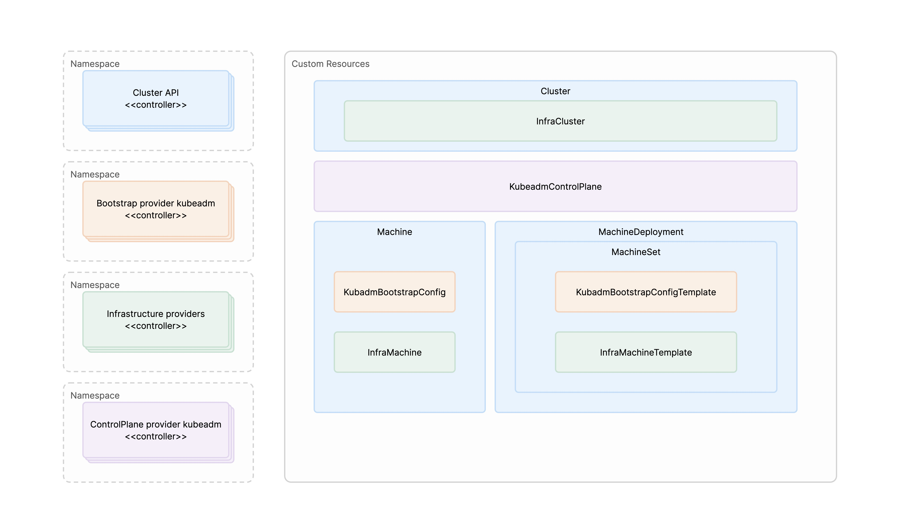

# Architecture

## Overview

Our immutable infrastructure platform is built on the Cluster API (CAPI) framework, providing a declarative, Kubernetes-native approach to cluster lifecycle management.

## Architecture Components

### Core Cluster API Framework

The platform is built around the Cluster API framework, which provides:

- **Declarative API**: Kubernetes-native resources for cluster management
- **Provider Interface**: Standardized interfaces for different infrastructure providers
- **Lifecycle Management**: Automated cluster provisioning, scaling, and upgrades
- **GitOps Integration**: Native support for GitOps workflows

### Provider Architecture

Our platform integrates three key Cluster API providers:

#### 1. Bootstrap Provider - Kubeadm

The **Cluster API Bootstrap Provider Kubeadm** handles the initialization and configuration of Kubernetes nodes:

- **Node Initialization**: Automates the process of turning bare machines into Kubernetes nodes
- **Configuration Management**: Manages kubelet configuration, certificates, and bootstrap tokens
- **Join Process**: Handles the process of joining worker nodes to the cluster
- **Certificate Management**: Automates certificate generation and rotation

#### 2. Control Plane Provider - Kubeadm

The **Cluster API Control Plane Provider Kubeadm** manages the Kubernetes control plane:

- **Control Plane Deployment**: Deploys and manages the Kubernetes API server, etcd, and control plane components
- **High Availability**: Supports multi-node control plane deployments with load balancing
- **Upgrade Management**: Handles rolling upgrades of control plane components
- **Health Monitoring**: Monitors control plane health and performs recovery operations

#### 3. Infrastructure Provider

The chosen **Infrastructure Provider** (our custom provider such as DCS) manages the underlying infrastructure for the target platform:

- **Compute Provisioning**: Creates and manages virtual machines or instances on the target platform
- **Network Configuration**: Sets up networking infrastructure
- **Resource Management**: Manages compute, storage, and network resources
- **Provider Integration**: Integrates with the provider's APIs and services

## Cluster API Architecture

## Key Features

### Immutable Infrastructure Principles

- **Declarative Configuration**: All infrastructure is defined as code
- **Version Control**: Infrastructure changes are tracked and versioned
- **Reproducible Deployments**: Consistent environments across different deployments
- **Rollback Capability**: Easy rollback to previous infrastructure states

### Cluster API Benefits

- **Standardized Interface**: Consistent API across different infrastructure providers
- **Multi-Cloud Support**: Ability to deploy clusters across different cloud platforms
- **Extensible Architecture**: Easy to add new providers and capabilities
- **Kubernetes Native**: Leverages Kubernetes patterns and tooling

### Infrastructure Provider Integration

- **Native Resource Management**: Direct integration with the provider's APIs
- **Resource Optimization**: Efficient resource allocation and placement per provider capabilities

:::warning
Upgrades rely on Cluster API's rolling update mechanism. During a rolling update, any previously attached disks are removed and replaced with new disks on newly created machines. Ensure that no cluster functionality or workloads depend on data stored on the original disks.
:::